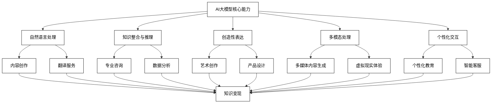
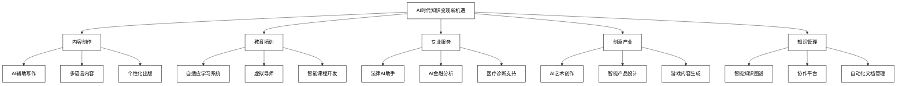

# 使用 AI 大模型实现知识变现的 10000 种方法

**关键词**：AI大模型、知识变现、人工智能应用、创新商业模式、数字经济

**文章摘要**：
本书深入探讨了在人工智能大模型时代，如何利用先进的AI技术实现知识的高效变现。从AI驱动的内容创作、知识传播、在线教育到专业服务，本书全面覆盖了当前AI赋能知识经济的各个方面。通过详细的案例分析和实践指导，为个人创作者、教育工作者、企业管理者以及各行各业的专业人士提供了丰富的知识变现策略和方法。本书不仅关注技术应用，还深入探讨了AI时代的伦理问题、法律挑战以及个人和组织的发展策略，为读者在快速变化的AI时代把握机遇、实现自身价值提供了全面的指导。

# 1 引言：AI大模型与知识经济的新时代

## 1.1 AI大模型的发展现状

人工智能（AI）技术的飞速发展正在深刻改变我们的生活和工作方式。其中，AI大模型作为最前沿的技术突破，正在引领一场知识创造和传播的革命。本节将详细介绍AI大模型的发展现状，包括主流AI大模型的概述以及它们的核心能力。

### 1.1.1 主流AI大模型概述

近年来，AI大模型的发展呈现出爆炸式增长，各大科技公司和研究机构纷纷推出了自己的大规模语言模型。以下是当前最具代表性的几个AI大模型：

1. **GPT系列（OpenAI）**
   - GPT-3：拥有1750亿参数，是首个展现出强大通用能力的大规模语言模型。
   - GPT-4：在GPT-3的基础上进一步提升，具有更强的理解能力和生成能力。

2. **BERT（Google）**
   - 双向Encoder表示从Transformers，在自然语言处理任务中表现卓越。

3. **T5（Google）**
   - Text-to-Text Transfer Transformer，将所有NLP任务统一为文本到文本的转换问题。

4. **LaMDA（Google）**
   - Language Model for Dialogue Applications，专注于开放域对话。

5. **PaLM（Google）**
   - Pathways Language Model，拥有5400亿参数，在多项任务中展现出色表现。

6. **DALL-E和DALL-E 2（OpenAI）**
   - 能够根据文本描述生成高质量图像的AI模型。

7. **Wu Dao 2.0（北京智源人工智能研究院）**
   - 号称拥有1.75万亿参数，是目前最大的AI模型之一。

8. **ERNIE（百度）**
   - Enhanced Representation through kNowledge IntEgration，融合了知识图谱的预训练模型。

9. **Megatron-Turing NLG（NVIDIA和Microsoft）**
   - 拥有5300亿参数，在多项NLP任务中表现优异。

这些AI大模型的出现标志着人工智能技术进入了一个新的阶段。它们不仅在规模上远超以往的模型，更重要的是在理解和生成能力上取得了质的飞跃。

### 1.1.2 AI大模型的核心能力

AI大模型展现出了一系列令人惊叹的核心能力，这些能力正在重塑我们对AI潜力的认知：

1. **自然语言理解与生成**
   - 能够理解复杂的语言结构和语境
   - 生成流畅、连贯且富有创意的文本
   - 多语言翻译和理解能力

2. **知识整合与推理**
   - 跨领域知识的融合和应用
   - 逻辑推理和问题解决能力
   - 抽象概念的理解和运用

3. **上下文学习**
   - 快速适应新任务和领域
   - 从少量示例中学习（少样本学习）
   - 理解和保持长期上下文信息

4. **多模态处理**
   - 文本、图像、音频等多种模态的融合处理
   - 跨模态转换（如文本到图像、语音到文本）

5. **创造性表达**
   - 生成原创性内容（如故事、诗歌、代码）
   - 艺术创作辅助（音乐作曲、绘画设计）

6. **任务泛化**
   - 在未经专门训练的任务上展现出色表现
   - 灵活应对各种复杂指令和要求

7. **情感理解与表达**
   - 识别和理解文本中的情感倾向
   - 生成带有适当情感色彩的内容

8. **个性化交互**
   - 根据用户特征和偏好调整输出
   - 维持一致的对话风格和人格特征

9. **实时学习与更新**
   - 能够从交互中不断学习和改进
   - 及时整合新信息和知识

10. **伦理意识和安全性**
   - 内置伦理准则，避免生成有害内容
   - 保护用户隐私和数据安全

这些核心能力使AI大模型成为强大的知识创造和传播工具。它们不仅能够辅助人类完成复杂的认知任务，还能在某些领域展现出超越人类的能力。

为了更直观地展示AI大模型的核心能力及其在知识变现中的应用，我们可以使用以下Mermaid流程图：

这个流程图展示了AI大模型的核心能力如何直接转化为各种知识变现的机会。从内容创作到专业服务，从艺术创作到个性化教育，AI大模型的多样化能力为知识经济开辟了广阔的新领域。

AI大模型的这些核心能力正在重塑知识的创造、传播和应用方式。它们不仅提高了知识工作的效率，还开创了全新的知识服务和产品形态。在接下来的章节中，我们将详细探讨如何利用这些能力来实现知识的高效变现。

## 1.2 知识经济的转型

知识经济作为21世纪的主导经济形态，正在经历一场由AI大模型引发的深刻变革。这场变革不仅改变了知识的生产和传播方式，更重塑了知识变现的模式和机会。本节将详细探讨传统知识变现模式的特点，以及AI时代带来的新机遇。

### 1.2.1 传统知识变现模式

在AI大模型出现之前，知识变现主要依赖于以下几种模式：

1. **出版与版权**
   - 图书出版：作者通过出版社发行实体书或电子书，获得版税收入。
   - 学术论文：研究人员发表论文，获得学术声誉和职业发展机会。
   - 专利申请：发明人通过申请专利保护知识产权，获得许可费或转让收益。

2. **教育培训**
   - 学校教育：教师通过在学校授课获得薪酬。
   - 职业培训：专业人士开设培训课程，收取学费。
   - 在线课程：通过MOOC平台或个人网站提供在线课程。

3. **咨询服务**
   - 管理咨询：为企业提供战略、运营等方面的建议。
   - 技术咨询：提供专业技术指导和解决方案。
   - 法律咨询：律师为客户提供法律意见和代理服务。

4. **媒体内容创作**
   - 新闻报道：记者通过撰写新闻获得稿费。
   - 博客写作：博主通过广告、赞助等方式获得收入。
   - 视频创作：YouTuber通过广告分成和赞助获得收益。

5. **软件和数字产品**
   - 应用程序开发：开发者通过销售app或提供订阅服务获利。
   - 数据库服务：提供专业数据库访问服务。
   - 数字工具：开发并销售各类数字工具和插件。

6. **演讲和公开活动**
   - 主题演讲：专家通过参加会议和活动进行演讲获得报酬。
   - 研讨会：组织专业研讨会，收取参会费用。

7. **研究与开发**
   - 企业研发：在公司研发部门工作，开发新产品或技术。
   - 学术研究：通过获得研究基金和资助进行研究工作。

8. **艺术创作**
   - 音乐创作：作曲家通过版权费和表演获得收入。
   - 视觉艺术：画家、摄影师通过作品销售和展览获利。

这些传统模式在很长一段时间内主导了知识经济，它们有以下特点：

- **时间和地理限制**：很多知识变现方式受到时间和地理位置的限制，如面对面授课或咨询。
- **规模化困难**：个人知识工作者难以实现大规模的知识传播和变现。
- **专业门槛高**：大多数高价值的知识服务需要长期的专业训练和经验积累。
- **中介依赖**：许多知识变现方式需要通过出版社、经纪人等中介机构。
- **更新周期长**：知识内容的更新和迭代往往需要较长时间。
- **互动性有限**：传统的知识产品（如书籍）缺乏即时互动的能力。

尽管这些传统模式仍然有其价值和市场，但它们在效率、规模和灵活性方面面临着越来越大的挑战。这正是AI时代带来新机遇的背景。

### 1.2.2 AI时代知识变现的新机遇

AI大模型的出现为知识经济带来了革命性的变化，创造了全新的知识变现机会：

1. **AI辅助内容创作**
   - 高效写作：利用AI快速生成文章、报告、书籍等内容。
   - 多语言本地化：自动将内容翻译并适应不同文化背景。
   - 个性化内容：根据读者偏好自动调整内容风格和深度。

2. **智能教育系统**
   - 自适应学习：AI根据学习者的进度和特点调整教学内容和方法。
   - 虚拟导师：24/7可用的AI辅导员，回答问题并提供指导。
   - 自动化课程开发：快速生成课程大纲、教材和练习题。

3. **AI增强专业服务**
   - 法律文书生成：自动生成合同、诉讼文件等法律文书。
   - 金融分析与预测：利用AI进行市场分析和投资建议。
   - 医疗诊断辅助：AI辅助医生进行初步诊断和治疗方案制定。

4. **智能创意工具**
   - AI艺术创作：生成音乐、绘画、诗歌等艺术作品。
   - 广告文案优化：自动生成和优化广告文案。
   - 产品设计辅助：AI辅助产品概念设计和原型生成。

5. **知识图谱与数据挖掘**
   - 智能研究助手：自动进行文献综述和研究趋势分析。
   - 知识关联发现：挖掘跨领域知识联系，促进创新。
   - 个性化知识推荐：根据用户兴趣智能推荐相关知识内容。

6. **交互式数字体验**
   - 虚拟现实教育：创建沉浸式学习环境。
   - 智能游戏设计：自动生成游戏剧情、对话和关卡。
   - 个性化数字助理：为用户提供定制的知识服务和生活建议。

7. **自动化知识管理**
   - 智能笔记工具：自动组织和关联个人知识库。
   - 团队知识协作平台：AI辅助团队知识共享和协作。
- 企业知识库维护：自动更新和优化企业内部知识库。

8. **实时语言服务**
    - 即时翻译：提供高质量的实时口译和文本翻译服务。
    - 多语言内容创作：同时用多种语言创作原创内容。
    - 语言学习助手：个性化语言学习计划和练习生成。

9. **预测性分析服务**
    - 市场趋势预测：利用AI分析大数据，预测行业发展趋势。
    - 个人职业规划：基于个人特点和市场需求提供职业发展建议。
    - 风险评估：为企业和个人提供全面的风险分析和管理建议。

10. **智能内容策划**
    - 个性化内容聚合：根据用户兴趣自动整合和推送相关内容。
    - 跨平台内容优化：自动调整内容以适应不同社交媒体平台。
    - 内容性能分析：实时分析内容表现，提供优化建议。

这些新兴的知识变现机会具有以下特点：

- **高度个性化**：能够根据每个用户的需求提供定制化的知识服务。
- **实时互动**：支持即时的知识交流和问题解答。
- **规模化能力**：可以同时服务大量用户，实现知识的广泛传播。
- **跨领域整合**：能够融合不同领域的知识，创造新的价值。
- **持续更新**：知识内容可以实时更新，保持最新最relevant。
- **低门槛入口**：使得更多人能够参与到知识创造和传播中来。
- **高效率生产**：大幅提高知识内容的生产效率。
- **全球化触达**：轻松突破语言和文化障碍，实现全球范围的知识传播。

为了更直观地展示AI时代知识变现的新机遇，我们可以使用以下Mermaid流程图：

这个流程图展示了AI时代带来的主要知识变现机会，涵盖了从内容创作到专业服务的多个领域。每个领域都有多个具体的应用方向，体现了AI对知识经济的全方位影响。

AI大模型的出现不仅创造了新的知识变现机会，还深刻改变了知识的生产、传播和消费方式。它使得知识工作者能够更高效地创造价值，同时也为知识消费者提供了更丰富、更个性化的选择。这场变革正在重塑整个知识经济的生态系统，为个人和组织带来前所未有的机遇和挑战。

在接下来的章节中，我们将深入探讨如何利用这些新机遇，实现知识的高效变现，以及在这个快速变化的时代保持竞争力。

## 1.3 本书目标与结构

本书旨在为读者提供一个全面、实用的指南，探讨如何在AI大模型时代充分利用新技术实现知识的高效变现。我们的目标是帮助知识工作者、创业者、教育工作者以及各行各业的专业人士理解并把握AI带来的新机遇，开发创新的知识产品和服务，在变革的浪潮中保持竞争优势。

### 本书主要目标：

1. **技术洞察**：深入解析AI大模型的核心能力及其在知识经济中的应用潜力。

2. **策略指导**：提供实际可行的知识变现策略，涵盖从内容创作到专业服务的多个领域。

3. **案例分析**：通过真实案例研究，展示AI驱动的知识变现成功实践。

4. **工具介绍**：介绍并评估各种AI工具和平台，帮助读者选择适合自己需求的解决方案。

5. **未来展望**：探讨AI技术的发展趋势及其对知识经济的长期影响。

6. **伦理考量**：讨论AI应用在知识变现中的伦理问题和最佳实践。

7. **技能提升**：指导读者如何提升必要的技能，以在AI时代保持竞争力。

### 本书结构：

本书共分为10个章节，每个章节聚焦于AI驱动知识变现的不同方面：

1. **引言：AI大模型与知识经济的新时代**
    - 概述AI大模型的发展现状
    - 分析知识经济的转型
    - 阐明本书目标与结构

2. **AI大模型赋能下的知识创造**
    - 探讨AI辅助内容生成
    - 分析多媒体内容制作的新方法
    - 介绍AI在教育资源开发中的应用
    - 讨论AI驱动的研究与分析方法

3. **AI驱动的知识传播与营销**
    - 解析AI在社交媒体运营中的应用
    - 探讨智能化邮件营销策略
    - 分析AI驱动的SEO与内容营销
    - 介绍AI辅助广告文案创作

4. **AI辅助的在线教育与培训**
    - 探讨AI在在线课程开发中的应用
    - 分析个性化学习路径的设计
    - 介绍虚拟教学助手的功能与实现
    - 讨论AI驱动的企业培训解决方案

5. **AI增强的咨询与服务**
    - 解析智能客户服务系统的构建
    - 探讨AI在专业咨询服务中的应用
    - 分析AI驱动的技术支持与故障排查
    - 介绍AI辅助的市场调研与分析方法

6. **AI驱动的产品与工具开发**
    - 探讨AI驱动的SaaS产品开发
    - 分析智能移动应用的设计与实现
    - 介绍AI增强的浏览器插件与小工具
    - 讨论AI API服务的开发与应用

7. **AI辅助的创意产业**
    - 解析AI在数字艺术创作中的应用
    - 探讨AI驱动的游戏开发新方法
    - 分析AI在广告与品牌创意中的角色
    - 介绍AI辅助的时尚与产品设计

8. **AI增强的专业服务**
    - 探讨AI在法律服务中的应用
    - 分析AI驱动的金融与投资顾问服务
    - 介绍AI在医疗健康咨询中的角色
    - 讨论AI辅助的人力资源管理

9. **AI驱动的社区与平台运营**
    - 解析AI驱动的知识共享平台设计
    - 探讨创作者经济平台的AI增强策略
    - 分析AI在专业社交网络中的应用
    - 介绍AI驱动的在线市场与交易平台

10. **未来展望与策略**
    - 探讨新兴技术与知识变现的结合
    - 分析AI应用的伦理与法律考量
    - 提供个人发展策略建议
    - 讨论企业在AI时代的转型策略

为了更直观地展示本书的结构和各章节之间的关系，我们可以使用以下Mermaid流程图：

```mermaid
graph TD
    A[使用AI大模型实现知识变现的10000种方法] --> B[1. 引言]
    A --> C[2. 知识创造]
    A --> D[3. 知识传播与营销]
    A --> E[4. 在线教育与培训]
    A --> F[5. 咨询与服务]
    A --> G[6. 产品与工具开发]
    A --> H[7. 创意产业]
    A --> I[8. 专业服务]
    A --> J[9. 社区与平台运营]
    A --> K[10. 未来展望与策略]

    B --> L[AI大模型现状]
    B --> M[知识经济转型]
    B --> N[书籍目标与结构]

    C --> O[内容生成]
    C --> P[多媒体制作]
    C --> Q[教育资源开发]
    C --> R[研究与分析]

    D --> S[社交媒体运营]
    D --> T[邮件营销]
    D --> U[SEO与内容营销]
    D --> V[广告文案创作]

    E --> W[课程开发]
    E --> X[个性化学习]
    E --> Y[虚拟教学助手]
    E --> Z[企业培训]

    F --> AA[智能客服]
    F --> AB[专业咨询]
    F --> AC[技术支持]
    F --> AD[市场调研]

    G --> AE[SaaS开发]
    G --> AF[移动应用]
    G --> AG[浏览器插件]
    G --> AH[API服务]

    H --> AI[数字艺术]
    H --> AJ[游戏开发]
    H --> AK[广告创意]
    H --> AL[产品设计]

    I --> AM[法律服务]
    I --> AN[金融顾问]
    I --> AO[医疗咨询]
    I --> AP[人力资源]

    J --> AQ[知识共享平台]
    J --> AR[创作者经济]
    J --> AS[专业社交网络]
    J --> AT[在线市场]

    K --> AU[新兴技术]
    K --> AV[伦理与法律]
    K --> AW[个人发展]
    K --> AX[企业转型]

%% 自定义样式
classDef default fill:#ffffff,stroke:#000000,color:#000000;
```

这个流程图清晰地展示了本书的整体结构，从引言到未来展望，涵盖了AI驱动知识变现的各个关键方面。每个主要章节下都有几个核心主题，确保了内容的全面性和深度。

通过这样的结构安排，本书旨在为读者提供一个系统化的学习路径，从理解AI大模型的基本概念，到掌握具体的知识变现策略，再到思考未来发展方向。无论读者是希望提升个人竞争力，还是寻求商业创新机会，都能在本书中找到有价值的见解和实践指导。

在接下来的章节中，我们将深入探讨每个主题，提供详细的分析、实用的建议和丰富的案例，帮助读者充分把握AI时代知识变现的无限可能。
