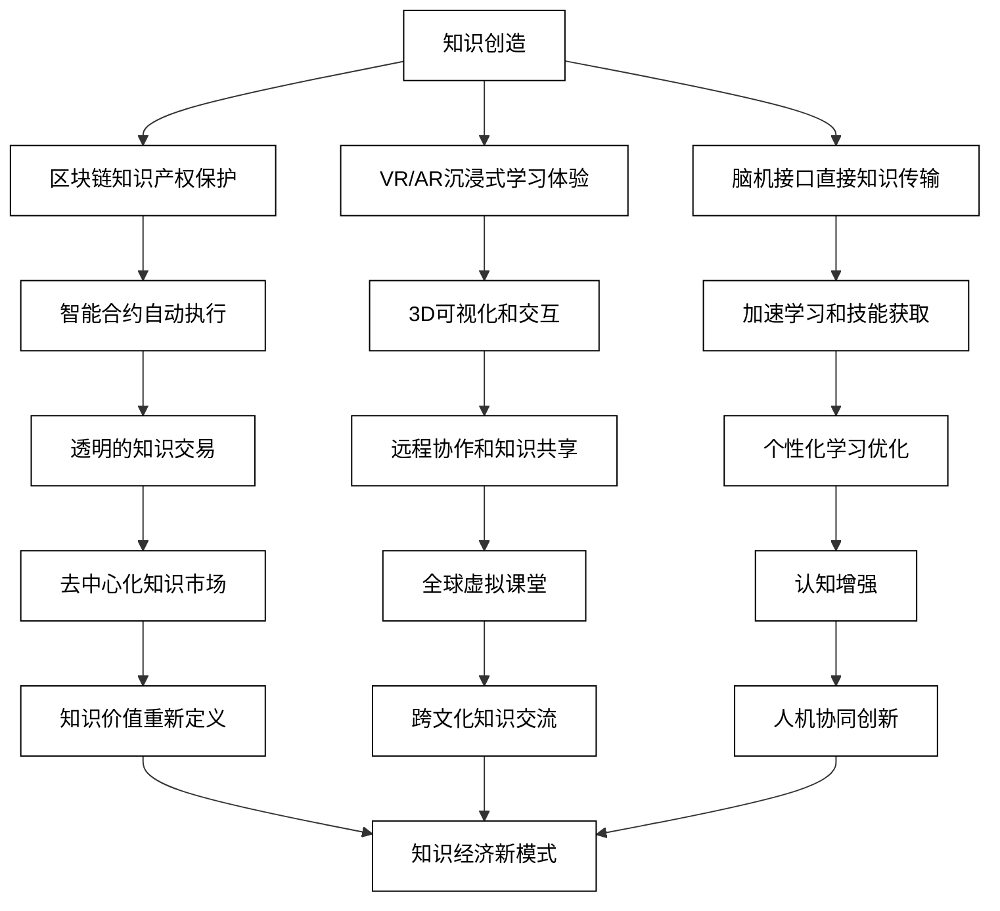
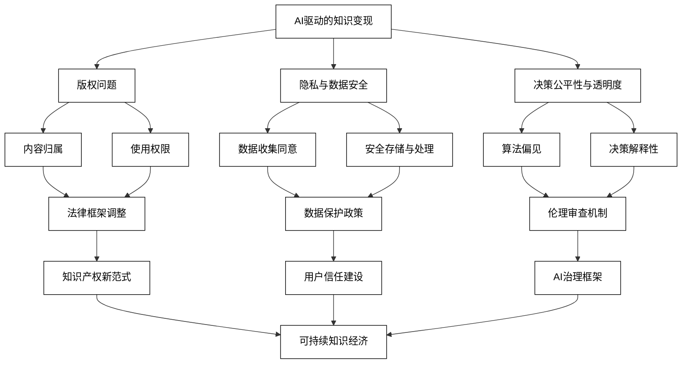
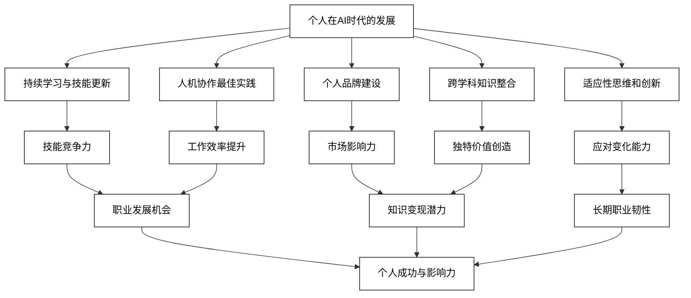
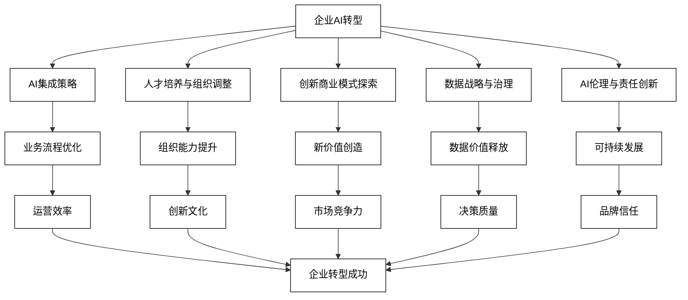

# 10 未来展望与策略

随着AI技术的快速发展，知识经济正在经历前所未有的变革。本章将探讨新兴技术与知识变现的结合，分析潜在的伦理与法律问题，并为个人和企业提供应对AI时代的策略建议。我们将深入探讨如何在这个充满机遇和挑战的新时代中取得成功。

## 10.1 新兴技术与知识变现

新兴技术正在为知识变现创造新的可能性，从区块链到虚拟现实/增强现实（VR/AR），再到脑机接口，这些技术正在revolutionize我们创造、分享和货币化知识的方式。以下是一些关键领域的探讨：

### 10.1.1 区块链与知识产权保护

区块链技术可以为知识产权提供更强大的保护和更透明的管理方式。

```python
def blockchain_ip_protection(content_hash, creator_info, licensing_terms):
    prompt = f"描述如何使用区块链技术保护以下知识产权：\n内容哈希：{content_hash}\n创作者信息：{creator_info}\n许可条款：{licensing_terms}\n解释区块链如何确保版权认证、追踪使用情况和自动执行许可协议。"
    response = openai.Completion.create(
        engine="text-davinci-002",
        prompt=prompt,
        max_tokens=400,
        n=1,
        stop=None,
        temperature=0.7,
    )
    return response.choices[0].text.strip()

content_hash = "0x1a2b3c4d5e6f..."
creator_info = "Jane Doe, ID: JD12345, 创作时间: 2023-06-15"
licensing_terms = "非商业用途免费，商业用途需支付5%版税"
blockchain_protection = blockchain_ip_protection(content_hash, creator_info, licensing_terms)
print(f"区块链知识产权保护方案：\n{blockchain_protection}")
```

### 10.1.2 VR/AR在知识传播中的应用

虚拟现实和增强现实技术可以创造沉浸式的学习和知识共享体验。

```python
def vr_ar_knowledge_sharing(content_type, learning_objectives, interaction_design):
    prompt = f"设计一个VR/AR知识共享体验：\n内容类型：{content_type}\n学习目标：{learning_objectives}\n交互设计：{interaction_design}\n描述如何利用VR/AR技术增强学习效果和知识传播。"
    response = openai.Completion.create(
        engine="text-davinci-002",
        prompt=prompt,
        max_tokens=400,
        n=1,
        stop=None,
        temperature=0.7,
    )
    return response.choices[0].text.strip()

content_type = "人体解剖学教学"
learning_objectives = "理解人体器官系统的3D结构和功能"
interaction_design = "允许学习者在虚拟环境中探索和操作人体模型"
vr_ar_experience = vr_ar_knowledge_sharing(content_type, learning_objectives, interaction_design)
print(f"VR/AR知识共享体验设计：\n{vr_ar_experience}")
```

### 10.1.3 脑机接口与直接知识传输

脑机接口技术可能revolutionize知识获取和分享的方式，实现更直接的信息交换。

```python
def bci_knowledge_transfer(knowledge_domain, transfer_protocol, safety_measures):
    prompt = f"探讨使用脑机接口进行直接知识传输的可能性：\n知识领域：{knowledge_domain}\n传输协议：{transfer_protocol}\n安全措施：{safety_measures}\n分析潜在的应用场景、技术挑战和伦理考量。"
    response = openai.Completion.create(
        engine="text-davinci-002",
        prompt=prompt,
        max_tokens=500,
        n=1,
        stop=None,
        temperature=0.7,
    )
    return response.choices[0].text.strip()

knowledge_domain = "外语学习"
transfer_protocol = "神经编码语言模型直接传输"
safety_measures = "数据加密、身份验证、神经保护机制"
bci_analysis = bci_knowledge_transfer(knowledge_domain, transfer_protocol, safety_measures)
print(f"脑机接口知识传输分析：\n{bci_analysis}")
```

4. **量子计算在知识处理中的应用**
   量子计算可能为复杂知识处理和模式识别带来突破。

```python
def quantum_knowledge_processing(data_complexity, processing_task, quantum_advantage):
    prompt = f"分析量子计算在知识处理中的潜在应用：\n数据复杂度：{data_complexity}\n处理任务：{processing_task}\n量子优势：{quantum_advantage}\n探讨量子计算如何revolutionize知识处理和分析。"
    response = openai.Completion.create(
        engine="text-davinci-002",
        prompt=prompt,
        max_tokens=400,
        n=1,
        stop=None,
        temperature=0.7,
    )
    return response.choices[0].text.strip()

data_complexity = "大规模多维数据集，包含复杂的相互关系"
processing_task = "识别隐藏模式和预测未来趋势"
quantum_advantage = "能够同时处理大量可能性，加速复杂计算"
quantum_analysis = quantum_knowledge_processing(data_complexity, processing_task, quantum_advantage)
print(f"量子计算在知识处理中的应用分析：\n{quantum_analysis}")
```

5. **5G和边缘计算在实时知识访问中的作用**
   5G和边缘计算技术可以实现更快速、更广泛的知识获取和分享。

```python
def edge_computing_knowledge_access(access_scenario, latency_requirements, data_processing):
    prompt = f"探讨5G和边缘计算如何改变实时知识访问：\n访问场景：{access_scenario}\n延迟要求：{latency_requirements}\n数据处理：{data_processing}\n分析这些技术如何提高知识获取的速度和可及性。"
    response = openai.Completion.create(
        engine="text-davinci-002",
        prompt=prompt,
        max_tokens=400,
        n=1,
        stop=None,
        temperature=0.7,
    )
    return response.choices[0].text.strip()

access_scenario = "移动设备上的实时语言翻译和文化背景解释"
latency_requirements = "响应时间小于100毫秒"
data_processing = "本地设备上的初步处理，结合云端的深度分析"
edge_computing_analysis = edge_computing_knowledge_access(access_scenario, latency_requirements, data_processing)
print(f"5G和边缘计算在实时知识访问中的作用分析：\n{edge_computing_analysis}")
```

这些新兴技术的应用展示了知识变现的未来可能性。通过结合这些技术，我们可以创造更安全、更沉浸、更高效的知识创造和分享方式，从而开辟知识经济的新前沿。

为了更好地理解这些新兴技术在知识变现中的相互关系和潜在影响，我们可以使用以下Mermaid流程图：



这个流程图展示了新兴技术如何从知识创造开始，通过不同的技术路径，最终converge到知识经济的新模式。它强调了技术之间的相互作用和协同效应，以及它们如何共同塑造知识变现的未来。通过这种方式，我们可以看到一个更加开放、高效和创新的知识经济生态系统正在形成。

## 10.2 伦理与法律考量

随着AI技术在知识变现领域的广泛应用，我们必须认真考虑相关的伦理和法律问题。从AI生成内容的版权问题到隐私保护与数据安全，再到AI决策的公平性与透明度，这些问题都需要我们深入探讨并制定相应的策略。以下是一些关键领域的分析：

### 10.2.1 AI生成内容的版权问题

AI生成内容的版权归属和使用权限是一个复杂的法律和伦理问题。

```python
def ai_content_copyright_analysis(content_type, ai_involvement, human_input):
    prompt = f"分析AI生成内容的版权问题：\n内容类型：{content_type}\nAI参与度：{ai_involvement}\n人类输入：{human_input}\n探讨版权归属、使用权限和潜在的法律挑战。"
    response = openai.Completion.create(
        engine="text-davinci-002",
        prompt=prompt,
        max_tokens=400,
        n=1,
        stop=None,
        temperature=0.7,
    )
    return response.choices[0].text.strip()

content_type = "AI辅助创作的小说"
ai_involvement = "AI生成情节大纲和部分对话"
human_input = "作家进行故事构建和文字润色"
copyright_analysis = ai_content_copyright_analysis(content_type, ai_involvement, human_input)
print(f"AI生成内容版权分析：\n{copyright_analysis}")
```

### 10.2.2 隐私保护与数据安全

在AI驱动的知识经济中，个人数据的保护和安全使用至关重要。

```python
def privacy_data_security_assessment(data_types, usage_scenarios, protection_measures):
    prompt = f"评估AI知识变现中的隐私和数据安全问题：\n数据类型：{data_types}\n使用场景：{usage_scenarios}\n保护措施：{protection_measures}\n分析潜在风险和建议的安全策略。"
    response = openai.Completion.create(
        engine="text-davinci-002",
        prompt=prompt,
        max_tokens=400,
        n=1,
        stop=None,
        temperature=0.7,
    )
    return response.choices[0].text.strip()

data_types = "用户学习历史、个人兴趣偏好、财务信息"
usage_scenarios = "个性化内容推荐、学习路径优化、支付处理"
protection_measures = "数据加密、访问控制、匿名化处理"
security_assessment = privacy_data_security_assessment(data_types, usage_scenarios, protection_measures)
print(f"隐私保护与数据安全评估：\n{security_assessment}")
```

### 10.2.3 AI决策的公平性与透明度

确保AI系统在知识变现过程中的决策公平性和透明度是一个重要的伦理问题。

```python
def ai_fairness_transparency_evaluation(decision_context, ai_model, affected_parties):
    prompt = f"评估AI决策的公平性和透明度：\n决策场景：{decision_context}\nAI模型：{ai_model}\n受影响方：{affected_parties}\n分析潜在的偏见、歧视问题，并提出提高透明度的方法。"
    response = openai.Completion.create(
        engine="text-davinci-002",
        prompt=prompt,
        max_tokens=400,
        n=1,
        stop=None,
        temperature=0.7,
    )
    return response.choices[0].text.strip()

decision_context = "AI驱动的内容推荐和知识资源分配"
ai_model = "基于用户历史行为和人口统计数据的机器学习模型"
affected_parties = "不同背景、年龄和教育水平的学习者"
fairness_evaluation = ai_fairness_transparency_evaluation(decision_context, ai_model, affected_parties)
print(f"AI决策公平性与透明度评估：\n{fairness_evaluation}")
```

4. **知识产权在AI时代的演变**
   AI技术的发展正在挑战传统的知识产权概念和保护机制。

```python
def ip_evolution_in_ai_era(traditional_ip, ai_challenges, proposed_solutions):
    prompt = f"分析AI时代知识产权的演变：\n传统知识产权：{traditional_ip}\nAI带来的挑战：{ai_challenges}\n提议的解决方案：{proposed_solutions}\n探讨如何调整知识产权法律和实践以适应AI时代。"
    response = openai.Completion.create(
        engine="text-davinci-002",
        prompt=prompt,
        max_tokens=400,
        n=1,
        stop=None,
        temperature=0.7,
    )
    return response.choices[0].text.strip()

traditional_ip = "版权、专利、商标保护"
ai_challenges = "AI生成内容的原创性、算法的可专利性、AI辅助发明"
proposed_solutions = "新型数字版权、算法透明度要求、AI-人类协作的知识产权框架"
ip_analysis = ip_evolution_in_ai_era(traditional_ip, ai_challenges, proposed_solutions)
print(f"AI时代知识产权演变分析：\n{ip_analysis}")
```

5. **AI伦理准则的制定与实施**
   为AI在知识经济中的应用制定和实施伦理准则是确保负责任发展的关键。

```python
def ai_ethics_guidelines_development(ethical_principles, stakeholders, implementation_challenges):
    prompt = f"制定AI知识变现的伦理准则：\n伦理原则：{ethical_principles}\n利益相关者：{stakeholders}\n实施挑战：{implementation_challenges}\n提出全面的伦理准则框架和实施策略。"
    response = openai.Completion.create(
        engine="text-davinci-002",
        prompt=prompt,
        max_tokens=500,
        n=1,
        stop=None,
        temperature=0.7,
    )
    return response.choices[0].text.strip()

ethical_principles = "公平性、透明度、隐私保护、问责制"
stakeholders = "技术开发者、内容创作者、平台运营商、用户、监管机构"
implementation_challenges = "跨国法律差异、技术快速发展、利益平衡"
ethics_guidelines = ai_ethics_guidelines_development(ethical_principles, stakeholders, implementation_challenges)
print(f"AI知识变现伦理准则：\n{ethics_guidelines}")
```

这些伦理与法律考量的分析展示了AI驱动的知识经济面临的复杂挑战。通过深入探讨这些问题，我们可以为AI技术的负责任应用和知识经济的健康发展奠定基础。

为了更好地理解这些伦理和法律问题的相互关系及其对知识变现的影响，我们可以使用以下Mermaid流程图：



这个流程图展示了AI驱动的知识变现所涉及的主要伦理和法律问题，以及这些问题如何相互关联并最终影响知识经济的可持续发展。它强调了版权、隐私、公平性等核心问题，以及解决这些问题所需的法律调整、政策制定和治理框架。通过这种全面的视角，我们可以更好地理解和应对AI时代知识变现的复杂挑战，确保技术创新与伦理责任的平衡发展。

## 10.3 个人发展策略

在AI驱动的知识经济时代，个人需要采取积极的策略来适应变化，提升自身价值，并在新的环境中取得成功。以下是一些关键的个人发展策略：

### 10.3.1 持续学习与技能更新

在快速变化的AI时代，持续学习和技能更新是保持竞争力的关键。

```python
def continuous_learning_strategy(current_skills, emerging_technologies, learning_resources):
    prompt = f"制定持续学习策略：\n当前技能：{current_skills}\n新兴技术：{emerging_technologies}\n学习资源：{learning_resources}\n提供个性化的学习路径和技能更新计划。"
    response = openai.Completion.create(
        engine="text-davinci-002",
        prompt=prompt,
        max_tokens=400,
        n=1,
        stop=None,
        temperature=0.7,
    )
    return response.choices[0].text.strip()

current_skills = "Python编程、数据分析、项目管理"
emerging_technologies = "人工智能、区块链、量子计算"
learning_resources = "在线课程平台、技术博客、行业会议"
learning_plan = continuous_learning_strategy(current_skills, emerging_technologies, learning_resources)
print(f"持续学习与技能更新策略：\n{learning_plan}")
```

### 10.3.2 人机协作的最佳实践

学会与AI工具有效协作，可以显著提高个人生产力和创造力。

```python
def human_ai_collaboration_best_practices(work_scenarios, ai_tools, collaboration_goals):
    prompt = f"提供人机协作的最佳实践：\n工作场景：{work_scenarios}\nAI工具：{ai_tools}\n协作目标：{collaboration_goals}\n描述如何最有效地利用AI增强人类能力。"
    response = openai.Completion.create(
        engine="text-davinci-002",
        prompt=prompt,
        max_tokens=400,
        n=1,
        stop=None,
        temperature=0.7,
    )
    return response.choices[0].text.strip()

work_scenarios = "内容创作、数据分析、客户服务"
ai_tools = "自然语言处理、预测分析、聊天机器人"
collaboration_goals = "提高生产效率、增强创造力、改善决策质量"
collaboration_practices = human_ai_collaboration_best_practices(work_scenarios, ai_tools, collaboration_goals)
print(f"人机协作最佳实践：\n{collaboration_practices}")
```

### 10.3.3 建立个人品牌与影响力

在数字时代，建立强大的个人品牌和影响力对于知识变现至关重要。

```python
def personal_branding_strategy(expertise_areas, target_audience, digital_platforms):
    prompt = f"制定个人品牌建设策略：\n专业领域：{expertise_areas}\n目标受众：{target_audience}\n数字平台：{digital_platforms}\n提供建立和维护个人品牌的具体方法。"
    response = openai.Completion.create(
        engine="text-davinci-002",
        prompt=prompt,
        max_tokens=400,
        n=1,
        stop=None,
        temperature=0.7,
    )
    return response.choices[0].text.strip()

expertise_areas = "人工智能伦理、技术创新管理、数字化转型"
target_audience = "技术决策者、创业者、学术研究者"
digital_platforms = "LinkedIn、Medium、专业博客、播客"
branding_strategy = personal_branding_strategy(expertise_areas, target_audience, digital_platforms)
print(f"个人品牌建设策略：\n{branding_strategy}")
```

4. **跨学科知识整合**
   在AI时代，跨学科知识的整合能力变得越来越重要。

```python
def interdisciplinary_knowledge_integration(primary_field, complementary_fields, integration_goals):
    prompt = f"设计跨学科知识整合策略：\n主要领域：{primary_field}\n互补领域：{complementary_fields}\n整合目标：{integration_goals}\n提供如何有效整合不同学科知识以创造独特价值的建议。"
    response = openai.Completion.create(
        engine="text-davinci-002",
        prompt=prompt,
        max_tokens=400,
        n=1,
        stop=None,
        temperature=0.7,
    )
    return response.choices[0].text.strip()

primary_field = "计算机科学"
complementary_fields = "心理学、设计思维、商业战略"
integration_goals = "开发更人性化的AI产品、提高AI解决方案的商业价值"
integration_strategy = interdisciplinary_knowledge_integration(primary_field, complementary_fields, integration_goals)
print(f"跨学科知识整合策略：\n{integration_strategy}")
```

5. **适应性思维和创新能力培养**
   在快速变化的AI环境中，培养适应性思维和创新能力至关重要。

```python
def adaptive_thinking_innovation_development(change_scenarios, innovation_challenges, skill_development):
    prompt = f"制定适应性思维和创新能力培养计划：\n变化场景：{change_scenarios}\n创新挑战：{innovation_challenges}\n技能发展：{skill_development}\n提供培养适应性和创新思维的具体方法和练习。"
    response = openai.Completion.create(
        engine="text-davinci-002",
        prompt=prompt,
        max_tokens=400,
        n=1,
        stop=None,
        temperature=0.7,
    )
    return response.choices[0].text.strip()

change_scenarios = "技术快速迭代、市场需求变化、全球化竞争"
innovation_challenges = "突破性技术应用、商业模式创新、用户体验革新"
skill_development = "设计思维、敏捷方法论、系统性思考"
adaptive_innovation_plan = adaptive_thinking_innovation_development(change_scenarios, innovation_challenges, skill_development)
print(f"适应性思维和创新能力培养计划：\n{adaptive_innovation_plan}")
```

这些个人发展策略强调了在AI驱动的知识经济中保持竞争力和创造价值的关键方法。通过持续学习、有效的人机协作、个人品牌建设、跨学科知识整合以及培养适应性思维和创新能力，个人可以在这个快速变化的环境中找到自己的位置并实现成长。

为了更好地理解这些个人发展策略之间的关系及其对个人成功的影响，我们可以使用以下Mermaid流程图：



这个流程图展示了个人在AI时代发展的关键策略，以及这些策略如何相互支持并最终导向个人成功与影响力。它强调了持续学习、人机协作、个人品牌、跨学科整合和创新思维的重要性，以及这些因素如何共同提升个人的竞争力、创造力和适应能力。通过这种全面的发展策略，个人可以在AI驱动的知识经济中不断成长，实现自身价值，并为社会创造更大的贡献。

## 10.4 企业转型建议

在AI驱动的知识经济时代，企业需要进行全面的转型以保持竞争力和创新能力。以下是一些关键的企业转型策略：

### 10.4.1 AI集成策略

企业需要制定全面的AI集成策略，以优化业务流程和创造新的价值。

```python
def ai_integration_strategy(business_processes, ai_capabilities, integration_goals):
    prompt = f"制定企业AI集成策略：\n业务流程：{business_processes}\nAI能力：{ai_capabilities}\n集成目标：{integration_goals}\n提供全面的AI集成计划，包括技术选择、实施步骤和预期成果。"
    response = openai.Completion.create(
        engine="text-davinci-002",
        prompt=prompt,
        max_tokens=500,
        n=1,
        stop=None,
        temperature=0.7,
    )
    return response.choices[0].text.strip()

business_processes = "客户服务、产品开发、供应链管理"
ai_capabilities = "自然语言处理、预测分析、计算机视觉"
integration_goals = "提高运营效率、增强客户体验、加速创新"
ai_strategy = ai_integration_strategy(business_processes, ai_capabilities, integration_goals)
print(f"企业AI集成策略：\n{ai_strategy}")
```

### 10.4.2 人才培养与组织调整

企业需要培养AI人才并调整组织结构以适应AI时代的需求。

```python
def talent_development_org_restructuring(skill_gaps, organizational_challenges, future_needs):
    prompt = f"设计人才培养和组织调整方案：\n技能缺口：{skill_gaps}\n组织挑战：{organizational_challenges}\n未来需求：{future_needs}\n提供全面的人才发展计划和组织重构建议。"
    response = openai.Completion.create(
        engine="text-davinci-002",
        prompt=prompt,
        max_tokens=500,
        n=1,
        stop=None,
        temperature=0.7,
    )
    return response.choices[0].text.strip()

skill_gaps = "AI开发、数据科学、数字化转型管理"
organizational_challenges = "传统部门壁垒、创新文化缺乏、决策流程缓慢"
future_needs = "跨功能协作、快速迭代能力、数据驱动决策"
talent_org_plan = talent_development_org_restructuring(skill_gaps, organizational_challenges, future_needs)
print(f"人才培养与组织调整方案：\n{talent_org_plan}")
```

### 10.4.3 创新商业模式探索

企业需要探索基于AI的新商业模式，以创造和捕获新的价值。

```python
def innovative_business_model_exploration(current_model, ai_opportunities, market_trends):
    prompt = f"探索AI驱动的创新商业模式：\n当前模式：{current_model}\nAI机会：{ai_opportunities}\n市场趋势：{market_trends}\n提出创新的商业模式概念和实施路径。"
    response = openai.Completion.create(
        engine="text-davinci-002",
        prompt=prompt,
        max_tokens=500,
        n=1,
        stop=None,
        temperature=0.7,
    )
    return response.choices[0].text.strip()

current_model = "传统软件许可销售模式"
ai_opportunities = "个性化AI助手、预测性维护服务、AI驱动的决策支持"
market_trends = "订阅经济增长、数据价值提升、生态系统合作模式兴起"
new_business_model = innovative_business_model_exploration(current_model, ai_opportunities, market_trends)
print(f"创新商业模式探索：\n{new_business_model}")
```

4. **数据战略与治理**
   制定全面的数据战略和建立有效的数据治理机制对AI时代的企业至关重要。

```python
def data_strategy_governance(data_assets, regulatory_requirements, business_objectives):
    prompt = f"制定企业数据战略和治理方案：\n数据资产：{data_assets}\n监管要求：{regulatory_requirements}\n业务目标：{business_objectives}\n提供全面的数据管理、利用和保护策略。"
    response = openai.Completion.create(
        engine="text-davinci-002",
        prompt=prompt,
        max_tokens=500,
        n=1,
        stop=None,
        temperature=0.7,
    )
    return response.choices[0].text.strip()

data_assets = "客户数据、运营数据、市场数据"
regulatory_requirements = "GDPR、CCPA、行业特定数据保护规定"
business_objectives = "提高客户洞察、优化运营效率、开发数据驱动的新产品"
data_strategy = data_strategy_governance(data_assets, regulatory_requirements, business_objectives)
print(f"数据战略与治理方案：\n{data_strategy}")
```

5. **AI伦理与责任创新**
   企业需要在追求AI创新的同时，确保伦理和责任的平衡。

```python
def ai_ethics_responsible_innovation(ethical_challenges, stakeholder_concerns, innovation_goals):
    prompt = f"制定AI伦理和责任创新框架：\n伦理挑战：{ethical_challenges}\n利益相关者关切：{stakeholder_concerns}\n创新目标：{innovation_goals}\n提供平衡伦理责任和创新的具体策略和实践。"
    response = openai.Completion.create(
        engine="text-davinci-002",
        prompt=prompt,
        max_tokens=500,
        n=1,
        stop=None,
        temperature=0.7,
    )
    return response.choices[0].text.strip()

ethical_challenges = "算法偏见、隐私保护、AI决策透明度"
stakeholder_concerns = "员工对自动化的担忧、客户对数据使用的顾虑、社会对AI影响的疑虑"
innovation_goals = "开发负责任的AI产品、建立值得信赖的品牌形象、推动可持续的技术进步"
ethics_innovation_framework = ai_ethics_responsible_innovation(ethical_challenges, stakeholder_concerns, innovation_goals)
print(f"AI伦理与责任创新框架：\n{ethics_innovation_framework}")
```

这些企业转型建议强调了在AI驱动的知识经济中保持竞争力和创新能力的关键策略。通过全面的AI集成、人才培养和组织调整、创新商业模式探索、数据战略制定以及负责任的AI创新，企业可以在这个快速变化的环境中实现可持续发展和长期成功。

为了更好地理解这些企业转型策略之间的关系及其对企业成功的影响，我们可以使用以下Mermaid流程图：



这个流程图展示了企业AI转型的关键策略，以及这些策略如何相互支持并最终导向企业转型的成功。它强调了AI集成、人才发展、商业模式创新、数据管理和伦理责任的重要性，以及这些因素如何共同提升企业的运营效率、创新能力、市场竞争力和可持续发展能力。通过这种全面的转型策略，企业可以在AI驱动的知识经济中不断适应和成长，创造新的价值，并在市场中保持领先地位。
