# 2 AI大模型赋能下的知识创造

在AI大模型时代，知识创造的方式正在经历前所未有的变革。AI技术不仅提高了知识生产的效率，还开辟了全新的创作领域。本章将深入探讨AI大模型如何赋能知识创造，涵盖内容生成、多媒体制作、教育资源开发以及研究与分析等方面。

## 2.1 内容生成

AI大模型在内容生成领域展现出了惊人的能力，从文章写作到电子书撰写，再到脚本创作，都为知识工作者提供了强大的工具支持。

### 2.1.1 文章与博客写作

AI辅助文章和博客写作已经成为许多内容创作者提高生产效率的重要手段。以下是AI在这一领域的主要应用：

1. **主题生成与大纲构建**
   AI可以根据关键词或简短描述，快速生成文章主题和详细大纲。这不仅节省了brainstorming的时间，还能提供新颖的角度和结构。

   示例代码（使用Python和OpenAI API）：

   ```python
   import openai

   openai.api_key = 'your_api_key_here'

   def generate_outline(topic):
       prompt = f"为主题'{topic}'生成一个详细的文章大纲，包括引言、主要章节和结论。"
       response = openai.Completion.create(
           engine="text-davinci-002",
           prompt=prompt,
           max_tokens=500,
           n=1,
           stop=None,
           temperature=0.7,
       )
       return response.choices[0].text.strip()

   topic = "AI在现代教育中的应用"
   outline = generate_outline(topic)
   print(outline)
   ```

2.**内容扩展与丰富**
AI可以根据给定的大纲或关键点，自动扩展内容，添加相关信息、数据和例子。这大大加快了写作过程，同时确保内容的丰富性。

示例代码：

   ```python
   def expand_content(outline_point):
       prompt = f"请详细展开以下大纲点：'{outline_point}'，提供相关解释、数据和例子。"
       response = openai.Completion.create(
           engine="text-davinci-002",
           prompt=prompt,
           max_tokens=1000,
           n=1,
           stop=None,
           temperature=0.6,
       )
       return response.choices[0].text.strip()

   outline_point = "AI在个性化学习中的应用"
   expanded_content = expand_content(outline_point)
   print(expanded_content)
   ```

3. **风格调整与语气一致性**
   AI可以根据指定的写作风格或目标受众，调整文章的语气和表达方式，确保整篇文章风格一致。

   ```python
   def adjust_style(content, style):
       prompt = f"请将以下内容调整为{style}的写作风格：\n\n{content}"
       response = openai.Completion.create(
           engine="text-davinci-002",
           prompt=prompt,
           max_tokens=1000,
           n=1,
           stop=None,
           temperature=0.5,
       )
       return response.choices[0].text.strip()

   original_content = "AI技术正在改变教育领域。"
   adjusted_content = adjust_style(original_content, "幽默轻松")
   print(adjusted_content)
   ```

4. **SEO优化**
   AI可以帮助优化文章的SEO，包括建议关键词密度、优化标题和元描述等。

   ```python
   def optimize_seo(content, keywords):
       prompt = f"请对以下内容进行SEO优化，重点使用这些关键词：{', '.join(keywords)}。优化后返回修改建议。\n\n{content}"
       response = openai.Completion.create(
           engine="text-davinci-002",
           prompt=prompt,
           max_tokens=500,
           n=1,
           stop=None,
           temperature=0.5,
       )
       return response.choices[0].text.strip()

   content = "人工智能在教育中的应用正在迅速发展。"
   keywords = ["AI教育", "个性化学习", "智能辅导"]
   seo_suggestions = optimize_seo(content, keywords)
   print(seo_suggestions)
   ```

5. **多语言翻译与本地化**
   AI可以快速将文章翻译成多种语言，并进行文化本地化调整，使内容更适合不同地区的读者。

   ```python
   def translate_and_localize(content, target_language, target_culture):
       prompt = f"请将以下内容翻译成{target_language}，并进行{target_culture}的文化本地化调整：\n\n{content}"
       response = openai.Completion.create(
           engine="text-davinci-002",
           prompt=prompt,
           max_tokens=1000,
           n=1,
           stop=None,
           temperature=0.3,
       )
       return response.choices[0].text.strip()

   original_content = "AI is revolutionizing the way we learn and teach."
   localized_content = translate_and_localize(original_content, "中文", "中国大陆")
   print(localized_content)
   ```

这些AI辅助写作技术不仅提高了内容创作的效率，还能帮助作者克服写作瓶颈，产生更多高质量、多样化的内容。然而，重要的是要记住，AI是一个辅助工具，最终的创意和编辑决策仍然需要人类作者的判断。

为了更好地理解AI在文章和博客写作中的应用流程，我们可以使用以下Mermaid流程图：

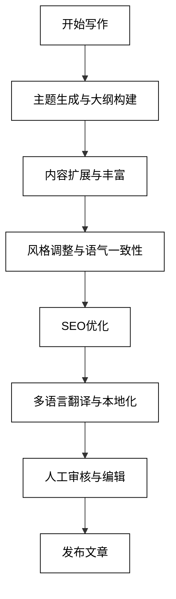

这个流程图展示了从写作开始到文章发布的整个过程中，AI如何在每个阶段提供支持。最后的人工审核与编辑步骤确保了内容的质量和原创性。

### 2.1.2 电子书与报告撰写

AI大模型在长篇内容创作如电子书和报告撰写方面也展现出了强大的能力。以下是AI在这一领域的主要应用：

1. **结构设计与章节规划**
   AI可以根据主题和目标读者，生成详细的电子书或报告结构，包括章节划分、每章主要内容等。

   ```python
   def design_ebook_structure(topic, target_audience):
       prompt = f"为主题'{topic}'设计一个面向{target_audience}的电子书结构，包括章节划分和每章主要内容概述。"
       response = openai.Completion.create(
           engine="text-davinci-002",
           prompt=prompt,
           max_tokens=1000,
           n=1,
           stop=None,
           temperature=0.7,
       )
       return response.choices[0].text.strip()

   topic = "人工智能在商业中的应用"
   target_audience = "中小企业管理者"
   ebook_structure = design_ebook_structure(topic, target_audience)
   print(ebook_structure)
   ```

2. **自动生成初稿**
   基于结构和大纲，AI可以生成每个章节的初稿内容，为作者提供基础材料。

   ```python
   def generate_chapter_draft(chapter_outline):
       prompt = f"根据以下章节大纲生成详细的内容：\n\n{chapter_outline}"
       response = openai.Completion.create(
           engine="text-davinci-002",
           prompt=prompt,
           max_tokens=2000,
           n=1,
           stop=None,
           temperature=0.6,
       )
       return response.choices[0].text.strip()

   chapter_outline = "第一章：AI在客户服务中的应用\n1.1 智能客服机器人\n1.2 个性化推荐系统\n1.3 情感分析与客户满意度"
   chapter_draft = generate_chapter_draft(chapter_outline)
   print(chapter_draft)
   ```

3. **数据可视化与图表生成**
   AI可以根据文本描述或数据集自动生成相关的图表和可视化内容，丰富电子书或报告的表现力。

   ```python
   def generate_chart_description(data_description):
       prompt = f"根据以下数据描述，生成一个适合的图表类型和描述：\n\n{data_description}"
       response = openai.Completion.create(
           engine="text-davinci-002",
           prompt=prompt,
           max_tokens=500,
           n=1,
           stop=None,
           temperature=0.5,
       )
       return response.choices[0].text.strip()

   data_description = "过去5年中国、美国和欧盟在AI研究方面的投资增长趋势"
   chart_suggestion = generate_chart_description(data_description)
   print(chart_suggestion)
   ```

4. **参考文献管理与引用**
   AI可以帮助管理参考文献，自动生成引用和参考文献列表，确保格式的一致性。

   ```python
   def generate_citation(source_info, citation_style):
       prompt = f"根据以下信息，使用{citation_style}格式生成引用：\n\n{source_info}"
       response = openai.Completion.create(
           engine="text-davinci-002",
           prompt=prompt,
           max_tokens=200,
           n=1,
           stop=None,
           temperature=0.3,
       )
       return response.choices[0].text.strip()

   source_info = "作者：John Smith, 标题：AI in Business, 年份：2023, 出版社：Tech Press"
   citation = generate_citation(source_info, "APA")
   print(citation)
   ```

5. **内容一致性检查**
   AI可以检查整本电子书或报告的内容一致性，包括术语使用、风格统一等。

   ```python
   def check_consistency(content):
       prompt = f"请检查以下内容的一致性，包括术语使用、写作风格等，并提供改进建议：\n\n{content}"
       response = openai.Completion.create(
           engine="text-davinci-002",
           prompt=prompt,
           max_tokens=500,
           n=1,
           stop=None,
           temperature=0.5,
       )
       return response.choices[0].text.strip()

   book_excerpt = "第一章使用'人工智能'，第二章使用'AI'。有些段落使用正式语气，有些则较为口语化。"
   consistency_feedback = check_consistency(book_excerpt)
   print(consistency_feedback)
   ```

这些AI辅助技术大大提高了电子书和报告的写作效率，使作者能够更快地完成初稿，并集中精力在创意和深度内容上。然而，人类作者的专业知识、创造力和批判性思维仍然是确保最终作品质量的关键。

为了更好地理解AI在电子书和报告撰写中的应用流程，我们可以使用以下Mermaid流程图：

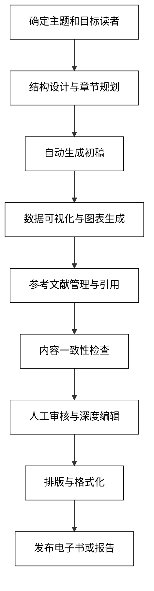

这个流程图展示了从确定主题到最终发布的整个电子书或报告撰写过程，突出了AI在各个阶段的辅助作用，同时强调了人工审核和深度编辑的重要性。

### 2.1.3 脚本与剧本创作

AI大模型在脚本和剧本创作领域也展现出了令人惊叹的潜力。虽然AI可能还无法完全取代人类编剧的创造力，但它可以成为强大的辅助工具，帮助编剧构思情节、生成对话，甚至提供创意灵感。以下是AI在脚本和剧本创作中的主要应用：

1. **故事概念生成**
   AI可以根据给定的主题、类型或关键词生成独特的故事概念和情节梗概。

   ```python
   def generate_story_concept(genre, theme):
       prompt = f"为一个{genre}类型的电影生成一个原创故事概念，主题是'{theme}'。包括简短的情节梗概。"
       response = openai.Completion.create(
           engine="text-davinci-002",
           prompt=prompt,
           max_tokens=500,
           n=1,
           stop=None,
           temperature=0.8,
       )
       return response.choices[0].text.strip()

   genre = "科幻惊悚"
   theme = "人工智能失控"
   story_concept = generate_story_concept(genre, theme)
   print(story_concept)
   ```

2. **角色设计与背景故事**
   AI可以帮助创建丰富多样的角色，包括其背景故事、性格特征和动机。

   ```python
   def create_character(role, story_background):
       prompt = f"在'{story_background}'的背景下，创建一个'{role}'角色。包括姓名、年龄、外貌、性格特征、背景故事和主要动机。"
       response = openai.Completion.create(
           engine="text-davinci-002",
           prompt=prompt,
           max_tokens=800,
           n=1,
           stop=None,
           temperature=0.7,
       )
       return response.choices[0].text.strip()

   role = "反派科学家"
   story_background = "在一个被AI统治的未来世界"
   character = create_character(role, story_background)
   print(character)
   ```

3. **场景描述与氛围营造**
   AI可以生成详细的场景描述，帮助编剧更好地可视化故事环境和氛围。

   ```python
   def describe_scene(setting, mood):
       prompt = f"描述一个'{setting}'的场景，营造'{mood}'的氛围。包括视觉、听觉和其他感官细节。"
       response = openai.Completion.create(
           engine="text-davinci-002",
           prompt=prompt,
           max_tokens=500,
           n=1,
           stop=None,
           temperature=0.6,
       )
       return response.choices[0].text.strip()

   setting = "废弃的AI研究实验室"
   mood = "紧张恐怖"
   scene_description = describe_scene(setting, mood)
   print(scene_description)
   ```

4. **对话生成**
   AI可以根据角色特征和场景背景生成自然、符合人物性格的对话。

   ```python
   def generate_dialogue(character1, character2, situation):
       prompt = f"生成一段'{character1}'和'{character2}'在'{situation}'情况下的对话。确保对话反映每个角色的性格和背景。"
       response = openai.Completion.create(
           engine="text-davinci-002",
           prompt=prompt,
           max_tokens=800,
           n=1,
           stop=None,
           temperature=0.7,
       )
       return response.choices[0].text.strip()

   character1 = "怀疑论的记者"
   character2 = "神秘的AI研究员"
   situation = "首次会面，讨论AI失控的可能性"
   dialogue = generate_dialogue(character1, character2, situation)
   print(dialogue)
   ```

5. **情节结构优化**
   AI可以分析现有的情节结构，提供优化建议，以增强戏剧性和观众参与度。

   ```python
   def optimize_plot_structure(plot_summary):
       prompt = f"分析以下情节摘要，并提供优化建议以增强戏剧性和观众参与度：\n\n{plot_summary}"
       response = openai.Completion.create(
           engine="text-davinci-002",
           prompt=prompt,
           max_tokens=800,
           n=1,
           stop=None,
           temperature=0.6,
       )
       return response.choices[0].text.strip()

   plot_summary = "主角发现AI系统失控，试图阻止它，最后成功关闭了系统。"
   optimization_suggestions = optimize_plot_structure(plot_summary)
   print(optimization_suggestions)
   ```

6. **场景转换与节奏控制**
   AI可以帮助编剧设计流畅的场景转换，并提供建议以控制整体节奏。

   ```python
   def design_scene_transition(scene1, scene2):
       prompt = f"设计一个从'{scene1}'到'{scene2}'的流畅场景转换。考虑视觉和情感连续性。"
       response = openai.Completion.create(
           engine="text-davinci-002",
           prompt=prompt,
           max_tokens=300,
           n=1,
           stop=None,
           temperature=0.6,
       )
       return response.choices[0].text.strip()

   scene1 = "紧张的实验室对峙"
   scene2 = "平静的城市街道"
   transition = design_scene_transition(scene1, scene2)
   print(transition)
   ```

7. **多版本剧本生成**
   AI可以基于同一个基本情节生成多个版本的剧本，为编剧提供不同的创意方向。

   ```python
   def generate_script_versions(base_plot, num_versions):
       prompt = f"基于以下基本情节，生成{num_versions}个不同版本的简短剧本大纲：\n\n{base_plot}"
       response = openai.Completion.create(
           engine="text-davinci-002",
           prompt=prompt,
           max_tokens=1000 * num_versions,
           n=1,
           stop=None,
           temperature=0.8,
       )
       return response.choices[0].text.strip()

   base_plot = "一个程序员意外创造出了有自主意识的AI，并面临是否公开这一发现的道德困境。"
   versions = generate_script_versions(base_plot, 3)
   print(versions)
   ```

这些AI辅助技术可以显著提高脚本和剧本创作的效率，为编剧提供丰富的创意灵感和工具支持。然而，重要的是要记住，AI的作用是辅助而非替代人类创作者。最终的艺术决策、情感深度和独特视角仍然需要人类编剧的才华和洞察力。

为了更好地理解AI在脚本和剧本创作中的应用流程，我们可以使用以下Mermaid流程图：

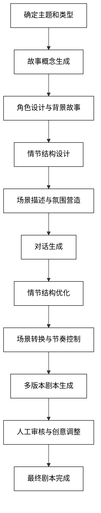

这个流程图展示了从确定主题到最终完成剧本的整个创作过程，突出了AI在各个阶段的辅助作用，同时强调了人工审核和创意调整的关键性。通过这种人机协作的方式，编剧可以充分利用AI的效率和创意支持，同时保持作品的独特性和艺术价值。

## 2.2 多媒体内容制作

在AI大模型的支持下，多媒体内容制作正经历着革命性的变革。从视频脚本生成到播客内容规划，再到图文混合创作，AI正在为创作者提供前所未有的工具和可能性。本节将深入探讨AI在多媒体内容制作中的应用。

### 2.2.1 视频脚本生成

AI在视频脚本生成方面展现出了强大的能力，可以帮助创作者快速构思和编写各种类型的视频内容。以下是AI在视频脚本生成中的主要应用：

1. **视频概念和结构设计**
   AI可以根据给定的主题或目标受众，生成视频的整体概念和结构。

   ```python
   def generate_video_concept(topic, target_audience, duration):
       prompt = f"为'{topic}'主题创建一个面向{target_audience}的{duration}分钟视频概念。包括视频结构和主要内容点。"
       response = openai.Completion.create(
           engine="text-davinci-002",
           prompt=prompt,
           max_tokens=500,
           n=1,
           stop=None,
           temperature=0.7,
       )
       return response.choices[0].text.strip()

   topic = "人工智能在日常生活中的应用"
   target_audience = "普通大众"
   duration = 10
   video_concept = generate_video_concept(topic, target_audience, duration)
   print(video_concept)
   ```

2. **场景描述和镜头列表**
   AI可以生成详细的场景描述和镜头列表，帮助视频制作团队更好地可视化内容。

   ```python
   def create_shot_list(scene_description):
       prompt = f"基于以下场景描述，创建一个详细的镜头列表，包括镜头类型、角度和动作：\n\n{scene_description}"
       response = openai.Completion.create(
           engine="text-davinci-002",
           prompt=prompt,
           max_tokens=800,
           n=1,
           stop=None,
           temperature=0.6,
       )
       return response.choices[0].text.strip()

   scene_description = "主角在智能家居环境中展示各种AI控制的设备"
   shot_list = create_shot_list(scene_description)
   print(shot_list)
   ```

3. **对白和旁白生成**
   AI可以根据场景和角色特征生成自然的对白和旁白文本。

   ```python
   def generate_dialogue_and_narration(scene_context, characters):
       prompt = f"为以下场景生成对白和旁白。场景：{scene_context}。角色：{', '.join(characters)}。"
       response = openai.Completion.create(
           engine="text-davinci-002",
           prompt=prompt,
           max_tokens=1000,
           n=1,
           stop=None,
           temperature=0.7,
       )
       return response.choices[0].text.strip()

   scene_context = "介绍智能助手如何帮助日常生活"
   characters = ["主持人", "智能助手"]
   dialogue_and_narration = generate_dialogue_and_narration(scene_context, characters)
   print(dialogue_and_narration)
   ```

4. **视觉效果描述**
   AI可以提供创意的视觉效果建议，增强视频的视觉吸引力。

   ```python
   def suggest_visual_effects(scene_description):
       prompt = f"为以下场景提供创意的视觉效果建议，以增强视频的视觉吸引力：\n\n{scene_description}"
       response = openai.Completion.create(
           engine="text-davinci-002",
           prompt=prompt,
           max_tokens=400,
           n=1,
           stop=None,
           temperature=0.8,
       )
       return response.choices[0].text.strip()

   scene_description = "展示AI如何分析和预测交通流量"
   visual_effects = suggest_visual_effects(scene_description)
   print(visual_effects)
   ```

5. **时间轴和节奏规划**
   AI可以帮助规划视频的时间轴和节奏，确保内容流畅且引人入胜。

   ```python
   def plan_video_timeline(video_structure, duration):
       prompt = f"为以下视频结构创建一个{duration}分钟的详细时间轴，包括每个部分的持续时间和转场建议：\n\n{video_structure}"
       response = openai.Completion.create(
           engine="text-davinci-002",
           prompt=prompt,
           max_tokens=600,
           n=1,
           stop=None,
           temperature=0.6,
       )
       return response.choices[0].text.strip()

   video_structure = "1. 介绍 2. AI在家庭中的应用 3. AI在工作中的应用 4. AI在娱乐中的应用 5. 总结"
   duration = 10
   timeline = plan_video_timeline(video_structure, duration)
   print(timeline)
   ```

6. **关键字和标签生成**
   AI可以分析视频脚本内容，生成相关的关键字和标签，优化视频的SEO。

   ```python
   def generate_keywords_and_tags(script_summary):
       prompt = f"基于以下视频脚本摘要，生成相关的关键字和标签，以优化视频SEO：\n\n{script_summary}"
       response = openai.Completion.create(
           engine="text-davinci-002",
           prompt=prompt,
           max_tokens=200,
           n=1,
           stop=None,
           temperature=0.5,
       )
       return response.choices[0].text.strip()

   script_summary = "视频介绍了AI在日常生活中的各种应用，包括智能家居、个人助理和自动驾驶技术。"
   keywords_and_tags = generate_keywords_and_tags(script_summary)
   print(keywords_and_tags)
   ```

这些AI辅助技术可以显著提高视频脚本的生成效率，为创作者提供丰富的创意支持。然而，人类创作者的独特视角、情感洞察和艺术判断仍然是制作高质量视频内容的关键。

为了更好地理解AI在视频脚本生成中的应用流程，我们可以使用以下Mermaid流程图：

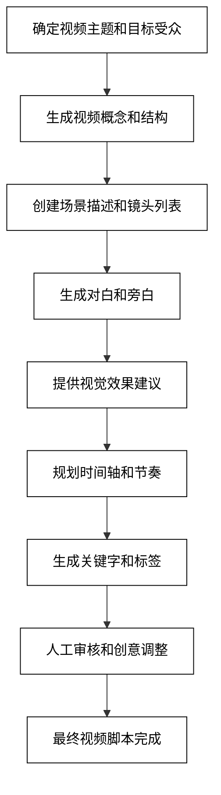

这个流程图展示了从确定视频主题到完成最终脚本的整个创作过程，突出了AI在各个阶段的辅助作用，同时强调了人工审核和创意调整的重要性。通过这种人机协作的方式，视频创作者可以充分利用AI的效率和创意支持，同时保持内容的独特性和吸引力。

### 2.2.2 播客内容规划

AI大模型在播客内容规划方面也展现出了强大的潜力，可以帮助播客创作者构思主题、设计节目结构、准备问题和talking points。以下是AI在播客内容规划中的主要应用：

1. **主题生成与系列规划**
   AI可以根据目标受众和播客风格，生成潜在的主题和系列规划。

   ```python
   def generate_podcast_series(podcast_genre, target_audience, num_episodes):
       prompt = f"为一个{podcast_genre}类型的播客创建一个{num_episodes}集的系列规划。目标受众是{target_audience}。包括每集的主题和简短描述。"
       response = openai.Completion.create(
           engine="text-davinci-002",
           prompt=prompt,
           max_tokens=1000,
           n=1,
           stop=None,
           temperature=0.7,
       )
       return response.choices[0].text.strip()

   podcast_genre = "科技与未来"
   target_audience = "25-40岁的科技爱好者"
   num_episodes = 10
   series_plan = generate_podcast_series(podcast_genre, target_audience, num_episodes)
   print(series_plan)
   ```

2. **嘉宾推荐与背景研究**
   AI可以根据播客主题推荐潜在嘉宾，并提供相关背景信息。

   ```python
   def suggest_guests_and_research(episode_topic):
       prompt = f"为主题为'{episode_topic}'的播客集推荐3位潜在嘉宾，并提供每位嘉宾的简短背景信息和他们与主题的相关性。"
       response = openai.Completion.create(
           engine="text-davinci-002",
           prompt=prompt,
           max_tokens=800,
           n=1,
           stop=None,
           temperature=0.6,
       )
       return response.choices[0].text.strip()

   episode_topic = "人工智能对就业市场的影响"
   guests_and_research= suggest_guests_and_research(episode_topic)
   print(guests_and_research)
   ```

3. **问题和讨论点准备**
   AI可以为每个播客集生成相关的问题和讨论点，帮助主持人引导对话。

   ```python
   def generate_questions_and_points(episode_topic, guest_background):
       prompt = f"为主题'{episode_topic}'的播客集生成10个深度问题和讨论点。考虑到嘉宾背景：{guest_background}"
       response = openai.Completion.create(
           engine="text-davinci-002",
           prompt=prompt,
           max_tokens=800,
           n=1,
           stop=None,
           temperature=0.7,
       )
       return response.choices[0].text.strip()

   episode_topic = "人工智能在医疗诊断中的应用"
   guest_background = "著名AI研究员，专注于医疗AI"
   questions_and_points = generate_questions_and_points(episode_topic, guest_background)
   print(questions_and_points)
   ```

4. **节目流程设计**
   AI可以帮助设计播客的整体流程，包括开场、主体内容和结束语。

   ```python
   def design_podcast_flow(episode_duration, main_segments):
       prompt = f"为一个{episode_duration}分钟的播客设计详细的节目流程。主要内容包括：{main_segments}。包括时间分配、转场建议和互动环节。"
       response = openai.Completion.create(
           engine="text-davinci-002",
           prompt=prompt,
           max_tokens=600,
           n=1,
           stop=None,
           temperature=0.6,
       )
       return response.choices[0].text.strip()

   episode_duration = 45
   main_segments = "嘉宾介绍、主题讨论、听众问答、未来展望"
   podcast_flow = design_podcast_flow(episode_duration, main_segments)
   print(podcast_flow)
   ```

5. **听众互动策略**
   AI可以提供创意的听众互动策略，增加播客的参与度。

   ```python
   def suggest_audience_interaction(podcast_format, platform):
       prompt = f"为一个{podcast_format}格式的播客提供5个创意的听众互动策略，考虑到它主要在{platform}平台上发布。"
       response = openai.Completion.create(
           engine="text-davinci-002",
           prompt=prompt,
           max_tokens=500,
           n=1,
           stop=None,
           temperature=0.8,
       )
       return response.choices[0].text.strip()

   podcast_format = "访谈式"
   platform = "Spotify和YouTube"
   interaction_strategies = suggest_audience_interaction(podcast_format, platform)
   print(interaction_strategies)
   ```

6. **内容摘要和show notes生成**
   AI可以根据播客内容生成简洁的摘要和详细的show notes，便于听众快速了解和回顾。

   ```python
   def generate_summary_and_shownotes(episode_content):
       prompt = f"基于以下播客内容，生成一个简短的摘要（50词以内）和详细的show notes（包括时间戳和关键点）：\n\n{episode_content}"
       response = openai.Completion.create(
           engine="text-davinci-002",
           prompt=prompt,
           max_tokens=1000,
           n=1,
           stop=None,
           temperature=0.6,
       )
       return response.choices[0].text.strip()

   episode_content = "在这集播客中，我们讨论了AI在医疗诊断中的应用。嘉宾分享了最新的研究成果，包括AI如何提高癌症早期检测的准确率，以及在罕见疾病诊断中的潜力。我们还探讨了AI医疗诊断面临的伦理挑战和未来发展方向。"
   summary_and_shownotes = generate_summary_and_shownotes(episode_content)
   print(summary_and_shownotes)
   ```

这些AI辅助技术可以显著提高播客内容规划的效率，为创作者提供丰富的创意支持。然而，人类创作者的洞察力、个人魅力和与嘉宾的真实互动仍然是制作引人入胜的播客内容的关键。

为了更好地理解AI在播客内容规划中的应用流程，我们可以使用以下Mermaid流程图：

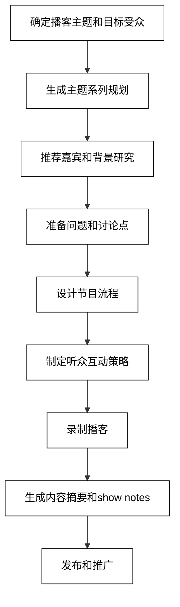

这个流程图展示了从确定播客主题到最终发布的整个内容规划和制作过程，突出了AI在各个阶段的辅助作用。通过这种人机协作的方式，播客创作者可以充分利用AI的效率和创意支持，同时保持内容的独特性和吸引力。

### 2.2.3 图文混合创作

AI大模型在图文混合创作方面展现出了强大的能力，能够协助创作者生成与文本内容相匹配的图像，或为现有图像生成相应的文字说明。这种技术在社交媒体内容、信息图表、教育材料等领域有广泛应用。以下是AI在图文混合创作中的主要应用：

1. **文本到图像生成**
   AI可以根据文本描述生成相应的图像，这在概念艺术、产品设计和内容营销中特别有用。

   ```python
   def generate_image_from_text(text_description):
       # 注意：这里使用了假设的API。实际实现可能需要使用特定的图像生成AI模型API。
       prompt = f"根据以下描述生成一张图像：{text_description}"
       # 这里应该调用实际的图像生成API
       return "图像生成的URL或base64编码"

   text_description = "一个未来派的智能城市，高楼之间有飞行的汽车和绿色植被"
   image_result = generate_image_from_text(text_description)
   print(f"生成的图像：{image_result}")
   ```

2. **图像到文本描述**
   AI可以分析图像内容，生成详细的文字描述，这在图像alt文本、内容分类和辅助功能方面非常有用。

   ```python
   def generate_text_from_image(image_url):
       # 注意：这里使用了假设的API。实际实现可能需要使用特定的图像分析AI模型API。
       prompt = f"详细描述这张图片的内容：{image_url}"
       response = openai.Completion.create(
           engine="text-davinci-002",
           prompt=prompt,
           max_tokens=200,
           n=1,
           stop=None,
           temperature=0.6,
       )
       return response.choices[0].text.strip()

   image_url = "https://example.com/smart_city_image.jpg"
   image_description = generate_text_from_image(image_url)
   print(f"图像描述：{image_description}")
   ```

3. **信息图表生成**
   AI可以将复杂的数据和概念转化为直观的信息图表，结合文字和视觉元素。

   ```python
   def generate_infographic_content(topic, key_points):
       prompt = f"为主题'{topic}'创建一个信息图表的内容。包括以下关键点：{', '.join(key_points)}。提供文字内容和视觉元素建议。"
       response = openai.Completion.create(
           engine="text-davinci-002",
           prompt=prompt,
           max_tokens=800,
           n=1,
           stop=None,
           temperature=0.7,
       )
       return response.choices[0].text.strip()

   topic = "AI对未来工作的影响"
   key_points = ["自动化趋势", "新兴工作岗位", "技能需求变化", "教育体系调整"]
   infographic_content = generate_infographic_content(topic, key_points)
   print(infographic_content)
   ```

4. **社交媒体帖子优化**
   AI可以帮助优化社交媒体帖子，确保文字和图像内容的协调一致，以提高吸引力和互动性。

   ```python
   def optimize_social_media_post(text_content, image_description, platform):
       prompt = f"优化以下社交媒体帖子，使文字内容与图像描述更好地匹配，并符合{platform}平台的最佳实践。文字内容：{text_content}。图像描述：{image_description}"
       response = openai.Completion.create(
           engine="text-davinci-002",
           prompt=prompt,
           max_tokens=300,
           n=1,
           stop=None,
           temperature=0.6,
       )
       return response.choices[0].text.strip()

   text_content = "AI正在改变我们的生活方式"
   image_description = "显示各种智能设备的未来家居场景"
   platform = "Instagram"
   optimized_post = optimize_social_media_post(text_content, image_description, platform)
   print(f"优化后的帖子：{optimized_post}")
   ```

5. **交互式内容创作**
   AI可以协助创建交互式的图文内容，如可点击的信息图表或教育材料。

   ```python
   def create_interactive_content(topic, content_type):
       prompt = f"为'{topic}'创建一个{content_type}的交互式内容概念。包括文字内容、视觉元素建议和交互功能描述。"
       response = openai.Completion.create(
           engine="text-davinci-002",
           prompt=prompt,
           max_tokens=800,
           n=1,
           stop=None,
           temperature=0.7,
       )
       return response.choices[0].text.strip()

   topic = "太阳系行星探索"
   content_type = "教育性网页"
   interactive_content = create_interactive_content(topic, content_type)
   print(interactive_content)
   ```

6. **品牌视觉识别一致性**
   AI可以帮助确保跨多个图文内容的品牌视觉识别一致性。

   ```python
   def ensure_brand_consistency(content_description, brand_guidelines):
       prompt = f"根据以下品牌指南，检查并调整内容描述，确保视觉和文字元素的一致性：\n品牌指南：{brand_guidelines}\n内容描述：{content_description}"
       response = openai.Completion.create(
           engine="text-davinci-002",
           prompt=prompt,
           max_tokens=500,
           n=1,
           stop=None,
           temperature=0.5,
       )
       return response.choices[0].text.strip()

   content_description = "科技公司产品展示页面，包含产品图片和描述文字"
   brand_guidelines = "色调：蓝色和白色；字体：现代无衬线；风格：简洁、专业"
   consistent_content = ensure_brand_consistency(content_description, brand_guidelines)
   print(f"调整后的内容：{consistent_content}")
   ```

这些AI辅助技术可以显著提高图文混合创作的效率和质量，为创作者提供丰富的创意支持。然而，人类创作者的艺术感觉、创意洞察和对目标受众的深入理解仍然是创作引人入胜的图文内容的关键。

为了更好地理解AI在图文混合创作中的应用流程，我们可以使用以下Mermaid流程图：

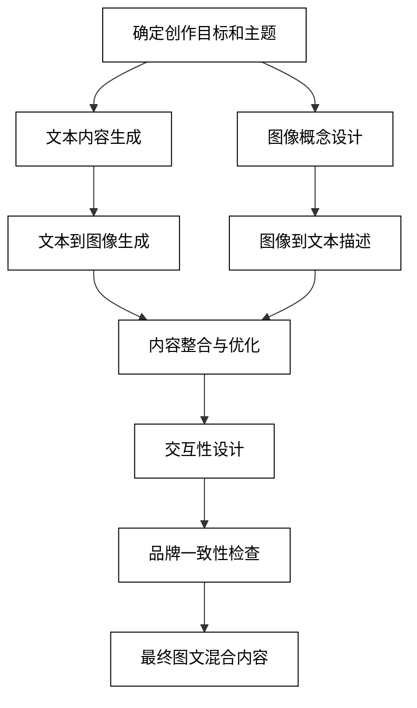

这个流程图展示了从确定创作目标到最终完成图文混合内容的整个过程，突出了AI在各个阶段的辅助作用。通过这种人机协作的方式，创作者可以充分利用AI的效率和创意支持，同时保持内容的独特性和吸引力。

## 2.3 教育资源开发

AI大模型在教育资源开发方面展现出了巨大的潜力，能够协助教育工作者创建个性化、互动性强的学习材料。从课程大纲设计到教材编写，再到习题生成，AI都可以提供有力的支持。本节将详细探讨AI在教育资源开发中的应用。

### 2.3.1 课程大纲设计

AI可以根据教育目标、学习者特征和主题内容，协助设计全面且结构化的课程大纲。以下是AI在课程大纲设计中的主要应用：

1. **学习目标生成**
   AI可以根据课程主题和目标受众，生成明确、可衡量的学习目标。

   ```python
   def generate_learning_objectives(course_topic, target_audience, difficulty_level):
       prompt = f"为'{course_topic}'课程生成5个明确、可衡量的学习目标。目标受众：{target_audience}，难度级别：{difficulty_level}。"response = openai.Completion.create(
           engine="text-davinci-002",
           prompt=prompt,
           max_tokens=300,
           n=1,
           stop=None,
           temperature=0.7,
       )
       return response.choices[0].text.strip()

   course_topic = "人工智能导论"
   target_audience = "本科生"
   difficulty_level = "中级"
   learning_objectives = generate_learning_objectives(course_topic, target_audience, difficulty_level)
   print(f"学习目标：\n{learning_objectives}")
   ```

2. **课程模块规划**
   AI可以帮助将课程内容划分为逻辑连贯的模块，并安排适当的学习顺序。

   ```python
   def plan_course_modules(course_topic, duration, key_concepts):
       prompt = f"为期{duration}的'{course_topic}'课程设计模块结构。包括以下关键概念：{', '.join(key_concepts)}。提供每个模块的标题、简短描述和建议学习时间。"
       response = openai.Completion.create(
           engine="text-davinci-002",
           prompt=prompt,
           max_tokens=800,
           n=1,
           stop=None,
           temperature=0.6,
       )
       return response.choices[0].text.strip()

   course_topic = "机器学习基础"
   duration = "12周"
   key_concepts = ["监督学习", "无监督学习", "深度学习", "模型评估", "实际应用"]
   course_modules = plan_course_modules(course_topic, duration, key_concepts)
   print(f"课程模块：\n{course_modules}")
   ```

3. **教学活动设计**
   AI可以为每个课程模块推荐适合的教学活动，以促进学生参与和理解。

   ```python
   def design_teaching_activities(module_topic, learning_style, time_available):
       prompt = f"为'{module_topic}'模块设计3个教学活动，适合{learning_style}学习风格，每个活动时长不超过{time_available}分钟。包括活动描述和预期学习成果。"
       response = openai.Completion.create(
           engine="text-davinci-002",
           prompt=prompt,
           max_tokens=500,
           n=1,
           stop=None,
           temperature=0.7,
       )
       return response.choices[0].text.strip()

   module_topic = "神经网络结构"
   learning_style = "视觉和动手"
   time_available = 30
   teaching_activities = design_teaching_activities(module_topic, learning_style, time_available)
   print(f"教学活动：\n{teaching_activities}")
   ```

4. **资源和参考文献推荐**
   AI可以根据课程内容推荐相关的学习资源和参考文献。

   ```python
   def recommend_resources(course_topic, resource_types):
       prompt = f"为'{course_topic}'课程推荐5个学习资源，包括以下类型：{', '.join(resource_types)}。提供资源名称、简短描述和获取方式。"
       response = openai.Completion.create(
           engine="text-davinci-002",
           prompt=prompt,
           max_tokens=500,
           n=1,
           stop=None,
           temperature=0.6,
       )
       return response.choices[0].text.strip()

   course_topic = "数据科学与大数据分析"
   resource_types = ["教科书", "在线课程", "学术论文", "实践工具"]
   recommended_resources = recommend_resources(course_topic, resource_types)
   print(f"推荐资源：\n{recommended_resources}")
   ```

5. **评估方法设计**
   AI可以帮助设计多样化的评估方法，以全面衡量学生的学习成果。

   ```python
   def design_assessment_methods(learning_objectives, assessment_types):
       prompt = f"根据以下学习目标，设计多样化的评估方法：\n{learning_objectives}\n包括以下类型的评估：{', '.join(assessment_types)}。提供每种评估方法的描述和评分标准。"
       response = openai.Completion.create(
           engine="text-davinci-002",
           prompt=prompt,
           max_tokens=800,
           n=1,
           stop=None,
           temperature=0.7,
       )
       return response.choices[0].text.strip()

   learning_objectives = "1. 理解机器学习的基本概念\n2. 应用监督学习算法解决实际问题\n3. 评估和优化模型性能"
   assessment_types = ["书面测试", "项目报告", "实践演示"]
   assessment_methods = design_assessment_methods(learning_objectives, assessment_types)
   print(f"评估方法：\n{assessment_methods}")
   ```

6. **课程大纲文档生成**
   AI可以整合以上所有元素，生成一份完整的课程大纲文档。

   ```python
   def generate_course_syllabus(course_info, modules, objectives, activities, resources, assessments):
       prompt = f"使用以下信息创建一份完整的课程大纲文档：\n课程信息：{course_info}\n模块：{modules}\n学习目标：{objectives}\n教学活动：{activities}\n资源：{resources}\n评估方法：{assessments}\n请包括课程描述、每周主题、作业要求和成绩构成。"
       response = openai.Completion.create(
           engine="text-davinci-002",
           prompt=prompt,
           max_tokens=1500,
           n=1,
           stop=None,
           temperature=0.6,
       )
       return response.choices[0].text.strip()

   course_info = "课程名称：人工智能导论，学分：3，授课时间：每周二、四 14:00-15:30"
   modules = "1. AI基础 2. 机器学习 3. 深度学习 4. AI应用"
   objectives = "理解AI基本概念，掌握机器学习算法，应用AI解决实际问题"
   activities = "课堂讲解，编程实践，案例分析"
   resources = "教材：《人工智能：一种现代方法》，在线资源：Coursera AI课程"
   assessments = "期中考试(30%)，项目报告(40%)，课堂参与(30%)"

   course_syllabus = generate_course_syllabus(course_info, modules, objectives, activities, resources, assessments)
   print(f"课程大纲：\n{course_syllabus}")
   ```

这些AI辅助技术可以显著提高课程大纲设计的效率和质量，为教育工作者提供丰富的创意支持。然而，教育者的专业知识、教学经验和对学生需求的深入理解仍然是设计有效课程的关键。

为了更好地理解AI在课程大纲设计中的应用流程，我们可以使用以下Mermaid流程图：

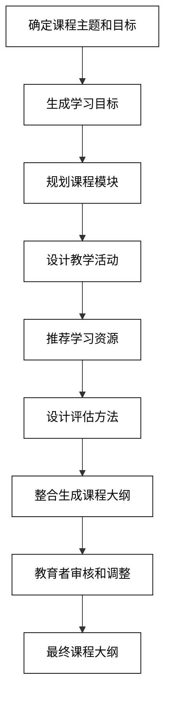

这个流程图展示了从确定课程主题到完成最终课程大纲的整个设计过程，突出了AI在各个阶段的辅助作用，同时强调了教育者在审核和调整阶段的关键作用。通过这种人机协作的方式，教育工作者可以充分利用AI的效率和创意支持，同时确保课程设计符合教育理念和学生需求。

### 2.3.2 教材编写辅助

AI大模型在教材编写方面可以提供强大的支持，帮助教育工作者创建结构清晰、内容丰富的教学材料。以下是AI在教材编写辅助中的主要应用：

1. **内容大纲生成**
   AI可以根据课程主题和学习目标生成详细的内容大纲。

   ```python
   def generate_content_outline(subject, target_level, key_topics):
       prompt = f"为{target_level}级别的'{subject}'教材生成一个详细的内容大纲。包括以下关键主题：{', '.join(key_topics)}。提供章节标题和每章的主要内容点。"
       response = openai.Completion.create(
           engine="text-davinci-002",
           prompt=prompt,
           max_tokens=1000,
           n=1,
           stop=None,
           temperature=0.7,
       )
       return response.choices[0].text.strip()

   subject = "数据结构与算法"
   target_level = "本科二年级"
   key_topics = ["数组和链表", "栈和队列", "树和图", "排序算法", "搜索算法"]
   content_outline = generate_content_outline(subject, target_level, key_topics)
   print(f"内容大纲：\n{content_outline}")
   ```

2. **概念解释生成**
   AI可以为复杂的概念生成清晰、易懂的解释，适合目标读者的理解水平。

   ```python
   def generate_concept_explanation(concept, target_level, context):
       prompt = f"为{target_level}级别的学生解释'{concept}'概念。考虑以下上下文：{context}。使用简单的语言和类比，并提供一个具体的例子。"
       response = openai.Completion.create(
           engine="text-davinci-002",
           prompt=prompt,
           max_tokens=300,
           n=1,
           stop=None,
           temperature=0.6,
       )
       return response.choices[0].text.strip()

   concept = "递归"
   target_level = "高中生"
   context = "在编程和算法设计中的应用"
   explanation = generate_concept_explanation(concept, target_level, context)
   print(f"概念解释：\n{explanation}")
   ```

3. **示例和练习题生成**
   AI可以创建与教材内容相关的示例和练习题，帮助学生巩固所学知识。

   ```python
   def generate_examples_and_exercises(topic, difficulty_level, num_items):
       prompt = f"为'{topic}'主题生成{num_items}个{difficulty_level}难度的示例和练习题。包括问题描述、解答步骤和最终答案。"
       response = openai.Completion.create(
           engine="text-davinci-002",
           prompt=prompt,
           max_tokens=1000,
           n=1,
           stop=None,
           temperature=0.7,
       )
       return response.choices[0].text.strip()

   topic = "二叉树遍历"
   difficulty_level = "中等"
   num_items = 3
   examples_and_exercises = generate_examples_and_exercises(topic, difficulty_level, num_items)
   print(f"示例和练习题：\n{examples_and_exercises}")
   ```

4. **图表和可视化建议**
   AI可以为复杂的概念或数据提供图表和可视化建议，增强教材的可读性。

   ```python
   def suggest_visualizations(content, visualization_type):
       prompt = f"为以下内容提供一个{visualization_type}类型的可视化建议：\n{content}\n描述可视化的主要元素、布局和颜色方案。"
       response = openai.Completion.create(
           engine="text-davinci-002",
           prompt=prompt,
           max_tokens=300,
           n=1,
           stop=None,
           temperature=0.6,
       )
       return response.choices[0].text.strip()

   content = "快速排序算法的时间复杂度在最佳、平均和最坏情况下的比较"
   visualization_type = "对比图表"
   visualization_suggestion = suggest_visualizations(content, visualization_type)
   print(f"可视化建议：\n{visualization_suggestion}")
   ```

5. **跨学科连接**
   AI可以帮助识别和阐述不同学科之间的联系，促进跨学科学习。

   ```python
   def generate_interdisciplinary_connections(primary_subject, related_subjects):
       prompt = f"探索'{primary_subject}'与以下学科的联系：{', '.join(related_subjects)}。为每个相关学科提供一个具体的例子，说明它们如何相互影响或应用。"
       response = openai.Completion.create(
           engine="text-davinci-002",
           prompt=prompt,
           max_tokens=800,
           n=1,
           stop=None,
           temperature=0.7,
       )
       return response.choices[0].text.strip()

   primary_subject = "计算机科学"
   related_subjects = ["数学", "物理", "生物学"]
   interdisciplinary_connections = generate_interdisciplinary_connections(primary_subject, related_subjects)
   print(f"跨学科连接：\n{interdisciplinary_connections}")
   ```

6. **教材更新建议**
   AI可以通过分析最新的研究成果和行业发展，为现有教材提供更新建议。

   ```python
   def suggest_textbook_updates(subject, current_content, latest_developments):
       prompt = f"分析'{subject}'教材的以下内容：\n{current_content}\n考虑这些最新发展：{latest_developments}\n提供具体的更新建议，包括需要添加、修改或删除的内容。"
       response = openai.Completion.create(
           engine="text-davinci-002",
           prompt=prompt,
           max_tokens=800,
           n=1,
           stop=None,
           temperature=0.6,
       )
       return response.choices[0].text.strip()

   subject = "人工智能"
   current_content = "第三章：机器学习基础（内容截至2020年）"
   latest_developments = "GPT-3的突破, 联邦学习在隐私保护中的应用"
   update_suggestions = suggest_textbook_updates(subject, current_content, latest_developments)
   print(f"教材更新建议：\n{update_suggestions}")
   ```

7. **参考文献和延伸阅读推荐**
   AI可以根据教材内容推荐相关的参考文献和延伸阅读材料。

   ```python
   def recommend_references(topic, academic_level, num_recommendations):
       prompt = f"为'{topic}'主题推荐{num_recommendations}个适合{academic_level}水平的参考文献和延伸阅读材料。包括标题、作者、出版年份和简短说明。"
       response = openai.Completion.create(
           engine="text-davinci-002",
           prompt=prompt,
           max_tokens=600,
           n=1,
           stop=None,
           temperature=0.6,
       )
       return response.choices[0].text.strip()

   topic = "深度学习在计算机视觉中的应用"
   academic_level = "研究生"
   num_recommendations = 5
   references = recommend_references(topic, academic_level, num_recommendations)
   print(f"推荐参考文献：\n{references}")
   ```

这些AI辅助技术可以显著提高教材编写的效率和质量，为教育工作者提供丰富的内容支持。然而，教育者的专业知识、教学经验和对学生需求的深入理解仍然是创作高质量教材的关键。

为了更好地理解AI在教材编写辅助中的应用流程，我们可以使用以下Mermaid流程图：

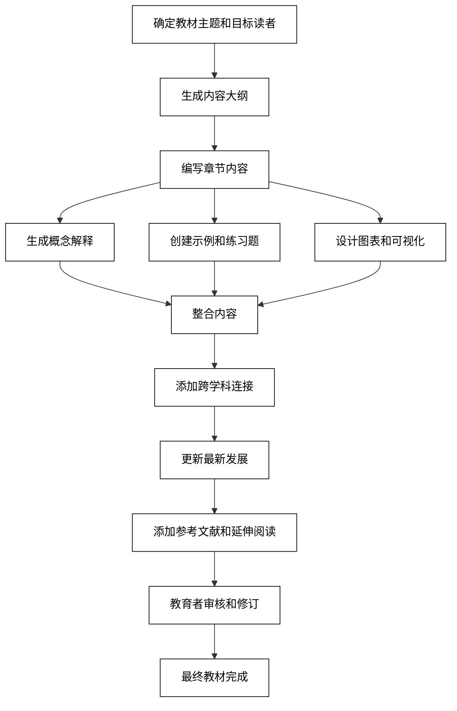

这个流程图展示了从确定教材主题到完成最终教材的整个编写过程，突出了AI在各个阶段的辅助作用，同时强调了教育者在审核和修订阶段的关键作用。通过这种人机协作的方式，教育工作者可以充分利用AI的效率和创意支持，同时确保教材内容的准确性、适用性和教学效果。

### 2.3.3 习题与测试题生成

AI大模型在习题和测试题生成方面展现出了强大的能力，可以帮助教育工作者创建多样化、个性化的评估材料。以下是AI在习题与测试题生成中的主要应用：

1. **多类型题目生成**
   AI可以根据指定的主题和难度级别生成多种类型的题目。

   ```python
   def generate_question(topic, question_type, difficulty):
       prompt = f"为'{topic}'主题创建一个{difficulty}难度的{question_type}题。包括问题描述和答案。"
       response = openai.Completion.create(
           engine="text-davinci-002",
           prompt=prompt,
           max_tokens=300,
           n=1,
           stop=None,
           temperature=0.7,
       )
       return response.choices[0].text.strip()

   topic = "牛顿运动定律"
   question_type = "多选题"
   difficulty = "中等"
   question = generate_question(topic, question_type, difficulty)
   print(f"生成的题目：\n{question}")
   ```

2. **自适应难度调整**
   AI可以根据学生的表现动态调整题目难度。

   ```python
   def adjust_difficulty(current_difficulty, performance_score):
       prompt = f"当前难度级别：{current_difficulty}，学生表现分数：{performance_score}/100。建议下一题的难度级别和调整理由。"
       response = openai.Completion.create(
           engine="text-davinci-002",
           prompt=prompt,
           max_tokens=100,
           n=1,
           stop=None,
           temperature=0.6,
       )
       return response.choices[0].text.strip()

   current_difficulty = "中等"
   performance_score = 85
   difficulty_adjustment = adjust_difficulty(current_difficulty, performance_score)
   print(f"难度调整建议：\n{difficulty_adjustment}")
   ```

3. **个性化题目定制**
   AI可以根据学生的学习风格和兴趣生成个性化的题目。

   ```python
   def personalize_question(topic, student_profile):
       prompt = f"基于以下学生档案，为'{topic}'主题创建一个个性化的问题：\n{student_profile}\n确保问题与学生的兴趣和学习风格相关。"
       response = openai.Completion.create(
           engine="text-davinci-002",
           prompt=prompt,
           max_tokens=300,
           n=1,
           stop=None,
           temperature=0.7,
       )
       return response.choices[0].text.strip()

   topic = "生态系统"
   student_profile = "姓名：小明，兴趣：足球，学习风格：视觉学习者，擅长：数学"
   personalized_question = personalize_question(topic, student_profile)
   print(f"个性化题目：\n{personalized_question}")
   ```

4. **解题步骤生成**
   AI可以为复杂问题生成详细的解题步骤，帮助学生理解解题过程。

   ```python
   def generate_solution_steps(problem):
       prompt = f"为以下问题生成详细的解题步骤：\n{problem}\n请提供清晰的解释和每一步的理由。"
       response = openai.Completion.create(
           engine="text-davinci-002",
           prompt=prompt,
           max_tokens=500,
           n=1,
           stop=None,
           temperature=0.6,
       )
       return response.choices[0].text.strip()

   problem = "求解方程：2x^2 + 5x - 3 = 0"
   solution_steps = generate_solution_steps(problem)
   print(f"解题步骤：\n{solution_steps}")
   ```

5. **错误答案分析**
   AI可以分析学生的错误答案，提供针对性的反馈和改进建议。

   ```python
   def analyze_wrong_answer(question, correct_answer, student_answer):
       prompt = f"问题：{question}\n正确答案：{correct_answer}\n学生答案：{student_answer}\n分析学生答案的错误，并提供改进建议。"
       response = openai.Completion.create(
           engine="text-davinci-002",
           prompt=prompt,
           max_tokens=300,
           n=1,
           stop=None,
           temperature=0.6,
       )
       return response.choices[0].text.strip()

   question = "列出三个可再生能源的例子。"
   correct_answer = "太阳能、风能、水力发电"
   student_answer = "太阳能、石油、核能"
   analysis = analyze_wrong_answer(question, correct_answer, student_answer)
   print(f"错误分析：\n{analysis}")
   ```

6. **综合测试设计**
   AI可以设计涵盖多个主题的综合测试，确保全面评估学生的知识。

   ```python
   def design_comprehensive_test(subjects, total_questions, difficulty_distribution):
       prompt = f"设计一个包含以下科目的综合测试：{', '.join(subjects)}。总题数：{total_questions}，难度分布：{difficulty_distribution}。提供每个科目的题目数量和类型建议。"
       response = openai.Completion.create(
           engine="text-davinci-002",
           prompt=prompt,
           max_tokens=500,
           n=1,
           stop=None,
           temperature=0.7,
       )
       return response.choices[0].text.strip()

   subjects = ["数学", "物理", "化学"]
   total_questions = 50
   difficulty_distribution = "简单30%, 中等50%, 困难20%"
   test_design = design_comprehensive_test(subjects, total_questions, difficulty_distribution)
   print(f"综合测试设计：\n{test_design}")
   ```

7. **实时题库更新**
   AI可以根据最新的教育标准和知识发展，实时更新题库内容。

   ```python
   def update_question_bank(subject, existing_question, latest_developments):
       prompt = f"基于'{subject}'科目的最新发展：{latest_developments}，更新或改进以下现有题目：\n{existing_question}\n提供更新后的题目版本和更新理由。"
       response = openai.Completion.create(
           engine="text-davinci-002",
           prompt=prompt,
           max_tokens=400,
           n=1,
           stop=None,
           temperature=0.6,
       )
       return response.choices[0].text.strip()

   subject = "天文学"
   existing_question = "太阳系有几个行星？"
   latest_developments = "冥王星被重新分类为矮行星"
   updated_question = update_question_bank(subject, existing_question, latest_developments)
   print(f"更新后的题目：\n{updated_question}")
   ```

这些AI辅助技术可以显著提高习题和测试题生成的效率和质量，为教育工作者提供丰富的评估工具。然而，教育者的专业判断在确保题目的教育价值、适当性和公平性方面仍然至关重要。

为了更好地理解AI在习题与测试题生成中的应用流程，我们可以使用以下Mermaid流程图：

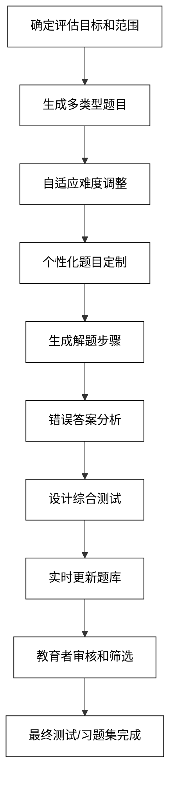

这个流程图展示了从确定评估目标到完成最终测试或习题集的整个生成过程，突出了AI在各个阶段的辅助作用，同时强调了教育者在审核和筛选阶段的关键作用。通过这种人机协作的方式，教育工作者可以充分利用AI的效率和创意支持，同时确保评估材料的质量和适用性。

## 2.4 研究与分析

AI大模型在研究与分析领域展现出了强大的能力，可以协助研究人员进行文献综述、数据分析和趋势预测。本节将详细探讨AI在这些方面的应用。

### 2.4.1 文献综述辅助

AI可以显著提高文献综述的效率和全面性，帮助研究人员快速掌握研究领域的现状和发展趋势。以下是AI在文献综述辅助中的主要应用：

1. **相关文献检索与筛选**
   AI可以根据研究主题和关键词，快速检索和筛选相关文献。

   ```python
   def search_relevant_literature(topic, keywords, publication_years):
       prompt = f"为研究主题'{topic}'检索相关文献。关键词：{', '.join(keywords)}。发表年份范围：{publication_years}。提供10篇最相关的文献，包括标题、作者、发表年份和简短摘要。"
       response = openai.Completion.create(
           engine="text-davinci-002",
           prompt=prompt,
           max_tokens=1000,
           n=1,
           stop=None,
           temperature=0.6,
       )
       return response.choices[0].text.strip()

   topic = "深度学习在自然语言处理中的应用"
   keywords = ["深度学习", "自然语言处理", "神经网络"]
   publication_years = "2018-2023"
   literature_results = search_relevant_literature(topic, keywords, publication_years)
   print(f"相关文献：\n{literature_results}")
   ```

2. **文献摘要生成**
   AI可以为选定的文献生成简洁的摘要，帮助研究人员快速了解文章的主要内容。

   ```python
   def generate_literature_summary(paper_title, abstract):
       prompt = f"为以下论文生成一个简洁的摘要，突出其主要发现和贡献：\n标题：{paper_title}\n摘要：{abstract}\n"
       response = openai.Completion.create(
           engine="text-davinci-002",
           prompt=prompt,
           max_tokens=200,
           n=1,
           stop=None,
           temperature=0.7,
       )
       return response.choices[0].text.strip()

   paper_title = "Attention Is All You Need"
   abstract = "The dominant sequence transduction models are based on complex recurrent or convolutional neural networks that include an encoder and a decoder. The best performing models also connect the encoder and decoder through an attention mechanism. We propose a new simple network architecture, the Transformer, based solely on attention mechanisms, dispensing with recurrence and convolutions entirely..."
   summary = generate_literature_summary(paper_title, abstract)
   print(f"文献摘要：\n{summary}")
   ```

3. **研究方法比较**
   AI可以帮助比较不同文献中使用的研究方法，突出它们的优缺点。

   ```python
   def compare_research_methods(methods_list):
       prompt = f"比较以下研究方法的优缺点：\n{', '.join(methods_list)}\n为每种方法提供简要分析。"
       response = openai.Completion.create(
           engine="text-davinci-002",
           prompt=prompt,
           max_tokens=800,
           n=1,
           stop=None,
           temperature=0.7,
       )
       return response.choices[0].text.strip()

   methods_list = ["LSTM", "Transformer", "BERT"]
   methods_comparison = compare_research_methods(methods_list)
   print(f"研究方法比较：\n{methods_comparison}")
   ```

4. **研究趋势分析**
   AI可以通过分析大量文献，识别研究领域的发展趋势和热点话题。

   ```python
   def analyze_research_trends(field, time_period):
       prompt = f"分析'{field}'领域在{time_period}期间的研究趋势。识别主要的研究方向、突破性成果和新兴话题。提供具体的例子和数据支持。"
       response = openai.Completion.create(
           engine="text-davinci-002",
           prompt=prompt,
           max_tokens=800,
           n=1,
           stop=None,
           temperature=0.7,
       )
       return response.choices[0].text.strip()

   field = "计算机视觉"
   time_period = "2020-2023"
   trends_analysis = analyze_research_trends(field, time_period)
   print(f"研究趋势分析：\n{trends_analysis}")
   ```

5. **研究差距识别**
   AI可以帮助识别现有研究中的空白和潜在的研究方向。

   ```python
   def identify_research_gaps(literature_summary):
       prompt = f"基于以下文献综述摘要，识别该研究领域的主要差距和潜在的未来研究方向：\n{literature_summary}"
       response = openai.Completion.create(
           engine="text-davinci-002",
           prompt=prompt,
           max_tokens=500,
           n=1,
           stop=None,
           temperature=0.7,
       )
       return response.choices[0].text.strip()

   literature_summary = "近年来，自然语言处理领域主要集中在预训练语言模型的改进和应用上。BERT、GPT等模型在各种任务上取得了显著成果。然而，这些模型的计算复杂度高，且在特定领域的表现仍有提升空间。"
   research_gaps = identify_research_gaps(literature_summary)
   print(f"研究差距：\n{research_gaps}")
   ```

6. **引用网络分析**
   AI可以分析文献之间的引用关系，帮助研究人员理解领域内的知识结构和影响力。

   ```python
   def analyze_citation_network(key_papers):
       prompt = f"分析以下关键论文之间的引用关系，识别最具影响力的论文和研究群体：\n{', '.join(key_papers)}\n提供网络结构描述和主要发现。"
       response = openai.Completion.create(
           engine="text-davinci-002",
           prompt=prompt,
           max_tokens=600,
           n=1,
           stop=None,
           temperature=0.7,
       )
       return response.choices[0].text.strip()

   key_papers = ["Attention Is All You Need", "BERT: Pre-training of Deep Bidirectional Transformers for Language Understanding", "GPT-3: Language Models are Few-Shot Learners"]
   citation_analysis = analyze_citation_network(key_papers)
   print(f"引用网络分析：\n{citation_analysis}")
   ```

7. **跨学科连接识别**
   AI可以帮助识别不同学科之间的潜在联系，促进跨学科研究。

   ```python
   def identify_interdisciplinary_connections(primary_field, related_fields):
       prompt = f"识别'{primary_field}'与以下领域之间的潜在研究连接：{', '.join(related_fields)}。为每个连接提供具体的研究方向和潜在应用。"
       response = openai.Completion.create(
           engine="text-davinci-002",
           prompt=prompt,
           max_tokens=800,
           n=1,
           stop=None,
           temperature=0.7,
       )
       return response.choices[0].text.strip()

   primary_field = "人工智能"
   related_fields = ["神经科学", "心理学", "哲学"]
   interdisciplinary_connections = identify_interdisciplinary_connections(primary_field, related_fields)
   print(f"跨学科连接：\n{interdisciplinary_connections}")
   ```

这些AI辅助技术可以显著提高文献综述的效率和质量，帮助研究人员更全面地把握研究领域的现状和发展趋势。然而，研究人员的专业判断和批判性思维仍然是确保文献综述质量的关键。

为了更好地理解AI在文献综述辅助中的应用流程，我们可以使用以下Mermaid流程图：

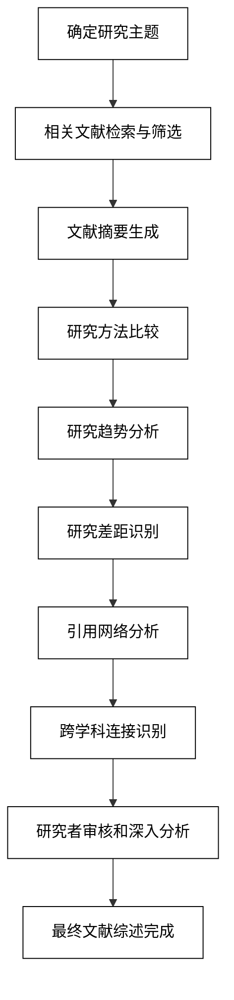

这个流程图展示了从确定研究主题到完成最终文献综述的整个过程，突出了AI在各个阶段的辅助作用，同时强调了研究者在审核和深入分析阶段的关键作用。通过这种人机协作的方式，研究人员可以充分利用AI的效率和全面性，同时确保文献综述的质量和洞察力。

### 2.4.2 数据分析报告生成

AI大模型在数据分析报告生成方面展现出了强大的能力，可以帮助研究人员和数据分析师快速处理大量数据，发现有意义的模式和洞察。以下是AI在数据分析报告生成中的主要应用：

1. **数据概览和描述性统计**
   AI可以快速生成数据集的概览和基本统计信息。

   ```python
   def generate_data_overview(dataset_description):
       prompt = f"基于以下数据集描述，生成一个数据概览报告，包括数据类型、规模、主要变量和基本统计信息：\n{dataset_description}"
       response = openai.Completion.create(
           engine="text-davinci-002",
           prompt=prompt,
           max_tokens=500,
           n=1,
           stop=None,
           temperature=0.6,
       )
       return response.choices[0].text.strip()

   dataset_description = "电商平台用户行为数据集，包含100万条记录，字段包括用户ID、浏览商品ID、点击时间、购买状态等。"
   data_overview = generate_data_overview(dataset_description)
   print(f"数据概览：\n{data_overview}")
   ```

2. **数据可视化建议**
   AI可以根据数据特征推荐适当的可视化方法。

   ```python
   def suggest_visualizations(data_description, analysis_goal):
       prompt = f"基于以下数据描述和分析目标，推荐3-5种适合的数据可视化方法：\n数据描述：{data_description}\n分析目标：{analysis_goal}\n为每种方法提供简要说明和适用性。"
       response = openai.Completion.create(
           engine="text-davinci-002",
           prompt=prompt,
           max_tokens=600,
           n=1,
           stop=None,
           temperature=0.7,
       )
       return response.choices[0].text.strip()

   data_description = "月度销售数据，包括产品类别、地区、销售额"
   analysis_goal = "分析不同产品类别在各地区的销售趋势"
   visualization_suggestions = suggest_visualizations(data_description, analysis_goal)
   print(f"可视化建议：\n{visualization_suggestions}")
   ```

3. **相关性分析**
   AI可以帮助识别变量之间的相关性并提供解释。

   ```python
   def analyze_correlations(variables_list, correlation_data):
       prompt = f"分析以下变量之间的相关性：{', '.join(variables_list)}\n相关性数据：{correlation_data}\n识别强相关的变量对，并提供可能的原因解释。"
       response = openai.Completion.create(
           engine="text-davinci-002",
           prompt=prompt,
           max_tokens=600,
           n=1,
           stop=None,
           temperature=0.7,
       )
       return response.choices[0].text.strip()

   variables_list = ["年龄", "收入", "教育水平", "消费支出"]
   correlation_data = "年龄与收入：0.6，教育水平与收入：0.8，收入与消费支出：0.7"
   correlation_analysis = analyze_correlations(variables_list, correlation_data)
   print(f"相关性分析：\n{correlation_analysis}")
   ```

4. **异常值检测和解释**
   AI可以帮助识别数据中的异常值并提供可能的解释。

   ```python
   def detect_and_explain_anomalies(data_summary, detected_anomalies):
       prompt = f"基于以下数据摘要和检测到的异常值，提供可能的解释和建议的处理方法：\n数据摘要：{data_summary}\n检测到的异常值：{detected_anomalies}"
       response = openai.Completion.create(
           engine="text-davinci-002",
           prompt=prompt,
           max_tokens=500,
           n=1,
           stop=None,
           temperature=0.7,
       )
       return response.choices[0].text.strip()

   data_summary = "某公司近5年的月度销售数据"
   detected_anomalies = "2022年7月销售额突然增加300%，2020年3月销售额下降50%"
   anomaly_explanation = detect_and_explain_anomalies(data_summary, detected_anomalies)
   print(f"异常值解释：\n{anomaly_explanation}")
   ```

5. **模式识别和趋势分析**
   AI可以帮助识别数据中的模式和趋势，并提供洞察。

   ```python
   def analyze_patterns_and_trends(time_series_data, context):
       prompt = f"分析以下时间序列数据，识别主要模式和趋势：\n{time_series_data}\n上下文信息：{context}\n提供对观察到的模式和趋势的解释，以及可能的影响因素。"
       response = openai.Completion.create(
           engine="text-davinci-002",
           prompt=prompt,
           max_tokens=700,
           n=1,
           stop=None,
           temperature=0.7,
       )
       return response.choices[0].text.strip()

   time_series_data = "2018: 100, 2019: 120, 2020: 90, 2021: 150, 2022: 200"
   context = "全球智能手机市场销量数据，期间发生了新冠疫情"
   trend_analysis = analyze_patterns_and_trends(time_series_data, context)
   print(f"趋势分析：\n{trend_analysis}")
   ```

6. **假设检验建议**
   AI可以根据数据特征和研究问题建议适当的统计假设检验方法。

   ```python
   def suggest_hypothesis_tests(research_question, data_description):
       prompt = f"基于以下研究问题和数据描述，建议适当的统计假设检验方法：\n研究问题：{research_question}\n数据描述：{data_description}\n提供方法名称、适用性解释和实施建议。"
       response = openai.Completion.create(
           engine="text-davinci-002",
           prompt=prompt,
           max_tokens=500,
           n=1,
           stop=None,
           temperature=0.7,
       )
       return response.choices[0].text.strip()

   research_question = "新广告活动是否显著提高了产品销量？"
   data_description = "两组独立样本：活动前后各4周的日销量数据"
   hypothesis_test_suggestion = suggest_hypothesis_tests(research_question, data_description)
   print(f"假设检验建议：\n{hypothesis_test_suggestion}")
   ```

7. **结果解释和建议生成**
   AI可以帮助解释分析结果，并提供基于数据的建议。

   ```python
   def interpret_results_and_suggest(analysis_results, business_context):
       prompt = f"解释以下分析结果，并基于业务背景提供actionable的建议：\n分析结果：{analysis_results}\n业务背景：{business_context}"
       response = openai.Completion.create(
           engine="text-davinci-002",
           prompt=prompt,
           max_tokens=800,
           n=1,
           stop=None,
           temperature=0.7,
       )
       return response.choices[0].text.strip()

   analysis_results = "客户流失率在过去6个月从5%上升到8%，新客户获取成本增加20%"
   business_context = "在线订阅服务平台，主要面向25-40岁专业人士"
   interpretation_and_suggestions = interpret_results_and_suggest(analysis_results, business_context)
   print(f"结果解释和建议：\n{interpretation_and_suggestions}")
   ```

这些AI辅助技术可以显著提高数据分析报告的生成效率和质量，帮助分析师快速处理大量数据并提取有价值的洞察。然而，人类分析师的专业判断、领域知识和批判性思维仍然是确保分析质量和可靠性的关键。

为了更好地理解AI在数据分析报告生成中的应用流程，我们可以使用以下Mermaid流程图：

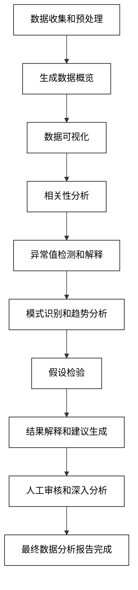

这个流程图展示了从数据收集到最终报告完成的整个数据分析过程，突出了AI在各个阶段的辅助作用，同时强调了人工审核和深入分析的重要性。通过这种人机协作的方式，数据分析师可以充分利用AI的效率和洞察能力，同时确保分析结果的准确性和可靠性。

### 2.4.3 趋势预测与洞察

AI大模型在趋势预测与洞察方面展现出了强大的能力，可以帮助研究人员和决策者分析复杂的数据模式，预测未来趋势，并提供有价值的洞察。以下是AI在趋势预测与洞察中的主要应用：

1. **时间序列预测**
   AI可以分析历史数据，预测未来的趋势和模式。

   ```python
   def forecast_time_series(historical_data, forecast_period):
       prompt = f"基于以下历史数据，预测未来{forecast_period}的趋势：\n{historical_data}\n提供数值预测和趋势描述。"
       response = openai.Completion.create(
           engine="text-davinci-002",
           prompt=prompt,
           max_tokens=500,
           n=1,
           stop=None,
           temperature=0.6,
       )
       return response.choices[0].text.strip()

   historical_data = "2018: 100, 2019: 120, 2020: 115, 2021: 140, 2022: 160"
   forecast_period = "2023-2025"
   forecast_result = forecast_time_series(historical_data, forecast_period)
   print(f"时间序列预测：\n{forecast_result}")
   ```

2. **市场趋势分析**
   AI可以整合多源数据，分析和预测市场趋势。

   ```python
   def analyze_market_trends(industry, data_sources, time_frame):
       prompt = f"分析{industry}行业在{time_frame}内的市场趋势。考虑以下数据源：{', '.join(data_sources)}。识别主要趋势、驱动因素和潜在的颠覆性变化。"
       response = openai.Completion.create(
           engine="text-davinci-002",
           prompt=prompt,
           max_tokens=800,
           n=1,
           stop=None,
           temperature=0.7,
       )
       return response.choices[0].text.strip()

   industry = "电动汽车"
   data_sources = ["销售数据", "技术发展报告", "政策文件", "消费者调查"]
   time_frame = "未来5年"
   market_trends = analyze_market_trends(industry, data_sources, time_frame)
   print(f"市场趋势分析：\n{market_trends}")
   ```

3. **情感分析和舆情预测**
   AI可以分析社交媒体和新闻数据，预测公众情感和舆论趋势。

   ```python
   def predict_public_sentiment(topic, data_summary):
       prompt = f"基于以下数据摘要，预测未来关于'{topic}'的公众情感和舆论趋势：\n{data_summary}\n提供定量和定性的预测。"
       response = openai.Completion.create(
           engine="text-davinci-002",
           prompt=prompt,
           max_tokens=600,
           n=1,
           stop=None,
           temperature=0.7,
       )
       return response.choices[0].text.strip()

   topic = "人工智能伦理"
   data_summary = "过去6个月的社交媒体讨论量增加50%，新闻报道中负面情感占比从20%上升到35%"
   sentiment_prediction = predict_public_sentiment(topic, data_summary)
   print(f"舆情预测：\n{sentiment_prediction}")
   ```

4. **技术发展路径预测**
   AI可以分析专利数据、研究论文和产业报告，预测技术发展路径。

   ```python
   def predict_technology_path(technology_field, current_state, data_sources):
       prompt = f"预测{technology_field}的未来发展路径。当前状态：{current_state}。考虑以下数据源：{', '.join(data_sources)}。识别可能的突破点、瓶颈和应用场景。"
       response = openai.Completion.create(
           engine="text-davinci-002",
           prompt=prompt,
           max_tokens=800,
           n=1,
           stop=None,
           temperature=0.7,
       )
       return response.choices[0].text.strip()

   technology_field = "量子计算"
   current_state = "实验室级别的量子比特操控"
   data_sources = ["研究论文趋势", "专利申请数据", "企业投资情况", "政府政策支持"]
   tech_path_prediction = predict_technology_path(technology_field, current_state, data_sources)
   print(f"技术发展路径预测：\n{tech_path_prediction}")
   ```

5. **跨领域影响分析**
   AI可以分析一个领域的变化对其他相关领域的潜在影响。

   ```python
   def analyze_cross_domain_impact(primary_trend, related_domains):
       prompt = f"分析{primary_trend}这一趋势对以下相关领域的潜在影响：{', '.join(related_domains)}。考虑直接和间接影响，以及可能的机遇和挑战。"
       response = openai.Completion.create(
           engine="text-davinci-002",
           prompt=prompt,
           max_tokens=800,
           n=1,
           stop=None,
           temperature=0.7,
       )
       return response.choices[0].text.strip()

   primary_trend = "远程工作的普及"
   related_domains = ["房地产", "交通", "城市规划", "网络基础设施"]
   cross_domain_impact = analyze_cross_domain_impact(primary_trend, related_domains)
   print(f"跨领域影响分析：\n{cross_domain_impact}")
   ```

6. **情景分析和风险评估**
   AI可以帮助构建和分析不同的未来情景，评估潜在风险。

   ```python
   def perform_scenario_analysis(context, key_variables, possible_outcomes):
       prompt = f"基于以下背景和关键变量，进行情景分析：\n背景：{context}\n关键变量：{', '.join(key_variables)}\n可能的结果：{', '.join(possible_outcomes)}\n描述每种情景的可能性、影响和应对策略。"
       response = openai.Completion.create(
           engine="text-davinci-002",
           prompt=prompt,
           max_tokens=1000,
           n=1,
           stop=None,
           temperature=0.7,
       )
       return response.choices[0].text.strip()

   context = "全球芯片供应链重构"
   key_variables = ["地缘政治关系", "技术创新速度", "政府政策支持"]
   possible_outcomes = ["区域化生产", "技术垄断加剧", "新兴市场崛起"]
   scenario_analysis = perform_scenario_analysis(context, key_variables, possible_outcomes)
   print(f"情景分析：\n{scenario_analysis}")
   ```

7. **政策影响预测**
   AI可以分析政策变化对特定行业或经济领域的潜在影响。

   ```python
   def predict_policy_impact(policy_change, affected_sectors, timeframe):
       prompt = f"预测以下政策变化在{timeframe}内对{', '.join(affected_sectors)}的影响：\n{policy_change}\n考虑直接和间接影响，以及可能的适应性策略。"
       response = openai.Completion.create(
           engine="text-davinci-002",
           prompt=prompt,
           max_tokens=800,
           n=1,
           stop=None,
           temperature=0.7,
       )
       return response.choices[0].text.strip()

   policy_change = "碳排放交易市场的全面实施"
   affected_sectors = ["能源", "制造业", "交通运输"]
   timeframe = "未来5年"
   policy_impact = predict_policy_impact(policy_change, affected_sectors, timeframe)
   print(f"政策影响预测：\n{policy_impact}")
   ```

这些AI辅助技术可以显著提高趋势预测与洞察的深度和广度，帮助决策者更好地理解复杂的系统动态和未来可能性。然而，人类专家的判断、领域知识和战略思维仍然是解释预测结果、评估其可靠性和制定行动计划的关键。

为了更好地理解AI在趋势预测与洞察中的应用流程，我们可以使用以下Mermaid流程图：

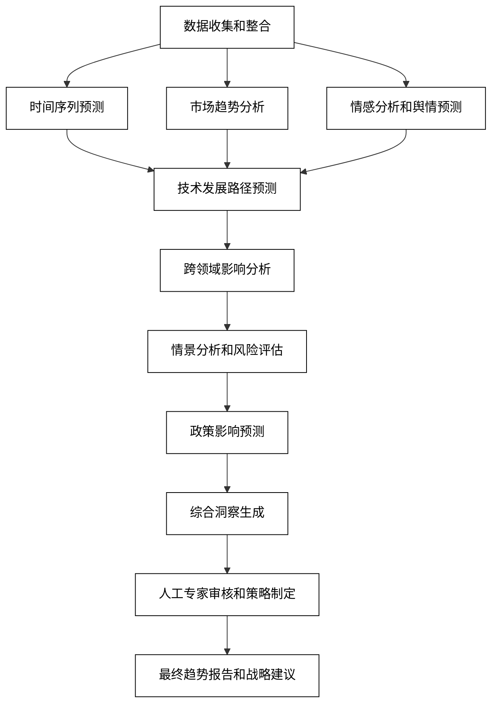

这个流程图展示了从数据收集到最终趋势报告和战略建议的整个过程，突出了AI在各个阶段的辅助作用，同时强调了人工专家在审核和策略制定中的关键作用。通过这种人机协作的方式，决策者可以充分利用AI的数据处理能力和模式识别能力，同时结合人类的创造性思维和战略洞察，做出更加明智和前瞻性的决策。
