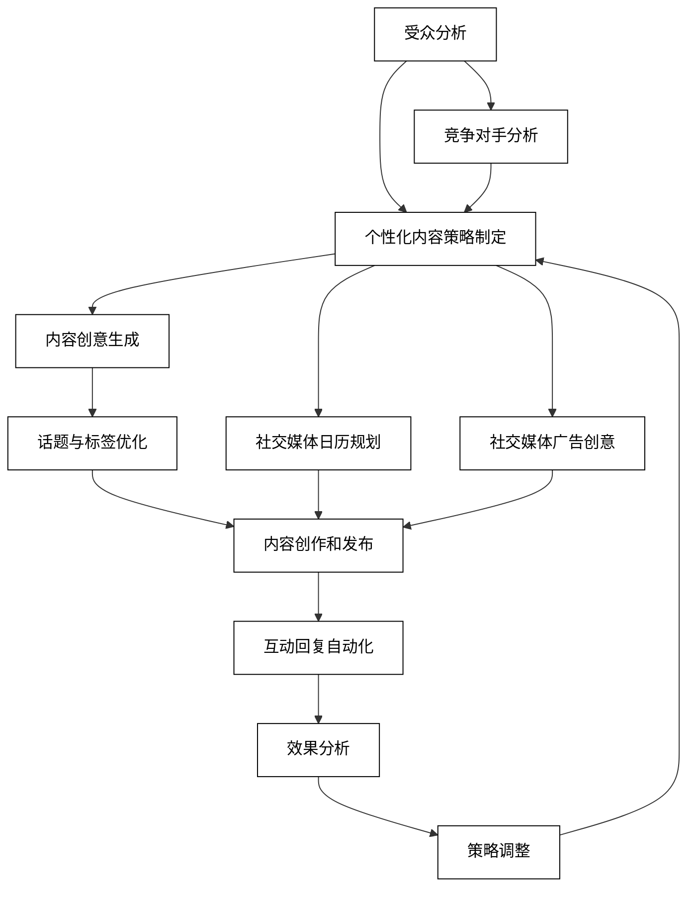
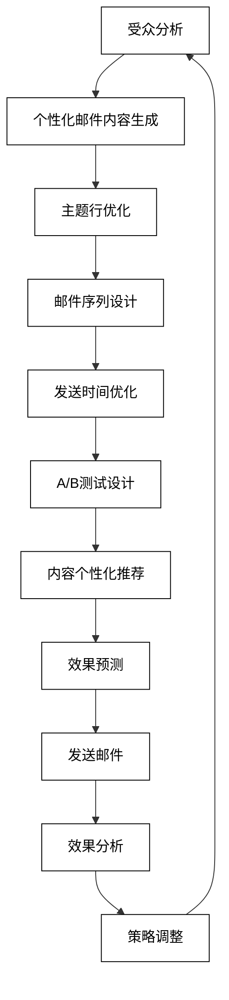
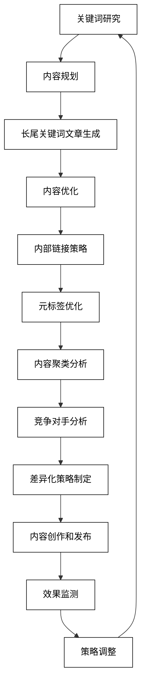
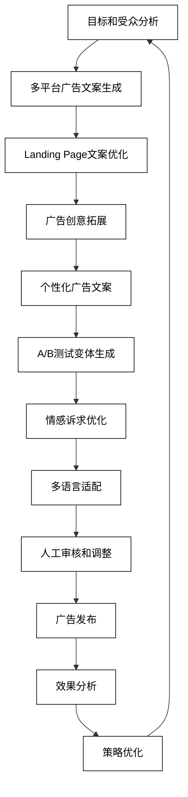

# 3 AI驱动的知识传播与营销

在AI大模型时代，知识的传播和营销方式正在经历深刻的变革。AI技术不仅提高了内容创作的效率，还能够实现精准的受众定位和个性化的内容推送。本章将深入探讨AI在社交媒体运营、邮件营销、SEO与内容营销以及广告文案创作等方面的应用，展示如何利用AI技术实现更有效的知识传播和营销策略。

## 3.1 社交媒体运营

社交媒体已成为知识传播和品牌营销的重要渠道。AI技术在社交媒体运营中的应用，可以帮助内容创作者和营销人员更好地理解受众、优化内容策略、提高互动效果。以下是AI在社交媒体运营中的主要应用：

### 3.1.1 个性化内容策略

AI可以分析用户行为和偏好，为不同的受众群体制定个性化的内容策略。

```python
def generate_personalized_content_strategy(audience_segment, platform, engagement_data):
    prompt = f"为{platform}平台上的'{audience_segment}'受众群体制定个性化内容策略。考虑以下参与度数据：{engagement_data}。提供内容主题建议、最佳发布时间和格式推荐。"
    response = openai.Completion.create(
        engine="text-davinci-002",
        prompt=prompt,
        max_tokens=500,
        n=1,
        stop=None,
        temperature=0.7,
    )
    return response.choices[0].text.strip()

audience_segment = "25-34岁的科技爱好者"
platform = "Instagram"
engagement_data = "视频内容平均观看时长2分钟，图文帖子平均点赞数500，最活跃时间段为晚上8-10点"
content_strategy = generate_personalized_content_strategy(audience_segment, platform, engagement_data)
print(f"个性化内容策略：\n{content_strategy}")
```

### 3.1.2 话题与标签优化

AI可以分析热门话题和趋势，推荐最佳的标签和话题策略。

```python
def optimize_hashtags_and_topics(content_theme, target_audience, platform):
    prompt = f"为{platform}平台上关于'{content_theme}'的内容优化话题和标签策略。目标受众：{target_audience}。提供5-10个推荐的标签和3-5个相关话题。"
    response = openai.Completion.create(
        engine="text-davinci-002",
        prompt=prompt,
        max_tokens=300,
        n=1,
        stop=None,
        temperature=0.7,
    )
    return response.choices[0].text.strip()

content_theme = "可持续时尚"
target_audience = "环保意识强的千禧一代"
platform = "Twitter"
optimized_tags_and_topics = optimize_hashtags_and_topics(content_theme, target_audience, platform)
print(f"优化的标签和话题：\n{optimized_tags_and_topics}")
```

### 3.1.3 互动回复自动化

AI可以生成个性化的回复，提高与粉丝的互动效果。

```python
def generate_interactive_replies(comment_type, brand_voice, platform):
    prompt = f"为{platform}平台上的{comment_type}类型评论生成3个符合{brand_voice}品牌语气的回复。确保回复友好、有趣且能促进进一步互动。"
    response = openai.Completion.create(
        engine="text-davinci-002",
        prompt=prompt,
        max_tokens=300,
        n=1,
        stop=None,
        temperature=0.7,
    )
    return response.choices[0].text.strip()

comment_type = "产品询问"
brand_voice = "专业但友好"
platform = "Facebook"
interactive_replies = generate_interactive_replies(comment_type, brand_voice, platform)
print(f"互动回复示例：\n{interactive_replies}")
```

4. **内容创意生成**
   AI可以根据品牌主题和目标受众生成创意内容想法。

```python
def generate_content_ideas(brand_theme, target_audience, content_types):
    prompt = f"为'{brand_theme}'主题生成5个针对{target_audience}的创意内容想法。考虑以下内容类型：{', '.join(content_types)}。提供简短的概念描述和潜在的参与度预测。"
    response = openai.Completion.create(
        engine="text-davinci-002",
        prompt=prompt,
        max_tokens=500,
        n=1,
        stop=None,
        temperature=0.8,
    )
    return response.choices[0].text.strip()

brand_theme = "健康生活方式"
target_audience = "忙碌的都市白领"
content_types = ["短视频", "信息图", "互动问答"]
content_ideas = generate_content_ideas(brand_theme, target_audience, content_types)
print(f"内容创意：\n{content_ideas}")
```

5. **社交媒体日历规划**
   AI可以帮助制定长期的社交媒体内容日历，确保内容的一致性和多样性。

```python
def plan_social_media_calendar(brand, platforms, time_period):
    prompt = f"为{brand}制定未来{time_period}的社交媒体内容日历。涵盖以下平台：{', '.join(platforms)}。包括每周主题建议、内容类型分配和重要日期的特殊内容计划。"
    response = openai.Completion.create(
        engine="text-davinci-002",
        prompt=prompt,
        max_tokens=800,
        n=1,
        stop=None,
        temperature=0.7,
    )
    return response.choices[0].text.strip()

brand = "有机食品连锁店"
platforms = ["Instagram", "Facebook", "TikTok"]
time_period = "1个月"
social_media_calendar = plan_social_media_calendar(brand, platforms, time_period)
print(f"社交媒体日历：\n{social_media_calendar}")
```

6. **竞争对手分析**
   AI可以分析竞争对手的社交媒体策略，提供有价值的洞察。

```python
def analyze_competitor_strategy(competitor, platform, time_period):
    prompt = f"分析{competitor}在{platform}平台上过去{time_period}的社交媒体策略。识别其内容主题、发布频率、互动策略和表现最好的帖子类型。提供可操作的洞察和建议。"
    response = openai.Completion.create(
        engine="text-davinci-002",
        prompt=prompt,
        max_tokens=600,
        n=1,
        stop=None,
        temperature=0.7,
    )
    return response.choices[0].text.strip()

competitor = "主要竞争对手A"
platform = "LinkedIn"
time_period = "3个月"
competitor_analysis = analyze_competitor_strategy(competitor, platform, time_period)
print(f"竞争对手分析：\n{competitor_analysis}")
```

7. **社交媒体广告创意**
   AI可以生成针对特定目标受众的社交媒体广告创意。

```python
def generate_ad_creative(product, target_audience, platform, ad_objective):
    prompt = f"为{product}创建一个针对{target_audience}的{platform}平台广告创意。广告目标：{ad_objective}。包括标题、简短描述和视觉元素建议。"
    response = openai.Completion.create(
        engine="text-davinci-002",
        prompt=prompt,
        max_tokens=300,
        n=1,
        stop=None,
        temperature=0.7,
    )
    return response.choices[0].text.strip()

product = "智能家居设备"
target_audience = "30-45岁的科技早期采用者"
platform = "Facebook"
ad_objective = "提高品牌认知度"
ad_creative = generate_ad_creative(product, target_audience, platform, ad_objective)
print(f"广告创意：\n{ad_creative}")
```

这些AI辅助技术可以显著提高社交媒体运营的效率和效果，帮助品牌和内容创作者更好地与目标受众建立联系。然而，人类运营者的创造力、情感智能和战略思维仍然是社交媒体营销成功的关键因素。

为了更好地理解AI在社交媒体运营中的应用流程，我们可以使用以下Mermaid流程图：



这个流程图展示了AI驱动的社交媒体运营的完整循环，从受众分析到策略调整。它强调了AI在整个过程中的持续支持作用，以及如何将不同的AI应用整合到一个连贯的社交媒体策略中。通过这种方法，运营者可以不断优化其社交媒体表现，提高知识传播的效果和品牌影响力。

## 3.2 邮件营销

邮件营销仍然是一种强大的知识传播和客户沟通工具。AI技术可以显著提高邮件营销的个性化程度、相关性和效果。以下是AI在邮件营销中的主要应用：

### 3.2.1 个性化邮件内容生成

AI可以根据收件人的特征和行为数据生成高度个性化的邮件内容。

```python
def generate_personalized_email(recipient_data, email_purpose):
    prompt = f"根据以下收件人数据生成一封个性化的邮件：\n{recipient_data}\n邮件目的：{email_purpose}\n包括个性化的主题行、正文内容和号召性用语(CTA)。"
    response = openai.Completion.create(
        engine="text-davinci-002",
        prompt=prompt,
        max_tokens=500,
        n=1,
        stop=None,
        temperature=0.7,
    )
    return response.choices[0].text.strip()

recipient_data = "姓名：张三，年龄：35，职业：市场经理，最近浏览：数字营销课程，上次购买：3个月前"
email_purpose = "推荐新的高级数字营销课程"
personalized_email = generate_personalized_email(recipient_data, email_purpose)
print(f"个性化邮件内容：\n{personalized_email}")
```

### 3.2.2 邮件序列自动化

AI可以设计和优化自动化的邮件序列，提高客户参与度。

```python
def design_email_sequence(campaign_goal, target_audience, sequence_length):
    prompt = f"设计一个{sequence_length}封邮件的自动化序列，目标是{campaign_goal}。目标受众：{target_audience}。提供每封邮件的主题、主要内容点和发送时间建议。"
    response = openai.Completion.create(
        engine="text-davinci-002",
        prompt=prompt,
        max_tokens=800,
        n=1,
        stop=None,
        temperature=0.7,
    )
    return response.choices[0].text.strip()

campaign_goal = "引导潜在客户购买年度会员订阅"
target_audience = "免费试用用户"
sequence_length = 5
email_sequence = design_email_sequence(campaign_goal, target_audience, sequence_length)
print(f"邮件序列设计：\n{email_sequence}")
```

### 3.2.3 A/B测试优化

AI可以设计和分析A/B测试，持续优化邮件营销效果。

```python
def design_ab_test(element_to_test, current_performance, test_hypothesis):
    prompt = f"设计一个A/B测试来优化邮件中的{element_to_test}。当前性能：{current_performance}。测试假设：{test_hypothesis}。提供两个变体的详细描述、样本量建议和成功指标。"
    response = openai.Completion.create(
        engine="text-davinci-002",
        prompt=prompt,
        max_tokens=400,
        n=1,
        stop=None,
        temperature=0.7,
    )
    return response.choices[0].text.strip()

element_to_test = "主题行"
current_performance = "开启率20%"
test_hypothesis = "使用问句可以提高开启率"
ab_test_design = design_ab_test(element_to_test, current_performance, test_hypothesis)
print(f"A/B测试设计：\n{ab_test_design}")
```

4. **邮件时间优化**
   AI可以分析收件人的行为模式，推荐最佳的发送时间。

```python
def optimize_send_time(recipient_data, email_type):
    prompt = f"基于以下收件人数据，为{email_type}类型的邮件推荐最佳发送时间：\n{recipient_data}\n提供具体的时间建议和理由。"
    response = openai.Completion.create(
        engine="text-davinci-002",
        prompt=prompt,
        max_tokens=200,
        n=1,
        stop=None,
        temperature=0.6,
    )
    return response.choices[0].text.strip()

recipient_data = "工作日邮件开启时间集中在早上9点和晚上7点，周末开启时间分布较为平均"
email_type = "周刊订阅"
optimal_send_time = optimize_send_time(recipient_data, email_type)
print(f"最佳发送时间建议：\n{optimal_send_time}")
```

5. **主题行优化**
   AI可以生成和优化引人注目的邮件主题行。

```python
def generate_subject_lines(email_content, target_audience, brand_voice):
    prompt = f"基于以下邮件内容，为目标受众'{target_audience}'生成5个吸引人的主题行。确保符合'{brand_voice}'的品牌语气：\n{email_content}"
    response = openai.Completion.create(
        engine="text-davinci-002",
        prompt=prompt,
        max_tokens=300,
        n=1,
        stop=None,
        temperature=0.7,
    )
    return response.choices[0].text.strip()

email_content = "介绍新推出的人工智能课程，包括机器学习基础、深度学习应用等模块"
target_audience = "IT行业专业人士"
brand_voice = "专业、创新"
subject_lines = generate_subject_lines(email_content, target_audience, brand_voice)
print(f"生成的主题行：\n{subject_lines}")
```

6. **邮件内容个性化推荐**
   AI可以基于用户兴趣和行为推荐个性化的邮件内容。

```python
def recommend_personalized_content(user_profile, content_library):
    prompt = f"基于以下用户档案，从内容库中推荐3-5个最相关的内容项目：\n用户档案：{user_profile}\n内容库：{content_library}\n提供推荐理由。"
    response = openai.Completion.create(
        engine="text-davinci-002",
        prompt=prompt,
        max_tokens=400,
        n=1,
        stop=None,
        temperature=0.7,
    )
    return response.choices[0].text.strip()

user_profile = "职业：软件工程师，兴趣：机器学习、云计算，最近阅读：Python编程技巧"
content_library = "1. 深度学习实战 2. 云原生应用开发 3. 数据结构与算法 4. DevOps最佳实践 5. 区块链技术入门"
personalized_recommendations = recommend_personalized_content(user_profile, content_library)
print(f"个性化内容推荐：\n{personalized_recommendations}")
```

7. **邮件效果预测**
   AI可以基于历史数据预测邮件营销活动的可能效果。

```python
def predict_email_performance(campaign_details, historical_data):
    prompt = f"基于以下活动详情和历史数据，预测此次邮件营销活动的可能效果：\n活动详情：{campaign_details}\n历史数据：{historical_data}\n提供开启率、点击率和转化率的预测，以及影响因素分析。"
    response = openai.Completion.create(
        engine="text-davinci-002",
        prompt=prompt,
        max_tokens=400,
        n=1,
        stop=None,
        temperature=0.6,
    )
    return response.choices[0].text.strip()

campaign_details = "黑色星期五促销邮件，目标受众：现有客户，主要优惠：全场8折"
historical_data = "去年同期活动：开启率30%，点击率15%，转化率5%"
performance_prediction = predict_email_performance(campaign_details, historical_data)
print(f"邮件效果预测：\n{performance_prediction}")
```

这些AI辅助技术可以显著提高邮件营销的效率和效果，帮助营销人员创建更加个性化、相关和吸引人的邮件内容。然而，人类营销人员的创意思维、策略规划和对品牌价值的把握仍然是邮件营销成功的关键因素。

为了更好地理解AI在邮件营销中的应用流程，我们可以使用以下Mermaid流程图：



这个流程图展示了AI驱动的邮件营销的完整循环，从受众分析到策略调整。它强调了AI在整个过程中的持续支持作用，以及如何将不同的AI应用整合到一个连贯的邮件营销策略中。通过这种方法，营销人员可以不断优化其邮件营销表现，提高知识传播的效果和客户参与度。

## 3.3 SEO与内容营销

在数字时代，搜索引擎优化（SEO）和内容营销对于知识传播和品牌建设至关重要。AI技术可以显著提高SEO策略的效果和内容营销的质量。以下是AI在SEO与内容营销中的主要应用：

### 3.3.1 关键词研究与内容规划

AI可以帮助识别高价值的关键词和内容主题，优化内容规划策略。

```python
def research_keywords_and_topics(main_topic, target_audience, content_goals):
    prompt = f"为'{main_topic}'主题进行关键词研究和内容规划。目标受众：{target_audience}，内容目标：{content_goals}。提供以下内容：\n1. 10个高价值关键词\n2. 5个长尾关键词短语\n3. 3个内容支柱主题\n4. 每个支柱主题下的5个子主题建议"
    response = openai.Completion.create(
        engine="text-davinci-002",
        prompt=prompt,
        max_tokens=800,
        n=1,
        stop=None,
        temperature=0.7,
    )
    return response.choices[0].text.strip()

main_topic = "可持续能源解决方案"
target_audience = "家庭和小型企业主"
content_goals = "提高品牌知名度和生成潜在客户"
keyword_and_topic_plan = research_keywords_and_topics(main_topic, target_audience, content_goals)
print(f"关键词研究和内容规划：\n{keyword_and_topic_plan}")
```

### 3.3.2 长尾关键词文章生成

AI可以基于长尾关键词生成优化的文章内容。

```python
def generate_long_tail_article(long_tail_keyword, word_count, target_audience):
    prompt = f"基于长尾关键词'{long_tail_keyword}'生成一篇针对{target_audience}的SEO优化文章。文章长度约{word_count}字。包括引人入胜的标题、清晰的结构、相关的子标题和自然融入关键词的段落。"
    response = openai.Completion.create(
        engine="text-davinci-002",
        prompt=prompt,
        max_tokens=1000,
        n=1,
        stop=None,
        temperature=0.7,
    )
    return response.choices[0].text.strip()

long_tail_keyword = "家用太阳能电池板安装成本"
word_count = 800
target_audience = "考虑安装太阳能系统的房主"
long_tail_article = generate_long_tail_article(long_tail_keyword, word_count, target_audience)
print(f"长尾关键词文章：\n{long_tail_article}")
```

### 3.3.3 内容重写与优化

AI可以帮助重写和优化现有内容，提高其SEO效果。

```python
def optimize_existing_content(original_content, target_keywords, seo_goals):
    prompt = f"优化以下内容以提高其SEO效果。目标关键词：{', '.join(target_keywords)}。SEO目标：{seo_goals}\n原始内容：\n{original_content}\n提供优化后的内容，包括改进的标题、元描述和内容结构。"
    response = openai.Completion.create(
        engine="text-davinci-002",
        prompt=prompt,
        max_tokens=1000,
        n=1,
        stop=None,
        temperature=0.7,
    )
    return response.choices[0].text.strip()

original_content = "太阳能是一种清洁能源。它可以帮助减少电费。很多人正在考虑安装太阳能板。"
target_keywords = ["可再生能源", "太阳能投资回报", "绿色家居"]
seo_goals = "提高有机搜索排名和增加页面停留时间"
optimized_content = optimize_existing_content(original_content, target_keywords, seo_goals)
print(f"优化后的内容：\n{optimized_content}")
```

4. **内部链接策略**
   AI可以分析网站结构，提供优化的内部链接建议。

```python
def suggest_internal_linking(page_url, site_structure, content_summary):
    prompt = f"为页面 {page_url} 提供内部链接优化建议。网站结构：{site_structure}。页面内容摘要：{content_summary}。建议5-7个相关的内部链接，包括锚文本和目标页面URL。"
    response = openai.Completion.create(
        engine="text-davinci-002",
        prompt=prompt,
        max_tokens=500,
        n=1,
        stop=None,
        temperature=0.7,
    )
    return response.choices[0].text.strip()

page_url = "https://example.com/solar-energy-basics"
site_structure = "主页、产品、服务、博客、关于我们、联系我们"
content_summary = "太阳能基础知识介绍，包括工作原理、优势和应用场景"
internal_linking_suggestions = suggest_internal_linking(page_url, site_structure, content_summary)
print(f"内部链接建议：\n{internal_linking_suggestions}")
```

5. **元标签优化**
   AI可以生成优化的页面标题和元描述。

```python
def optimize_meta_tags(page_content, target_keywords, max_title_length, max_description_length):
    prompt = f"基于以下页面内容和目标关键词，生成优化的页面标题和元描述：\n页面内容：{page_content}\n目标关键词：{', '.join(target_keywords)}\n标题最大长度：{max_title_length}字符\n描述最大长度：{max_description_length}字符"
    response = openai.Completion.create(
        engine="text-davinci-002",
        prompt=prompt,
        max_tokens=300,
        n=1,
        stop=None,
        temperature=0.7,
    )
    return response.choices[0].text.strip()

page_content = "本文介绍太阳能电池板的工作原理、安装过程和长期收益。适合考虑转向可再生能源的家庭和企业。"
target_keywords = ["太阳能电池板", "可再生能源", "节能投资"]
max_title_length = 60
max_description_length = 160
optimized_meta_tags = optimize_meta_tags(page_content, target_keywords, max_title_length, max_description_length)
print(f"优化的元标签：\n{optimized_meta_tags}")
```

6. **内容聚类和主题建模**
   AI可以分析大量内容，识别主题聚类和内容差距。

```python
def analyze_content_clusters(content_list, desired_clusters):
    prompt = f"分析以下内容列表，识别{desired_clusters}个主要主题聚类。对每个聚类提供一个描述性标题和3-5个关键主题。同时指出任何明显的内容差距：\n{content_list}"
    response = openai.Completion.create(
        engine="text-davinci-002",
        prompt=prompt,
        max_tokens=800,
        n=1,
        stop=None,
        temperature=0.7,
    )
    return response.choices[0].text.strip()

content_list = "1. 太阳能基础知识 2. 风能发电技术 3. 家用太阳能安装指南 4. 可再生能源政策解读 5. 节能家电选购建议 6. 商业太阳能解决方案"
desired_clusters = 3
content_cluster_analysis = analyze_content_clusters(content_list, desired_clusters)
print(f"内容聚类分析：\n{content_cluster_analysis}")
```

7. **竞争对手内容分析**
   AI可以分析竞争对手的内容策略，提供差异化建议。

```python
def analyze_competitor_content(competitor_url, our_content_themes):
    prompt = f"分析竞争对手 {competitor_url} 的内容策略，并与我们的内容主题 {our_content_themes} 进行比较。识别他们的优势、劣势，以及我们可以利用的机会。提供3-5个差异化内容策略建议。"
    response = openai.Completion.create(
        engine="text-davinci-002",
        prompt=prompt,
        max_tokens=600,
        n=1,
        stop=None,
        temperature=0.7,
    )
    return response.choices[0].text.strip()

competitor_url = "https://competitor.com"
our_content_themes = "可再生能源技术、能源效率提升、可持续生活方式"
competitor_analysis = analyze_competitor_content(competitor_url, our_content_themes)
print(f"竞争对手内容分析：\n{competitor_analysis}")
```

这些AI辅助技术可以显著提高SEO和内容营销的效率和效果，帮助内容创作者和营销人员制定更加精准的策略，创作更有价值的内容。然而，人类专家的创意思维、战略洞察和对目标受众的深入理解仍然是成功的SEO和内容营销策略的核心。

为了更好地理解AI在SEO与内容营销中的应用流程，我们可以使用以下Mermaid流程图：



这个流程图展示了AI驱动的SEO与内容营销的完整循环，从关键词研究到策略调整。它强调了AI在整个过程中的持续支持作用，以及如何将不同的AI应用整合到一个连贯的SEO和内容营销策略中。通过这种方法，营销人员可以不断优化其内容策略，提高搜索引擎排名和内容的价值，从而更有效地传播知识和吸引目标受众。

## 3.4 广告文案创作

在数字营销时代，高质量的广告文案对于吸引受众注意力、传递品牌信息和促进转化至关重要。AI技术在广告文案创作方面展现出了强大的潜力，可以帮助营销人员更快速、更精准地创作出有吸引力的广告内容。以下是AI在广告文案创作中的主要应用：

### 3.4.1 多平台广告文案生成

AI可以根据不同平台的特性和目标受众，生成定制化的广告文案。

```python
def generate_platform_specific_ad(product, target_audience, platform, ad_specs):
    prompt = f"为{product}创作一则针对{target_audience}的{platform}平台广告。广告规格：{ad_specs}。包括引人注目的标题、简洁的描述和有力的号召性用语(CTA)。"
    response = openai.Completion.create(
        engine="text-davinci-002",
        prompt=prompt,
        max_tokens=300,
        n=1,
        stop=None,
        temperature=0.7,
    )
    return response.choices[0].text.strip()

product = "智能家居安全系统"
target_audience = "25-45岁的城市家庭"
platform = "Facebook"
ad_specs = "标题不超过40个字符，描述不超过125个字符，包含一个CTA按钮"
platform_specific_ad = generate_platform_specific_ad(product, target_audience, platform, ad_specs)
print(f"平台特定广告文案：\n{platform_specific_ad}")
```

### 3.4.2 landing page文案优化

AI可以帮助优化登陆页面的文案，提高转化率。

```python
def optimize_landing_page_copy(current_copy, target_audience, conversion_goal):
    prompt = f"优化以下登陆页面文案，以提高转化率。目标受众：{target_audience}，转化目标：{conversion_goal}\n当前文案：\n{current_copy}\n提供优化建议，包括标题、主要卖点、产品描述和CTA。"
    response = openai.Completion.create(
        engine="text-davinci-002",
        prompt=prompt,
        max_tokens=500,
        n=1,
        stop=None,
        temperature=0.7,
    )
    return response.choices[0].text.strip()

current_copy = "智能家居安全系统 - 保护您的家人和财产。易于安装，24/7监控。立即购买！"
target_audience = "注重安全的年轻家庭"
conversion_goal = "增加产品试用申请"
optimized_landing_page = optimize_landing_page_copy(current_copy, target_audience, conversion_goal)
print(f"优化后的登陆页面文案：\n{optimized_landing_page}")
```

### 3.4.3 广告创意拓展

AI可以基于初始创意概念，生成多个广告创意变体。

```python
def expand_ad_creative(initial_concept, brand_voice, desired_variations):
    prompt = f"基于以下初始广告创意概念，生成{desired_variations}个不同的创意变体。确保保持'{brand_voice}'的品牌语气：\n初始概念：{initial_concept}"
    response = openai.Completion.create(
        engine="text-davinci-002",
        prompt=prompt,
        max_tokens=500,
        n=1,
        stop=None,
        temperature=0.8,
    )
    return response.choices[0].text.strip()

initial_concept = "智能家居让生活更轻松"
brand_voice = "科技感、友好、简洁"
desired_variations = 3
expanded_creatives = expand_ad_creative(initial_concept, brand_voice, desired_variations)
print(f"拓展的广告创意：\n{expanded_creatives}")
```

4. **个性化广告文案**
   AI可以根据用户数据生成高度个性化的广告文案。

```python
def generate_personalized_ad(user_data, product_features, ad_format):
    prompt = f"基于以下用户数据和产品特征，生成一则个性化的广告。广告格式：{ad_format}\n用户数据：{user_data}\n产品特征：{product_features}"
    response = openai.Completion.create(
        engine="text-davinci-002",
        prompt=prompt,
        max_tokens=300,
        n=1,
        stop=None,
        temperature=0.7,
    )
    return response.choices[0].text.strip()

user_data = "30岁男性，已婚，有一个2岁的孩子，喜欢科技产品，经常在线购物"
product_features = "智能婴儿监视器，具有温度感应、双向通话和移动应用控制功能"
ad_format = "社交媒体短视频广告，15秒"
personalized_ad = generate_personalized_ad(user_data, product_features, ad_format)
print(f"个性化广告文案：\n{personalized_ad}")
```

5. **A/B测试变体生成**
   AI可以为A/B测试生成多个广告文案变体。

```python
def generate_ab_test_variants(base_ad_copy, element_to_test, num_variants):
    prompt = f"基于以下基础广告文案，生成{num_variants}个针对'{element_to_test}'的A/B测试变体：\n基础文案：{base_ad_copy}"
    response = openai.Completion.create(
        engine="text-davinci-002",
        prompt=prompt,
        max_tokens=400,
        n=1,
        stop=None,
        temperature=0.7,
    )
    return response.choices[0].text.strip()

base_ad_copy = "体验智能家居的未来 - 让科技简化您的生活"
element_to_test = "标题吸引力"
num_variants = 3
ab_test_variants = generate_ab_test_variants(base_ad_copy, element_to_test, num_variants)
print(f"A/B测试变体：\n{ab_test_variants}")
```

6. **情感诉求优化**
   AI可以帮助优化广告文案的情感诉求，以更好地与目标受众产生共鸣。

```python
def optimize_emotional_appeal(ad_copy, target_emotion, audience_pain_points):
    prompt = f"优化以下广告文案，以更好地触发'{target_emotion}'情感，同时解决目标受众的以下痛点：{audience_pain_points}\n原始文案：{ad_copy}"
    response = openai.Completion.create(
        engine="text-davinci-002",
        prompt=prompt,
        max_tokens=300,
        n=1,
        stop=None,
        temperature=0.7,
    )
    return response.choices[0].text.strip()

ad_copy = "智能家居系统 - 控制您的家"
target_emotion = "安心感"
audience_pain_points = "担心家庭安全，能源成本高，生活繁忙难以管理家务"
emotionally_optimized_ad = optimize_emotional_appeal(ad_copy, target_emotion, audience_pain_points)
print(f"情感优化后的广告文案：\n{emotionally_optimized_ad}")
```

7. **多语言广告文案适配**
   AI可以帮助将广告文案翻译并适配到不同的语言和文化背景。

```python
def adapt_ad_copy_for_language(original_copy, target_language, cultural_context):
    prompt = f"将以下广告文案翻译并适配到{target_language}，考虑{cultural_context}的文化背景。确保保留原始信息的核心，同时使其在目标文化中自然且有吸引力。\n原始文案：{original_copy}"
    response = openai.Completion.create(
        engine="text-davinci-002",
        prompt=prompt,
        max_tokens=300,
        n=1,
        stop=None,
        temperature=0.7,
    )
    return response.choices[0].text.strip()

original_copy = "Smart home, smart life. Control your world with a touch."
target_language = "中文"
cultural_context = "中国城市年轻专业人士"
adapted_copy = adapt_ad_copy_for_language(original_copy, target_language, cultural_context)
print(f"适配后的广告文案：\n{adapted_copy}")
```

这些AI辅助技术可以显著提高广告文案创作的效率和质量，帮助营销人员快速生成针对不同平台、受众和目标的广告内容。然而，人类创意人员的洞察力、品牌理解和情感智能仍然是创作真正引人共鸣的广告文案的关键。

为了更好地理解AI在广告文案创作中的应用流程，我们可以使用以下Mermaid流程图：



这个流程图展示了AI驱动的广告文案创作的完整循环，从目标和受众分析到策略优化。它强调了AI在整个过程中的持续支持作用，以及如何将不同的AI应用整合到一个连贯的广告文案创作策略中。通过这种方法，营销人员可以不断优化其广告文案，提高广告的相关性和效果，从而更有效地传递品牌信息和实现营销目标。
