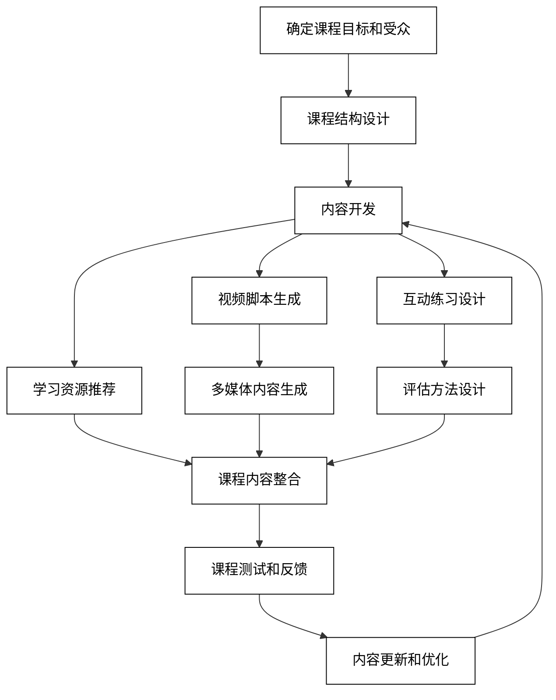
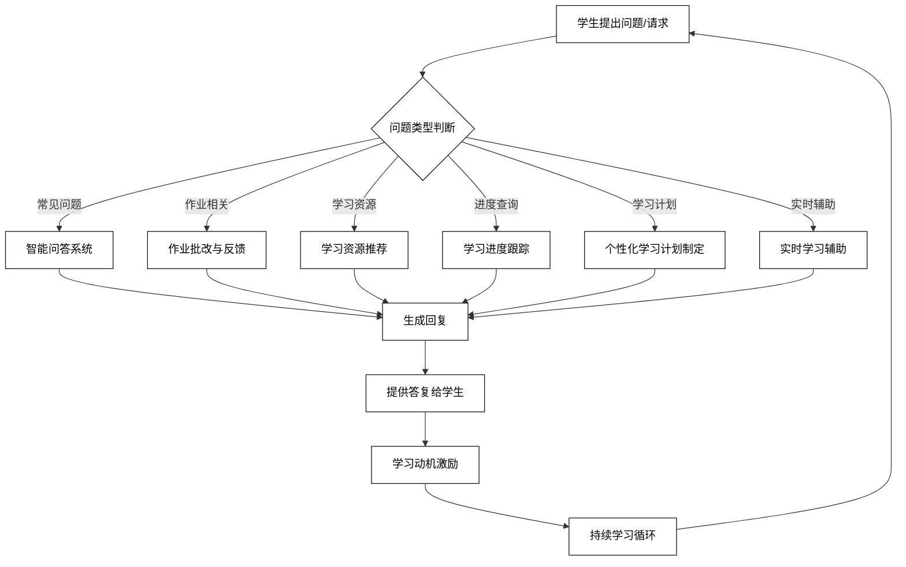
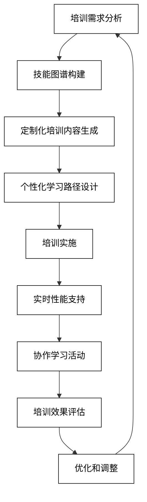

# 4 AI辅助的在线教育与培训

在线教育和培训领域正经历着由AI驱动的革命性变革。AI技术不仅能够提高教育内容的质量和个性化程度，还能够优化学习体验，提高学习效果。本章将深入探讨AI在在线课程开发、个性化学习路径、虚拟教学助手以及企业培训解决方案等方面的应用，展示如何利用AI技术创造更加高效、灵活和个性化的学习环境。

## 4.1 在线课程开发

AI技术在在线课程开发中发挥着越来越重要的作用，从课程结构设计到内容创作，再到互动练习设计，AI都能提供强大的支持。以下是AI在在线课程开发中的主要应用：

### 4.1.1 课程结构设计

AI可以帮助教育者设计逻辑清晰、结构合理的课程大纲。

```python
def design_course_structure(course_topic, learning_objectives, target_audience, course_duration):
    prompt = f"为'{course_topic}'设计一个在线课程结构。学习目标：{learning_objectives}。目标受众：{target_audience}。课程时长：{course_duration}。提供模块划分、每个模块的主要内容点和建议学习时间。"
    response = openai.Completion.create(
        engine="text-davinci-002",
        prompt=prompt,
        max_tokens=800,
        n=1,
        stop=None,
        temperature=0.7,
    )
    return response.choices[0].text.strip()

course_topic = "Python数据分析入门"
learning_objectives = "掌握Python基础语法，学会使用pandas和matplotlib进行数据处理和可视化"
target_audience = "无编程经验的数据分析初学者"
course_duration = "6周，每周5小时"
course_structure = design_course_structure(course_topic, learning_objectives, target_audience, course_duration)
print(f"课程结构设计：\n{course_structure}")
```

### 4.1.2 视频脚本生成

AI可以协助生成教学视频的脚本，确保内容的清晰性和连贯性。

```python
def generate_video_script(lesson_topic, key_points, video_duration):
    prompt = f"为'{lesson_topic}'主题生成一个{video_duration}分钟的教学视频脚本。包括以下关键点：{', '.join(key_points)}。脚本应包括开场白、主要内容讲解和总结。"
    response = openai.Completion.create(
        engine="text-davinci-002",
        prompt=prompt,
        max_tokens=1000,
        n=1,
        stop=None,
        temperature=0.7,
    )
    return response.choices[0].text.strip()

lesson_topic = "Python中的列表操作"
key_points = ["列表创建", "访问元素", "添加和删除元素", "列表切片", "列表推导式"]
video_duration = 10
video_script = generate_video_script(lesson_topic, key_points, video_duration)
print(f"视频脚本：\n{video_script}")
```

### 4.1.3 互动练习设计

AI可以设计多样化的互动练习，帮助学生巩固所学知识。

```python
def design_interactive_exercises(topic, difficulty_level, exercise_types):
    prompt = f"为'{topic}'主题设计3个{difficulty_level}难度的互动练习。包括以下类型的练习：{', '.join(exercise_types)}。每个练习应包括问题描述、正确答案和解释。"
    response = openai.Completion.create(
        engine="text-davinci-002",
        prompt=prompt,
        max_tokens=800,
        n=1,
        stop=None,
        temperature=0.7,
    )
    return response.choices[0].text.strip()

topic = "Python函数"
difficulty_level = "中级"
exercise_types = ["多选题", "代码填空", "实践任务"]
interactive_exercises = design_interactive_exercises(topic, difficulty_level, exercise_types)
print(f"互动练习设计：\n{interactive_exercises}")
```

4. **学习资源推荐**
   AI可以根据课程内容和学习目标推荐相关的补充学习资源。

```python
def recommend_learning_resources(course_content, learning_style, resource_types):
    prompt = f"基于以下课程内容，为偏好{learning_style}学习风格的学生推荐补充学习资源。包括以下类型的资源：{', '.join(resource_types)}。\n课程内容：{course_content}"
    response = openai.Completion.create(
        engine="text-davinci-002",
        prompt=prompt,
        max_tokens=500,
        n=1,
        stop=None,
        temperature=0.7,
    )
    return response.choices[0].text.strip()

course_content = "Python数据可视化：使用matplotlib绘制各类图表"
learning_style = "视觉化和实践"
resource_types = ["在线教程", "视频演示", "实践项目", "参考文档"]
recommended_resources = recommend_learning_resources(course_content, learning_style, resource_types)
print(f"推荐学习资源：\n{recommended_resources}")
```

5. **评估方法设计**
   AI可以帮助设计多样化的评估方法，以全面衡量学生的学习成果。

```python
def design_assessment_methods(learning_objectives, assessment_types):
    prompt = f"基于以下学习目标，设计多样化的评估方法：\n{learning_objectives}\n包括以下类型的评估：{', '.join(assessment_types)}。提供每种评估方法的描述、评分标准和权重建议。"
    response = openai.Completion.create(
        engine="text-davinci-002",
        prompt=prompt,
        max_tokens=800,
        n=1,
        stop=None,
        temperature= 0.7,
    )
    return response.choices[0].text.strip()

learning_objectives = "1. 理解Python基本数据结构\n2. 能够使用pandas进行数据处理\n3. 使用matplotlib创建基本图表"
assessment_types = ["多选题测试", "编程作业", "数据分析项目", "同伴评估"]
assessment_methods = design_assessment_methods(learning_objectives, assessment_types)
print(f"评估方法设计：\n{assessment_methods}")
```

6. **课程内容更新建议**
   AI可以分析最新的行业趋势和学习反馈，为课程内容更新提供建议。

```python
def suggest_course_updates(current_content, industry_trends, student_feedback):
    prompt = f"基于以下信息，为课程内容提供更新建议：\n当前内容：{current_content}\n行业趋势：{industry_trends}\n学生反馈：{student_feedback}\n提供具体的更新建议，包括需要添加、修改或删除的内容。"
    response = openai.Completion.create(
        engine="text-davinci-002",
        prompt=prompt,
        max_tokens=600,
        n=1,
        stop=None,
        temperature=0.7,
    )
    return response.choices[0].text.strip()

current_content = "Python数据分析课程（使用pandas 1.0版本）"
industry_trends = "pandas 2.0发布，引入了新的字符串处理方法"
student_feedback = "希望增加更多实际项目案例，加强数据可视化部分"
update_suggestions = suggest_course_updates(current_content, industry_trends, student_feedback)
print(f"课程更新建议：\n{update_suggestions}")
```

7. **多媒体内容生成**
   AI可以协助生成课程所需的多媒体内容，如图表、动画脚本等。

```python
def generate_multimedia_content(content_type, topic, key_points):
    prompt = f"为'{topic}'主题生成{content_type}内容。包括以下关键点：{', '.join(key_points)}。提供详细的描述或脚本。"
    response = openai.Completion.create(
        engine="text-davinci-002",
        prompt=prompt,
        max_tokens=500,
        n=1,
        stop=None,
        temperature=0.7,
    )
    return response.choices[0].text.strip()

content_type = "信息图表"
topic = "Python数据类型概览"
key_points = ["数字", "字符串", "列表", "元组", "字典"]
multimedia_content = generate_multimedia_content(content_type, topic, key_points)
print(f"多媒体内容生成：\n{multimedia_content}")
```

这些AI辅助技术可以显著提高在线课程开发的效率和质量，帮助教育者创建更加engaging和有效的学习体验。然而，教育者的专业知识、教学经验和对学生需求的深入理解仍然是开发高质量在线课程的关键。

为了更好地理解AI在在线课程开发中的应用流程，我们可以使用以下Mermaid流程图：



这个流程图展示了AI辅助的在线课程开发的完整循环，从确定课程目标到内容更新和优化。它强调了AI在各个阶段的支持作用，以及如何将不同的AI应用整合到一个连贯的课程开发过程中。通过这种方法，教育者可以创建更加动态、个性化和有效的在线学习体验，同时不断根据学习者的需求和行业发展来优化课程内容。

## 4.2 个性化学习路径

AI技术在创建个性化学习路径方面展现出了巨大的潜力，能够根据每个学习者的特点、需求和目标提供量身定制的学习体验。以下是AI在个性化学习路径中的主要应用：

### 4.2.1 学习者画像分析

AI可以通过分析学习者的背景、学习风格和目标来创建详细的学习者画像。

```python
def analyze_learner_profile(learner_data):
    prompt = f"基于以下学习者数据，创建一个详细的学习者画像，包括学习风格、优势、弱点和学习目标：\n{learner_data}"
    response = openai.Completion.create(
        engine="text-davinci-002",
        prompt=prompt,
        max_tokens=500,
        n=1,
        stop=None,
        temperature=0.7,
    )
    return response.choices[0].text.strip()

learner_data = "姓名：张三，年龄：28，职业：软件工程师，教育背景：计算机科学学士，学习目标：掌握机器学习，偏好：视觉学习，挑战：时间管理"
learner_profile = analyze_learner_profile(learner_data)
print(f"学习者画像：\n{learner_profile}")
```

### 4.2.2 自适应学习内容推荐

AI可以根据学习者的进度和表现，推荐个性化的学习内容。

```python
def recommend_adaptive_content(learner_profile, learning_progress, available_resources):
    prompt = f"基于以下学习者画像和学习进度，从可用资源中推荐下一步的学习内容：\n学习者画像：{learner_profile}\n学习进度：{learning_progress}\n可用资源：{available_resources}\n提供3-5个推荐项目，并解释每个推荐的理由。"
    response = openai.Completion.create(
        engine="text-davinci-002",
        prompt=prompt,
        max_tokens=600,
        n=1,
        stop=None,
        temperature=0.7,
    )
    return response.choices[0].text.strip()

learner_profile = "视觉学习者，对实践项目感兴趣，机器学习基础知识薄弱"
learning_progress = "已完成Python基础和数据预处理模块，正在学习监督学习算法"
available_resources = "视频教程、交互式编程练习、项目案例、理论文章、测验"
adaptive_recommendations = recommend_adaptive_content(learner_profile, learning_progress, available_resources)
print(f"自适应学习内容推荐：\n{adaptive_recommendations}")
```

### 4.2.3 进度跟踪与反馈系统

AI可以帮助设计和实施进度跟踪系统，提供及时的反馈和建议。

```python
def generate_progress_feedback(learning_objectives, completed_tasks, performance_data):
    prompt = f"基于以下信息生成学习进度反馈和改进建议：\n学习目标：{learning_objectives}\n已完成任务：{completed_tasks}\n表现数据：{performance_data}\n提供成就总结、改进领域和具体的下一步行动建议。"
    response = openai.Completion.create(
        engine="text-davinci-002",
        prompt=prompt,
        max_tokens=500,
        n=1,
        stop=None,
        temperature=0.7,
    )
    return response.choices[0].text.strip()

learning_objectives = "掌握机器学习基础算法并应用于实际项目"
completed_tasks = "完成监督学习模块，提交线性回归项目"
performance_data = "测验平均分：85/100，项目评分：90/100，学习时间：每周10小时"
progress_feedback = generate_progress_feedback(learning_objectives, completed_tasks, performance_data)
print(f"进度反馈：\n{progress_feedback}")
```

4. **学习路径优化**
   AI可以根据学习者的表现和目标动态调整学习路径。

```python
def optimize_learning_path(current_path, learner_performance, learning_goals):
    prompt = f"基于以下信息优化学习路径：\n当前路径：{current_path}\n学习者表现：{learner_performance}\n学习目标：{learning_goals}\n提供调整建议，包括需要强化的领域、可以跳过的内容和额外的学习资源。"
    response = openai.Completion.create(
        engine="text-davinci-002",
        prompt=prompt,
        max_tokens=600,
        n=1,
        stop=None,
        temperature=0.7,
    )
    return response.choices[0].text.strip()

current_path = "Python基础 > 数据预处理 > 监督学习 > 无监督学习 > 深度学习"
learner_performance = "在监督学习模块表现优秀，但在数据预处理部分遇到困难"
learning_goals = "在6个月内成为数据科学实践者，专注于预测分析"
optimized_path = optimize_learning_path(current_path, learner_performance, learning_goals)
print(f"优化后的学习路径：\n{optimized_path}")
```

5. **个性化练习生成**
   AI可以根据学习者的弱点和学习风格生成定制的练习题。

```python
def generate_personalized_exercises(learner_weaknesses, learning_style, topic):
    prompt = f"为以下学习者生成3个个性化的{topic}练习题：\n弱点：{learner_weaknesses}\n学习风格：{learning_style}\n确保练习针对性地解决弱点，并符合学习者的学习风格。"
    response = openai.Completion.create(
        engine="text-davinci-002",
        prompt=prompt,
        max_tokens=500,
        n=1,
        stop=None,
        temperature=0.7,
    )
    return response.choices[0].text.strip()

learner_weaknesses = "特征选择和模型评估"
learning_style = "实践导向，偏好可视化解释"
topic = "机器学习模型选择"
personalized_exercises = generate_personalized_exercises(learner_weaknesses, learning_style, topic)
print(f"个性化练习：\n{personalized_exercises}")
```

6. **学习节奏建议**
   AI可以分析学习者的进度和时间投入，提供优化学习节奏的建议。

```python
def suggest_learning_pace(learning_history, available_time, course_deadline):
    prompt = f"基于以下信息提供学习节奏建议：\n学习历史：{learning_history}\n每周可用时间：{available_time}\n课程截止日期：{course_deadline}\n提供每周学习计划建议，包括时间分配和里程碑设置。"
    response = openai.Completion.create(
        engine="text-davinci-002",
        prompt=prompt,
        max_tokens=400,
        n=1,
        stop=None,
        temperature=0.7,
    )
    return response.choices[0].text.strip()

learning_history = "过去两周平均每天学习2小时，完成了30%的课程内容"
available_time = "每周20小时"
course_deadline = "3个月后"
learning_pace_suggestion = suggest_learning_pace(learning_history, available_time, course_deadline)
print(f"学习节奏建议：\n{learning_pace_suggestion}")
```

7. **学习成果预测**
   AI可以基于学习者的表现和参与度预测可能的学习成果。

```python
def predict_learning_outcomes(learner_data, course_difficulty, engagement_metrics):
    prompt = f"基于以下信息预测学习成果：\n学习者数据：{learner_data}\n课程难度：{course_difficulty}\n参与度指标：{engagement_metrics}\n提供预期的学习成果，包括可能的挑战和成功因素。"
    response = openai.Completion.create(
        engine="text-davinci-002",
        prompt=prompt,
        max_tokens=400,
        n=1,
        stop=None,
        temperature=0.7,
    )
    return response.choices[0].text.strip()

learner_data = "本科计算机背景，有2年编程经验，学习动机强"
course_difficulty = "高级，要求有机器学习基础"
engagement_metrics = "课程完成率85%，论坛参与度高，平均每周提交2个项目"
learning_outcome_prediction = predict_learning_outcomes(learner_data, course_difficulty, engagement_metrics)
print(f"学习成果预测：\n{learning_outcome_prediction}")
```

这些AI辅助技术可以显著提高学习体验的个性化程度，帮助每个学习者根据自己的特点和需求获得最佳的学习效果。然而，人类教育者的指导和支持仍然是个性化学习成功的关键因素，特别是在提供情感支持和处理复杂学习情况时。

为了更好地理解AI在个性化学习路径中的应用流程，我们可以使用以下Mermaid流程图：

```mermaid
graph TD
    A[学习者入学] --> B[学习者画像分析]
    B --> C[初始学习路径设计]
    C --> D[自适应学习内容推荐]
    D --> E[学习活动参与]
    E --> F[进度跟踪与反馈]
    F --> G[学习路径优化]
    G --> H[个性化练习生成]
    H --> I[学习节奏调整]
    I --> J[学习成果预测]
    J --> K[持续优化循环]K --> D

%% 自定义样式
classDef default fill:#ffffff,stroke:#000000,color:#000000;
```

这个流程图展示了AI驱动的个性化学习路径的完整循环，从学习者入学到持续优化的过程。它强调了AI在整个学习过程中的持续支持作用，以及如何将不同的AI应用整合到一个动态的、自适应的学习系统中。通过这种方法，每个学习者都能获得量身定制的学习体验，最大化学习效果和参与度。

## 4.3 虚拟教学助手

虚拟教学助手是AI在教育领域的一个重要应用，它可以为学习者提供24/7的支持，回答问题，提供反馈，并协助教育者管理大规模课程。以下是AI虚拟教学助手的主要功能和应用：

### 4.3.1 智能问答系统

AI可以构建智能问答系统，快速回答学生的常见问题和课程相关查询。

```python
def answer_student_query(query, course_content, faq_database):
    prompt = f"基于以下课程内容和FAQ数据库，回答学生的问题：\n问题：{query}\n课程内容：{course_content}\nFAQ数据库：{faq_database}\n提供简洁明了的回答，如果问题超出范围，建议寻求进一步帮助。"
    response = openai.Completion.create(
        engine="text-davinci-002",
        prompt=prompt,
        max_tokens=300,
        n=1,
        stop=None,
        temperature=0.7,
    )
    return response.choices[0].text.strip()

query = "如何在Python中创建一个列表？"
course_content = "Python基础课程，包括数据类型、控制流和函数"
faq_database = "Q: Python和Java的区别是什么？ A: Python是解释型语言，语法简洁；Java是编译型语言，更适合大型项目。"
answer = answer_student_query(query, course_content, faq_database)
print(f"智能问答回复：\n{answer}")
```

### 4.3.2 作业批改与反馈

AI可以协助批改作业并提供详细的反馈。

```python
def grade_assignment(student_submission, grading_rubric, feedback_guidelines):
    prompt = f"根据以下评分标准和反馈指南，为学生的作业提供评分和反馈：\n学生提交：{student_submission}\n评分标准：{grading_rubric}\n反馈指南：{feedback_guidelines}\n提供分数、详细反馈和改进建议。"
    response = openai.Completion.create(
        engine="text-davinci-002",
        prompt=prompt,
        max_tokens=500,
        n=1,
        stop=None,
        temperature=0.7,
    )
    return response.choices[0].text.strip()

student_submission = "def calculate_average(numbers):\n    return sum(numbers) / len(numbers)"
grading_rubric = "正确性（50%），代码风格（30%），效率（20%）"
feedback_guidelines = "指出优点，提供具体的改进建议，鼓励学生进一步学习"
grading_result = grade_assignment(student_submission, grading_rubric, feedback_guidelines)
print(f"作业评分和反馈：\n{grading_result}")
```

### 4.3.3 学习动机激励

AI可以通过个性化的消息和建议来激励学生，保持他们的学习动力。

```python
def generate_motivation_message(student_progress, learning_goals, recent_achievements):
    prompt = f"基于以下信息生成一条激励学生的个性化消息：\n学习进度：{student_progress}\n学习目标：{learning_goals}\n近期成就：{recent_achievements}\n消息应该积极、鼓舞人心，并提供具体的下一步建议。"
    response = openai.Completion.create(
        engine="text-davinci-002",
        prompt=prompt,
        max_tokens=200,
        n=1,
        stop=None,
        temperature=0.7,
    )
    return response.choices[0].text.strip()

student_progress = "完成课程的60%，最近进度有所放缓"
learning_goals = "在3个月内掌握Python数据分析"
recent_achievements = "成功完成第一个数据可视化项目"
motivation_message = generate_motivation_message(student_progress, learning_goals, recent_achievements)
print(f"激励消息：\n{motivation_message}")
```

4. **学习资源推荐**
   AI可以根据学生的学习进度和兴趣推荐相关的学习资源。

```python
def recommend_learning_resources(student_profile, current_topic, learning_style):
    prompt = f"为以下学生推荐3-5个学习资源：\n学生档案：{student_profile}\n当前学习主题：{current_topic}\n学习风格：{learning_style}\n包括资源类型、简短描述和推荐理由。"
    response = openai.Completion.create(
        engine="text-davinci-002",
        prompt=prompt,
        max_tokens=400,
        n=1,
        stop=None,
        temperature=0.7,
    )
    return response.choices[0].text.strip()

student_profile = "大学二年级学生，主修计算机科学，对机器学习感兴趣"
current_topic = "神经网络基础"
learning_style = "视觉学习者，喜欢交互式教程"
resource_recommendations = recommend_learning_resources(student_profile, current_topic, learning_style)
print(f"学习资源推荐：\n{resource_recommendations}")
```

5. **学习进度跟踪**
   AI可以帮助跟踪和可视化学生的学习进度，提供及时的进展报告。

```python
def generate_progress_report(learning_objectives, completed_modules, assessment_results):
    prompt = f"基于以下信息生成学习进度报告：\n学习目标：{learning_objectives}\n已完成模块：{completed_modules}\n评估结果：{assessment_results}\n报告应包括完成百分比、强项、需要改进的领域和下一步建议。"
    response = openai.Completion.create(
        engine="text-davinci-002",
        prompt=prompt,
        max_tokens=400,
        n=1,
        stop=None,
        temperature=0.7,
    )
    return response.choices[0].text.strip()

learning_objectives = "掌握Python数据分析的核心技能"
completed_modules = "Python基础、数据处理、数据可视化"
assessment_results = "Python基础：90%，数据处理：85%，数据可视化：75%"
progress_report = generate_progress_report(learning_objectives, completed_modules, assessment_results)
print(f"学习进度报告：\n{progress_report}")
```

6. **个性化学习计划制定**
   AI可以帮助学生制定个性化的学习计划，考虑他们的目标、时间限制和学习风格。

```python
def create_personalized_study_plan(student_goals, available_time, course_structure):
    prompt = f"为学生创建个性化学习计划：\n学习目标：{student_goals}\n每周可用时间：{available_time}\n课程结构：{course_structure}\n提供每周学习任务、时间分配和里程碑设置。"
    response = openai.Completion.create(
        engine="text-davinci-002",
        prompt=prompt,
        max_tokens=500,
        n=1,
        stop=None,
        temperature=0.7,
    )
    return response.choices[0].text.strip()

student_goals = "在2个月内掌握机器学习基础并完成一个项目"
available_time = "每周20小时"
course_structure = "1. ML基础 2. 监督学习 3. 无监督学习 4. 模型评估 5. 项目实践"
study_plan = create_personalized_study_plan(student_goals, available_time, course_structure)
print(f"个性化学习计划：\n{study_plan}")
```

7. **实时学习辅助**
   AI可以在学生学习过程中提供实时的辅助和解释。

```python
def provide_realtime_assistance(current_task, student_query, relevant_content):
    prompt = f"为学生提供实时学习辅助：\n当前任务：{current_task}\n学生问题：{student_query}\n相关内容：{relevant_content}\n提供清晰、简洁的解释或指导。"
    response = openai.Completion.create(
        engine="text-davinci-002",
        prompt=prompt,
        max_tokens=300,
        n=1,
        stop=None,
        temperature=0.7,
    )
    return response.choices[0].text.strip()

current_task = "实现K-means聚类算法"
student_query = "如何确定最佳的K值？"
relevant_content = "K-means算法，肘部法则，轮廓系数"
realtime_assistance = provide_realtime_assistance(current_task, student_query, relevant_content)
print(f"实时学习辅助：\n{realtime_assistance}")
```

这些AI驱动的虚拟教学助手功能可以显著提高学习体验的质量和效率，为学生提供全天候的支持和个性化指导。然而，人类教育者的角色仍然至关重要，特别是在处理复杂的学习情况、提供情感支持和培养批判性思维等方面。

为了更好地理解AI虚拟教学助手的工作流程，我们可以使用以下Mermaid流程图：



这个流程图展示了AI虚拟教学助手如何处理学生的各种请求和需求，从问题回答到个性化支持。它强调了AI在整个学习过程中的全面支持作用，以及如何将不同的AI功能整合到一个综合的虚拟助教系统中。通过这种方法，学生可以获得及时、相关和个性化的支持，从而提高学习效果和参与度。

## 4.4 企业培训解决方案

AI技术在企业培训领域的应用正在迅速发展，为组织提供了更加高效、个性化和可扩展的培训解决方案。以下是AI在企业培训解决方案中的主要应用：

### 4.4.1 技能图谱构建

AI可以帮助企业构建全面的技能图谱，识别关键技能和发展路径。

```python
def build_skill_map(industry, job_roles, future_trends):
    prompt = f"为{industry}行业构建技能图谱，考虑以下工作角色：{', '.join(job_roles)}，以及未来趋势：{future_trends}。包括核心技能、专业技能和软技能，并标注技能之间的关系和发展路径。"
    response = openai.Completion.create(
        engine="text-davinci-002",
        prompt=prompt,
        max_tokens=800,
        n=1,
        stop=None,
        temperature=0.7,
    )
    return response.choices[0].text.strip()

industry = "金融科技"
job_roles = ["数据分析师", "软件工程师", "产品经理"]
future_trends = "区块链技术、人工智能在金融领域的应用、开放银行"
skill_map = build_skill_map(industry, job_roles, future_trends)
print(f"技能图谱：\n{skill_map}")
```

### 4.4.2 定制化培训内容生成

AI可以根据企业和员工的具体需求生成定制化的培训内容。

```python
def generate_custom_training_content(skill_area, employee_level, company_context):
    prompt = f"为{skill_area}领域生成定制化培训内容，针对{employee_level}级别的员工，考虑以下公司背景：{company_context}。包括学习目标、关键主题、案例研究和实践活动。"
    response = openai.Completion.create(
        engine="text-davinci-002",
        prompt=prompt,
        max_tokens=600,
        n=1,
        stop=None,
        temperature=0.7,
    )
    return response.choices[0].text.strip()

skill_area = "数据驱动决策"
employee_level = "中层管理者"
company_context = "快速增长的电子商务公司，正在扩展国际市场"
custom_content = generate_custom_training_content(skill_area, employee_level, company_context)
print(f"定制化培训内容：\n{custom_content}")
```

### 4.4.3 培训效果评估与优化

AI可以帮助评估培训效果，并提供优化建议。

```python
def evaluate_training_effectiveness(training_objectives, participant_feedback, performance_metrics):
    prompt = f"评估培训效果并提供优化建议：\n培训目标：{training_objectives}\n参与者反馈：{participant_feedback}\n绩效指标：{performance_metrics}\n分析培训的有效性，识别成功之处和改进空间，并提出具体的优化建议。"
    response = openai.Completion.create(
        engine="text-davinci-002",
        prompt=prompt,
        max_tokens=600,
        n=1,
        stop=None,
        temperature=0.7,
    )
    return response.choices[0].text.strip()

training_objectives = "提高团队的数据分析能力和数据驱动决策技能"
participant_feedback = "内容实用但节奏稍快，希望有更多实践机会"
performance_metrics = "培训后项目决策准确率提升15%，但数据分析时间仍高于目标"
evaluation_result = evaluate_training_effectiveness(training_objectives, participant_feedback, performance_metrics)
print(f"培训效果评估与优化建议：\n{evaluation_result}")
```

4. **个性化学习路径设计**
   AI可以为每个员工设计个性化的学习路径，基于其当前技能水平和职业发展目标。

```python
def design_personalized_learning_path(employee_profile, career_goals, available_resources):
    prompt = f"为员工设计个性化学习路径：\n员工档案：{employee_profile}\n职业目标：{career_goals}\n可用资源：{available_resources}\n提供分阶段的学习计划，包括推荐的课程、项目实践和评估方法。"
    response = openai.Completion.create(
        engine="text-davinci-002",
        prompt=prompt,
        max_tokens=600,
        n=1,
        stop=None,
        temperature=0.7,
    )
    return response.choices[0].text.strip()

employee_profile = "市场专员，3年经验，擅长社交媒体营销，数据分析技能有限"
career_goals = "在2年内晋升为数字营销经理"
available_resources = "在线课程、内部培训workshop、导师计划"
learning_path = design_personalized_learning_path(employee_profile, career_goals, available_resources)
print(f"个性化学习路径：\n{learning_path}")
```

5. **实时性能支持系统**
   AI可以提供实时的工作指导和支持，帮助员工在工作中应用所学知识。

```python
def provide_performance_support(task_description, employee_skill_level, relevant_training_material):
    prompt = f"为员工提供实时性能支持：\n任务描述：{task_description}\n员工技能水平：{employee_skill_level}\n相关培训材料：{relevant_training_material}\n提供步骤指导、最佳实践提示和常见问题解答。"
    response = openai.Completion.create(
        engine="text-davinci-002",
        prompt=prompt,
        max_tokens=500,
        n=1,
        stop=None,
        temperature=0.7,
    )
    return response.choices[0].text.strip()

task_description = "制定季度数字营销策略"
employee_skill_level = "中级数字营销专员"
relevant_training_material = "数字营销趋势分析、受众定位、渠道选择策略"
performance_support = provide_performance_support(task_description, employee_skill_level, relevant_training_material)
print(f"实时性能支持：\n{performance_support}")
```

6. **协作学习平台**
   AI可以促进员工之间的知识共享和协作学习。

```python
def facilitate_collaborative_learning(learning_topic, participant_profiles, collaboration_tools):
    prompt = f"设计一个协作学习活动：\n学习主题：{learning_topic}\n参与者档案：{participant_profiles}\n可用协作工具：{collaboration_tools}\n提供活动结构、分组策略、讨论主题和成果展示方式。"
    response = openai.Completion.create(
        engine="text-davinci-002",
        prompt=prompt,
        max_tokens=500,
        n=1,
        stop=None,
        temperature=0.7,
    )
    return response.choices[0].text.strip()

learning_topic = "跨部门项目管理最佳实践"
participant_profiles = "来自市场、技术、财务部门的团队领导"
collaboration_tools = "视频会议、在线白板、项目管理软件"
collaborative_activity = facilitate_collaborative_learning(learning_topic, participant_profiles, collaboration_tools)
print(f"协作学习活动设计：\n{collaborative_activity}")
```

7. **培训需求分析**
   AI可以通过分析公司数据和行业趋势，识别关键的培训需求。

```python
def analyze_training_needs(company_data, industry_trends, employee_feedback):
    prompt = f"基于以下信息分析公司的培训需求：\n公司数据：{company_data}\n行业趋势：{industry_trends}\n员工反馈：{employee_feedback}\n识别最紧迫的培训需求，并提供优先级排序和理由。"
    response = openai.Completion.create(
        engine="text-davinci-002",
        prompt=prompt,
        max_tokens=600,
        n=1,
        stop=None,
        temperature=0.7,
    )
    return response.choices[0].text.strip()

company_data = "员工流失率上升，客户满意度下降，新产品开发周期延长"
industry_trends = "数字化转型加速，远程工作普及，人工智能技术应用增加"
employee_feedback = "需要更多领导力培训和技术技能提升"
training_needs = analyze_training_needs(company_data, industry_trends, employee_feedback)
print(f"培训需求分析：\n{training_needs}")
```

这些AI驱动的企业培训解决方案可以帮助组织更有效地开发人才，提高培训的针对性和效果，并支持持续学习文化的建立。然而，人力资源专业人员和培训师的角色仍然重要，特别是在战略规划、文化建设和处理复杂的组织动态方面。

为了更好地理解AI在企业培训解决方案中的应用流程，我们可以使用以下Mermaid流程图：



这个流程图展示了AI驱动的企业培训解决方案的完整循环，从需求分析到持续优化。它强调了AI在整个培训过程中的全面支持作用，以及如何将不同的AI应用整合到一个综合的企业学习和发展系统中。通过这种方法，企业可以创建更加动态、个性化和有效的培训计划，支持员工的持续成长和组织的整体发展。
