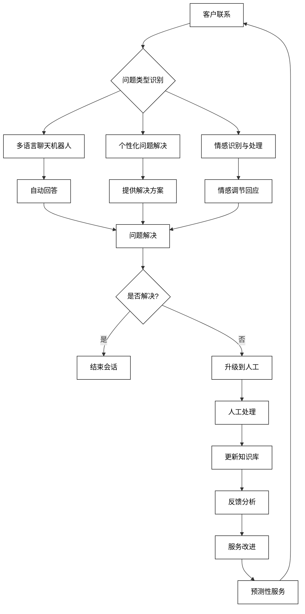
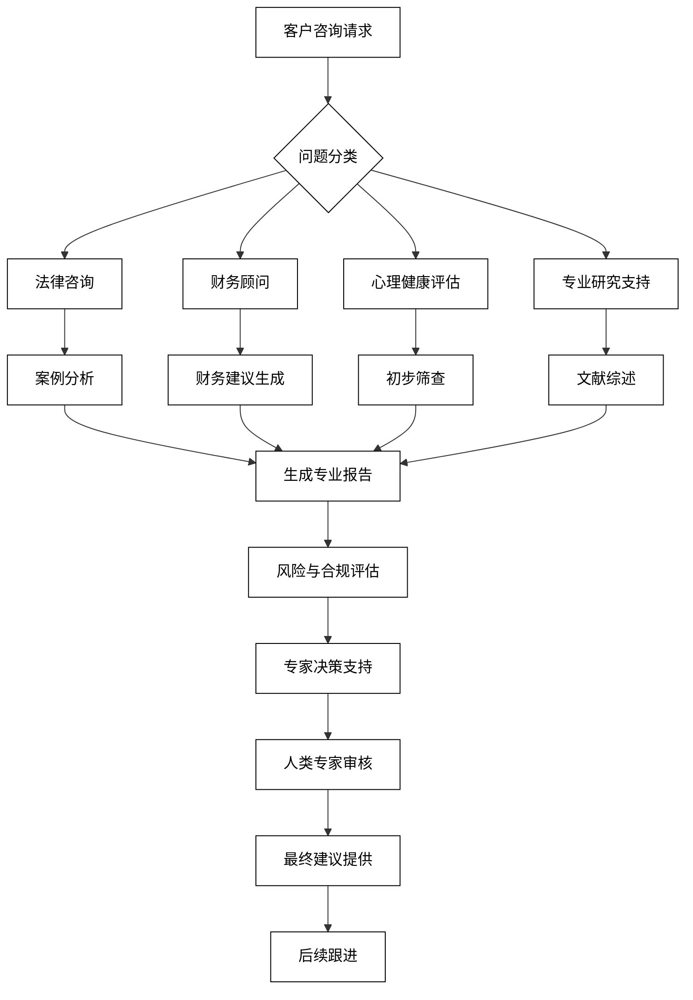
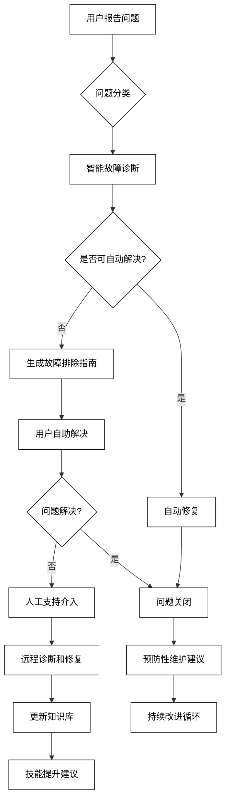
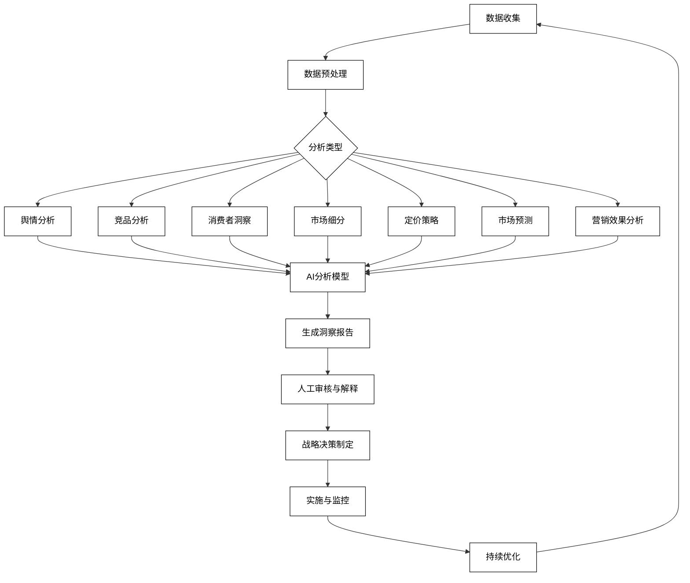

# 5 AI增强的咨询与服务

AI技术正在深刻地改变咨询和服务行业的面貌，为客户提供更加智能、高效和个性化的体验。从智能客户服务到专业咨询，再到技术支持和市场调研，AI的应用正在提升服务质量，优化运营效率，并创造新的价值。本章将深入探讨AI在这些领域的具体应用，展示如何利用AI技术增强咨询和服务能力。

## 5.1 智能客户服务

AI驱动的智能客户服务正在revolutionize客户体验，提供全天候、多语言的支持，同时大幅提高效率和一致性。以下是AI在智能客户服务中的主要应用：

### 5.1.1 多语言客服聊天机器人

AI可以支持多语言的客服聊天机器人，为全球客户提供即时支持。

```python
def multilingual_chatbot_response(user_query, user_language, product_info):
    prompt = f"作为多语言客服聊天机器人，用{user_language}回答以下问题。考虑产品信息：{product_info}\n用户问题：{user_query}\n请提供友好、准确和有帮助的回答。"
    response = openai.Completion.create(
        engine="text-davinci-002",
        prompt=prompt,
        max_tokens=200,
        n=1,
        stop=None,
        temperature=0.7,
    )
    return response.choices[0].text.strip()

user_query = "How can I track my order?"
user_language = "西班牙语"
product_info = "我们提供全球配送服务，订单号可以在确认邮件中找到"
chatbot_response = multilingual_chatbot_response(user_query, user_language, product_info)
print(f"聊天机器人回复（西班牙语）：\n{chatbot_response}")
```

### 5.1.2 个性化问题解决方案

AI可以基于客户历史和上下文提供个性化的问题解决方案。

```python
def personalized_solution(customer_issue, customer_history, product_knowledge_base):
    prompt = f"基于以下信息为客户提供个性化的解决方案：\n客户问题：{customer_issue}\n客户历史：{customer_history}\n产品知识库：{product_knowledge_base}\n提供步骤化的解决方案，考虑客户的具体情况。"
    response = openai.Completion.create(
        engine="text-davinci-002",
        prompt=prompt,
        max_tokens=300,
        n=1,
        stop=None,
        temperature=0.7,
    )
    return response.choices[0].text.strip()

customer_issue = "无法连接智能家居设备到WiFi"
customer_history = "新用户，一周前购买产品，使用Android手机"
product_knowledge_base = "常见连接问题包括：密码错误、路由器兼容性、App版本过旧"
solution = personalized_solution(customer_issue, customer_history, product_knowledge_base)
print(f"个性化解决方案：\n{solution}")
```

### 5.1.3 情感识别与处理

AI可以识别客户情绪，并相应地调整回应策略。

```python
def emotion_aware_response(customer_message, detected_emotion):
    prompt = f"根据检测到的情绪，生成一个适当的回应：\n客户消息：{customer_message}\n检测到的情绪：{detected_emotion}\n提供一个体贴、同理心的回应，旨在缓解客户的情绪并解决问题。"
    response = openai.Completion.create(
        engine="text-davinci-002",
        prompt=prompt,
        max_tokens=200,
        n=1,
        stop=None,
        temperature=0.7,
    )
    return response.choices[0].text.strip()

customer_message = "我已经等了三天了，但我的包裹还没到！这太让人失望了。"
detected_emotion = "沮丧和不耐烦"
emotion_response = emotion_aware_response(customer_message, detected_emotion)
print(f"情感感知回应：\n{emotion_response}")
```

4. **智能工单分类与路由**
   AI可以自动分类客户问题并将其路由到最合适的处理部门或代理。

```python
def classify_and_route_ticket(ticket_content, available_departments):
    prompt = f"分析以下客户工单内容，并决定将其路由到哪个部门：\n工单内容：{ticket_content}\n可用部门：{', '.join(available_departments)}\n提供路由决定和理由。"
    response = openai.Completion.create(
        engine="text-davinci-002",
        prompt=prompt,
        max_tokens=200,
        n=1,
        stop=None,
        temperature=0.7,
    )
    return response.choices[0].text.strip()

ticket_content = "我的账户显示未经授权的交易，我想立即冻结我的卡。"
available_departments = ["技术支持", "账户安全", "账单查询", "一般咨询"]
routing_decision = classify_and_route_ticket(ticket_content, available_departments)
print(f"工单分类与路由：\n{routing_decision}")
```

5. **自动生成知识库文章**
   AI可以基于常见问题和解决方案自动生成或更新知识库文章。

```python
def generate_knowledge_base_article(topic, common_questions, solution_data):
    prompt = f"为知识库创建一篇关于'{topic}'的文章。包含以下常见问题：{common_questions}。使用这些解决方案数据：{solution_data}。文章应该清晰、结构化，并易于客户理解。"
    response = openai.Completion.create(
        engine="text-davinci-002",
        prompt=prompt,
        max_tokens=500,
        n=1,
        stop=None,
        temperature=0.7,
    )
    return response.choices[0].text.strip()

topic = "重置账户密码"
common_questions = "如何重置密码？忘记密码怎么办？重置密码后无法登录怎么办？"
solution_data = "通过邮箱重置、使用安全问题、联系客户支持"
knowledge_article = generate_knowledge_base_article(topic, common_questions, solution_data)
print(f"生成的知识库文章：\n{knowledge_article}")
```

6. **客户反馈分析**
   AI可以分析客户反馈，提取关键洞察和改进建议。

```python
def analyze_customer_feedback(feedback_data, analysis_focus):
    prompt = f"分析以下客户反馈数据，重点关注{analysis_focus}：\n{feedback_data}\n提供主要发现、趋势和改进建议。"
    response = openai.Completion.create(
        engine="text-davinci-002",
        prompt=prompt,
        max_tokens=400,
        n=1,
        stop=None,
        temperature=0.7,
    )
    return response.choices[0].text.strip()

feedback_data = "产品质量好：45%，送货速度快：30%，客服态度佳：15%，价格合理：10%，产品种类少：20%，网站难用：15%"
analysis_focus = "客户满意度和产品改进方向"
feedback_analysis = analyze_customer_feedback(feedback_data, analysis_focus)
print(f"客户反馈分析：\n{feedback_analysis}")
```

7. **预测性客户服务**
   AI可以预测可能的客户问题，主动提供支持。

```python
def predict_customer_issues(customer_behavior, product_usage, historical_data):
    prompt = f"基于以下信息预测可能出现的客户问题：\n客户行为：{customer_behavior}\n产品使用情况：{product_usage}\n历史数据：{historical_data}\n识别潜在问题并提供主动支持建议。"
    response = openai.Completion.create(
        engine="text-davinci-002",
        prompt=prompt,
        max_tokens=300,
        n=1,
        stop=None,
        temperature=0.7,
    )
    return response.choices[0].text.strip()

customer_behavior = "频繁访问帮助页面，搜索'连接问题'"
product_usage = "智能家居设备使用频率低于平均水平"
historical_data = "类似用户常遇到WiFi连接问题"
prediction = predict_customer_issues(customer_behavior, product_usage, historical_data)
print(f"预测性客户服务建议：\n{prediction}")
```

这些AI驱动的智能客户服务应用可以显著提升客户体验，提高服务效率，并减轻人工客服的工作负担。然而，人类客服代表仍然在处理复杂问题、提供情感支持和维护客户关系方面发挥着关键作用。

为了更好地理解AI在智能客户服务中的应用流程，我们可以使用以下Mermaid流程图：



这个流程图展示了AI驱动的智能客户服务的完整流程，从客户联系到服务改进和预测性服务。它强调了AI在整个服务过程中的多方面应用，以及如何与人工服务无缝集成。通过这种方法，企业可以提供更加高效、个性化和主动的客户服务，同时不断优化和改进服务质量。

## 5.2 专业咨询服务

AI技术正在revolutionize专业咨询服务领域，为法律、财务和心理健康等专业领域提供智能支持。这不仅提高了服务效率，还扩大了专业知识的可及性。以下是AI在专业咨询服务中的主要应用：

### 5.2.1 法律咨询辅助

AI可以协助法律专业人士进行案例研究、文件审查和初步法律建议。

```python
def legal_case_analysis(case_description, relevant_laws, previous_cases):
    prompt = f"分析以下法律案例：\n案例描述：{case_description}\n相关法律：{relevant_laws}\n先例：{previous_cases}\n提供初步法律分析，包括可能的论点、潜在风险和建议的下一步行动。"
    response = openai.Completion.create(
        engine="text-davinci-002",
        prompt=prompt,
        max_tokens=500,
        n=1,
        stop=None,
        temperature=0.7,
    )
    return response.choices[0].text.strip()

case_description = "一家公司在未经员工同意的情况下监控了员工的电子邮件"
relevant_laws = "隐私法、劳动法"
previous_cases = "Smith v. XYZ Corp (2019): 法院裁定，在明确告知的情况下，公司可以监控工作邮箱"
legal_analysis = legal_case_analysis(case_description, relevant_laws, previous_cases)
print(f"法律案例分析：\n{legal_analysis}")
```

### 5.2.2 财务顾问支持系统

AI可以提供个性化的财务分析和投资建议。

```python
def financial_advice_generation(client_profile, financial_goals, market_data):
    prompt = f"基于以下信息生成个性化财务建议：\n客户档案：{client_profile}\n财务目标：{financial_goals}\n市场数据：{market_data}\n提供资产配置建议、风险评估和具体的投资策略。"
    response = openai.Completion.create(
        engine="text-davinci-002",
        prompt=prompt,
        max_tokens=400,
        n=1,
        stop=None,
        temperature=0.7,
    )
    return response.choices[0].text.strip()

client_profile = "35岁，已婚，年收入10万美元，风险承受能力中等"
financial_goals = "为退休储蓄，同时为子女教育基金做准备"
market_data = "股市波动，利率低迷，新兴市场增长潜力大"
financial_advice = financial_advice_generation(client_profile, financial_goals, market_data)
print(f"个性化财务建议：\n{financial_advice}")
```

### 5.2.3 心理健康初筛与建议

AI可以进行初步的心理健康评估并提供自助建议。

```python
def mental_health_screening(user_responses, assessment_criteria):
    prompt = f"基于以下用户回应进行心理健康初步评估：\n用户回应：{user_responses}\n评估标准：{assessment_criteria}\n提供初步分析、可能的关注领域和自助建议。注意，这不能替代专业的心理健康诊断。"
    response = openai.Completion.create(
        engine="text-davinci-002",
        prompt=prompt,
        max_tokens=400,
        n=1,
        stop=None,
        temperature=0.7,
    )
    return response.choices[0].text.strip()

user_responses = "睡眠质量差，工作压力大，社交活动减少，但没有自杀念头"
assessment_criteria = "抑郁症筛查量表（PHQ-9），焦虑障碍筛查量表（GAD-7）"
mental_health_assessment = mental_health_screening(user_responses, assessment_criteria)
print(f"心理健康初筛结果：\n{mental_health_assessment}")
```

4. **专业文献综述**
   AI可以协助专业人士快速总结和分析大量专业文献。

```python
def literature_review(research_topic, key_papers, review_focus):
    prompt = f"对以下研究主题进行文献综述：\n研究主题：{research_topic}\n关键论文：{key_papers}\n综述重点：{review_focus}\n提供主要发现、研究趋势和潜在的研究方向。"
    response = openai.Completion.create(
        engine="text-davinci-002",
        prompt=prompt,
        max_tokens=500,
        n=1,
        stop=None,
        temperature=0.7,
    )
    return response.choices[0].text.strip()

research_topic = "人工智能在医疗诊断中的应用"
key_papers = "1. AI in Radiology (2020) 2. Machine Learning for Disease Prediction (2021) 3. Ethical Considerations in AI-assisted Diagnosis (2019)"
review_focus = "技术进展、临床应用和伦理问题"
literature_summary = literature_review(research_topic, key_papers, review_focus)
print(f"文献综述：\n{literature_summary}")
```

5. **专业报告生成**
   AI可以协助生成各类专业报告，如市场分析报告、审计报告等。

```python
def generate_professional_report(report_type, data_points, analysis_requirements):
    prompt = f"生成一份{report_type}报告。使用以下数据点：{data_points}\n分析要求：{analysis_requirements}\n报告应包括执行摘要、详细分析、结论和建议。"
    response = openai.Completion.create(
        engine="text-davinci-002",
        prompt=prompt,
        max_tokens=600,
        n=1,
        stop=None,
        temperature=0.7,
    )
    return response.choices[0].text.strip()

report_type = "市场竞争分析"
data_points = "市场份额数据、主要竞争对手的SWOT分析、消费者调查结果"
analysis_requirements = "识别市场趋势、评估竞争优势、提出市场定位建议"
professional_report = generate_professional_report(report_type, data_points, analysis_requirements)
print(f"专业报告：\n{professional_report}")
```

6. **风险评估与合规检查**
   AI可以协助进行风险评估和合规性检查。

```python
def risk_compliance_assessment(business_description, regulatory_framework, industry_standards):
    prompt = f"对以下业务进行风险评估和合规性检查：\n业务描述：{business_description}\n监管框架：{regulatory_framework}\n行业标准：{industry_standards}\n识别潜在风险、合规问题和缓解策略。"
    response = openai.Completion.create(
        engine="text-davinci-002",
        prompt=prompt,
        max_tokens=500,
        n=1,
        stop=None,
        temperature=0.7,
    )
    return response.choices[0].text.strip()

business_description = "一家跨国电子商务平台，处理用户个人数据和支付信息"
regulatory_framework = "GDPR, PCI DSS, 各国消费者保护法"
industry_standards = "ISO 27001, NIST网络安全框架"
risk_assessment = risk_compliance_assessment(business_description, regulatory_framework, industry_standards)
print(f"风险与合规评估：\n{risk_assessment}")
```

7. **专家系统决策支持**
   AI可以模拟专家决策过程，为复杂问题提供决策支持。

```python
def expert_decision_support(problem_description, domain_knowledge, decision_criteria):
    prompt = f"作为专家系统，对以下问题提供决策支持：\n问题描述：{problem_description}\n领域知识：{domain_knowledge}\n决策标准：{decision_criteria}\n提供分析、可能的解决方案和推荐决策。"
    response = openai.Completion.create(
        engine="text-davinci-002",
        prompt=prompt,
        max_tokens=500,
        n=1,
        stop=None,
        temperature=0.7,
    )
    return response.choices[0].text.strip()

problem_description = "选择新的企业资源规划(ERP)系统"
domain_knowledge = "ERP系统功能、主要供应商比较、实施挑战"
decision_criteria = "成本效益、可扩展性、与现有系统的集成、用户友好性"
expert_advice = expert_decision_support(problem_description, domain_knowledge, decision_criteria)
print(f"专家决策支持：\n{expert_advice}")
```

这些AI驱动的专业咨询服务应用可以显著提高专业人士的工作效率，扩大专业知识的覆盖范围，并为客户提供更快速、更全面的初步建议。然而，人类专家的判断、伦理考量和复杂情况处理能力仍然是不可或缺的。

为了更好地理解AI在专业咨询服务中的应用流程，我们可以使用以下Mermaid流程图：



这个流程图展示了AI辅助的专业咨询服务的完整流程，从客户咨询请求到最终建议提供和后续跟进。它强调了AI在各个专业领域的支持作用，以及如何与人类专家的专业判断相结合。通过这种方法，专业服务机构可以提供更加高效、全面和个性化的咨询服务，同时确保专业质量和伦理标准的维护。

## 5.3 技术支持与故障排查

AI技术在技术支持和故障排查领域的应用正在显著提高问题解决的效率和准确性。从智能故障诊断到预防性维护，AI正在改变技术支持的方式。以下是AI在技术支持与故障排查中的主要应用：

### 5.3.1 智能故障诊断系统

AI可以分析症状和系统日志，快速识别问题根源并提供解决方案。

```python
def diagnose_technical_issue(symptoms, system_logs, device_info):
    prompt = f"基于以下信息诊断技术问题：\n症状：{symptoms}\n系统日志：{system_logs}\n设备信息：{device_info}\n提供可能的原因分析和推荐的解决步骤。"
    response = openai.Completion.create(
        engine="text-davinci-002",
        prompt=prompt,
        max_tokens=400,
        n=1,
        stop=None,
        temperature=0.7,
    )
    return response.choices[0].text.strip()

symptoms = "设备无法连接WiFi，但其他设备正常"
system_logs = "DHCP请求超时，DNS解析失败"
device_info = "智能手机，型号XYZ，操作系统版本12.3"
diagnosis = diagnose_technical_issue(symptoms, system_logs, device_info)
print(f"故障诊断结果：\n{diagnosis}")
```

### 5.3.2 交互式问题解决指南

AI可以生成个性化的、步骤化的问题解决指南。

```python
def generate_troubleshooting_guide(issue_description, user_skill_level, device_type):
    prompt = f"为以下技术问题创建一个交互式故障排除指南：\n问题描述：{issue_description}\n用户技能水平：{user_skill_level}\n设备类型：{device_type}\n提供清晰、逐步的指导，包括可能需要的工具和注意事项。"
    response = openai.Completion.create(
        engine="text-davinci-002",
        prompt=prompt,
        max_tokens=500,
        n=1,
        stop=None,
        temperature=0.7,
    )
    return response.choices[0].text.strip()

issue_description = "笔记本电脑开机后蓝屏"
user_skill_level = "初级"
device_type = "Windows笔记本电脑"
troubleshooting_guide = generate_troubleshooting_guide(issue_description, user_skill_level, device_type)
print(f"故障排除指南：\n{troubleshooting_guide}")
```

### 5.3.3 预防性维护建议

AI可以分析设备使用模式和历史数据，提供预防性维护建议。

```python
def preventive_maintenance_suggestions(device_usage_data, maintenance_history, environmental_factors):
    prompt = f"基于以下信息提供预防性维护建议：\n设备使用数据：{device_usage_data}\n维护历史：{maintenance_history}\n环境因素：{environmental_factors}\n提供具体的维护建议、时间表和潜在问题预警。"
    response = openai.Completion.create(
        engine="text-davinci-002",
        prompt=prompt,
        max_tokens=400,
        n=1,
        stop=None,
        temperature=0.7,
    )
    return response.choices[0].text.strip()

device_usage_data = "每日运行12小时，CPU使用率平均75%，硬盘空间使用90%"
maintenance_history = "上次系统更新3个月前，硬件检查6个月前"
environmental_factors = "高温多尘环境"
maintenance_advice = preventive_maintenance_suggestions(device_usage_data, maintenance_history, environmental_factors)
print(f"预防性维护建议：\n{maintenance_advice}")
```

4. **技术文档自动生成**
   AI可以根据产品规格和常见问题自动生成技术文档。

```python
def generate_technical_documentation(product_specs, common_issues, user_feedback):
    prompt = f"为以下产品生成技术文档：\n产品规格：{product_specs}\n常见问题：{common_issues}\n用户反馈：{user_feedback}\n包括产品概述、技术参数、使用说明、故障排除和常见问题解答。"
    response = openai.Completion.create(
        engine="text-davinci-002",
        prompt=prompt,
        max_tokens=600,
        n=1,
        stop=None,
        temperature=0.7,
    )
    return response.choices[0].text.strip()

product_specs = "智能家居控制器，支持WiFi和蓝牙，兼容多种智能设备"
common_issues = "设备配对失败，App崩溃，固件更新问题"
user_feedback = "界面友好，但初次设置复杂"
technical_doc = generate_technical_documentation(product_specs, common_issues, user_feedback)
print(f"技术文档：\n{technical_doc}")
```

5. **远程诊断和修复**
   AI可以进行远程系统诊断并尝试自动修复某些问题。

```python
def remote_diagnosis_and_repair(system_status, error_logs, remote_access_permissions):
    prompt = f"执行远程诊断并尝试修复：\n系统状态：{system_status}\n错误日志：{error_logs}\n远程访问权限：{remote_access_permissions}\n提供诊断结果、尝试的修复操作和结果报告。"
    response = openai.Completion.create(
        engine="text-davinci-002",
        prompt=prompt,
        max_tokens=500,
        n=1,
        stop=None,
        temperature=0.7,
    )
    return response.choices[0].text.strip()

system_status = "数据库服务器响应缓慢，CPU使用率高"
error_logs = "多次出现查询超时错误，内存使用接近上限"
remote_access_permissions = "完全管理员权限"
remote_repair_report = remote_diagnosis_and_repair(system_status, error_logs, remote_access_permissions)
print(f"远程诊断和修复报告：\n{remote_repair_report}")
```

6. **技术支持知识图谱**
   AI可以构建和维护技术支持知识图谱，帮助快速定位解决方案。

```python
def build_support_knowledge_graph(support_tickets, solution_database, product_documentation):
    prompt = f"基于以下信息构建技术支持知识图谱：\n支持工单：{support_tickets}\n解决方案数据库：{solution_database}\n产品文档：{product_documentation}\n提供主要问题类别、关键概念之间的关系和常见解决路径。"
    response = openai.Completion.create(
        engine="text-davinci-002",
        prompt=prompt,
        max_tokens=600,
        n=1,
        stop=None,
        temperature=0.7,
    )
    return response.choices[0].text.strip()

support_tickets = "网络连接问题40%，软件兼容性20%，硬件故障15%，用户操作错误25%"
solution_database = "包含500+已解决案例，按问题类型和解决方法分类"
product_documentation = "用户手册、技术规格、常见问题解答"
knowledge_graph = build_support_knowledge_graph(support_tickets, solution_database, product_documentation)
print(f"技术支持知识图谱：\n{knowledge_graph}")
```

7. **技能提升建议**
   AI可以为技术支持人员提供个性化的技能提升建议。

```python
def suggest_skill_improvements(support_agent_performance, emerging_tech_trends, customer_feedback):
    prompt = f"为技术支持人员提供技能提升建议：\n支持人员表现：{support_agent_performance}\n新兴技术趋势：{emerging_tech_trends}\n客户反馈：{customer_feedback}\n提供具体的学习建议、资源推荐和发展方向。"
    response = openai.Completion.create(
        engine="text-davinci-002",
        prompt=prompt,
        max_tokens=400,
        n=1,
        stop=None,
        temperature=0.7,
    )
    return response.choices[0].text.strip()

support_agent_performance = "解决率85%，客户满意度4.2/5，平均处理时间15分钟"
emerging_tech_trends = "云服务问题增加，IoT设备支持需求上升"
customer_feedback = "技术知识扎实，但沟通技巧有待提高"
skill_improvement_suggestions = suggest_skill_improvements(support_agent_performance, emerging_tech_trends, customer_feedback)
print(f"技能提升建议：\n{skill_improvement_suggestions}")
```

这些AI驱动的技术支持与故障排查应用可以显著提高问题解决的效率和准确性，减少人工支持的负担，并提供更好的用户体验。然而，复杂和非标准问题的处理仍然需要人类专家的介入和判断。

为了更好地理解AI在技术支持与故障排查中的应用流程，我们可以使用以下Mermaid流程图：



这个流程图展示了AI辅助的技术支持与故障排查的完整过程，从问题报告到解决和持续改进。它强调了AI在自动诊断、自助解决和知识管理方面的作用，同时也显示了人工支持在处理复杂问题时的重要性。通过这种方法，技术支持团队可以更高效地解决问题，提供更好的用户体验，并不断优化支持流程。

## 5.4 市场调研与分析

AI技术正在revolutionize市场调研和分析领域，提供更深入、更快速、更全面的市场洞察。从海量数据分析到预测性建模，AI正在帮助企业做出更明智的市场决策。以下是AI在市场调研与分析中的主要应用：

### 5.4.1 舆情分析与趋势预测

AI可以分析社交媒体、新闻和其他公开数据源，洞察公众情感和预测市场趋势。

```python
def sentiment_trend_analysis(data_sources, time_period, target_keywords):
    prompt = f"对以下数据源进行舆情分析和趋势预测：\n数据源：{data_sources}\n时间段：{time_period}\n目标关键词：{target_keywords}\n提供情感分析结果、主要话题、趋势预测和可能的影响因素。"
    response = openai.Completion.create(
        engine="text-davinci-002",
        prompt=prompt,
        max_tokens=500,
        n=1,
        stop=None,
        temperature=0.7,
    )
    return response.choices[0].text.strip()

data_sources = "Twitter, 新闻文章, 行业论坛"
time_period = "过去3个月"
target_keywords = "电动汽车, 可持续能源, 智能家居"
sentiment_analysis = sentiment_trend_analysis(data_sources, time_period, target_keywords)
print(f"舆情分析与趋势预测：\n{sentiment_analysis}")
```

### 5.4.2 竞品分析报告生成

AI可以收集和分析竞争对手的公开信息，生成全面的竞品分析报告。

```python
def generate_competitive_analysis(competitor_list, market_data, company_strengths):
    prompt = f"生成竞品分析报告：\n竞争对手：{competitor_list}\n市场数据：{market_data}\n我司优势：{company_strengths}\n提供每个竞争对手的SWOT分析、市场定位比较、产品/服务对比和潜在的竞争策略。"
    response = openai.Completion.create(
        engine="text-davinci-002",
        prompt=prompt,
        max_tokens=600,
        n=1,
        stop=None,
        temperature=0.7,
    )
    return response.choices[0].text.strip()

competitor_list = "A公司, B公司, C公司"
market_data = "总市场规模100亿, 年增长率15%, 主要细分市场：家庭用户60%, 企业用户40%"
company_strengths = "技术创新能力强, 客户服务出色, 品牌知名度高"
competitive_analysis = generate_competitive_analysis(competitor_list, market_data, company_strengths)
print(f"竞品分析报告：\n{competitive_analysis}")
```

### 5.4.3 消费者洞察挖掘

AI可以分析消费者行为数据，提取有价值的消费者洞察。

```python
def extract_consumer_insights(behavioral_data, survey_results, demographic_info):
    prompt = f"基于以下信息挖掘消费者洞察：\n行为数据：{behavioral_data}\n调查结果：{survey_results}\n人口统计信息：{demographic_info}\n识别关键消费者群体、行为模式、需求和偏好，并提供营销策略建议。"
    response = openai.Completion.create(
        engine="text-davinci-002",
        prompt=prompt,
        max_tokens=500,
        n=1,
        stop=None,
        temperature=0.7,
    )
    return response.choices[0].text.strip()

behavioral_data = "网站浏览模式、购买历史、产品评价数据"
survey_results = "客户满意度调查、品牌认知度调查"
demographic_info = "年龄分布、地理位置、收入水平"
consumer_insights = extract_consumer_insights(behavioral_data, survey_results, demographic_info)
print(f"消费者洞察：\n{consumer_insights}")
```

4. **市场细分与目标客户识别**
   AI可以帮助企业更精确地细分市场并识别最有价值的目标客户群。

```python
def market_segmentation(customer_data, product_preferences, purchasing_behavior):
    prompt = f"基于以下数据进行市场细分和目标客户识别：\n客户数据：{customer_data}\n产品偏好：{product_preferences}\n购买行为：{purchasing_behavior}\n提供主要细分市场描述、每个细分市场的特征和最具潜力的目标客户群推荐。"
    response = openai.Completion.create(
        engine="text-davinci-002",
        prompt=prompt,
        max_tokens=500,
        n=1,
        stop=None,
        temperature=0.7,
    )
    return response.choices[0].text.strip()

customer_data = "年龄、职业、家庭状况、收入水平"
product_preferences = "功能偏好、品牌忠诚度、价格敏感度"
purchasing_behavior = "购买频率、平均订单价值、首选购买渠道"
segmentation_result = market_segmentation(customer_data, product_preferences, purchasing_behavior)
print(f"市场细分结果：\n{segmentation_result}")
```

5. **产品定价策略分析**
   AI可以分析市场数据、竞争对手价格和消费者行为，提供最优定价策略建议。

```python
def pricing_strategy_analysis(product_costs, competitor_prices, demand_elasticity):
    prompt = f"分析并提供产品定价策略建议：\n产品成本：{product_costs}\n竞争对手价格：{competitor_prices}\n需求弹性：{demand_elasticity}\n考虑利润最大化、市场份额和品牌定位，提供具体的定价建议和预期影响。"
    response = openai.Completion.create(
        engine="text-davinci-002",
        prompt=prompt,
        max_tokens=400,
        n=1,
        stop=None,
        temperature=0.7,
    )
    return response.choices[0].text.strip()

product_costs = "原材料成本上涨10%, 固定成本稳定"
competitor_prices = "主要竞争对手A降价5%, B保持不变"
demand_elasticity = "价格弹性系数为-1.2"
pricing_strategy = pricing_strategy_analysis(product_costs, competitor_prices, demand_elasticity)
print(f"定价策略建议：\n{pricing_strategy}")
```

6. **市场预测模型**
   AI可以构建复杂的市场预测模型，预测未来的市场趋势和需求变化。

```python
def market_forecast_model(historical_data, economic_indicators, industry_trends):
    prompt = f"构建市场预测模型：\n历史数据：{historical_data}\n经济指标：{economic_indicators}\n行业趋势：{industry_trends}\n提供未来12个月的市场预测，包括销量、市场份额和潜在的颠覆性因素。"
    response = openai.Completion.create(
        engine="text-davinci-002",
        prompt=prompt,
        max_tokens=500,
        n=1,
        stop=None,
        temperature=0.7,
    )
    return response.choices[0].text.strip()

historical_data = "过去5年的月度销售数据、市场份额变化"
economic_indicators = "GDP增长率、通货膨胀率、消费者信心指数"
industry_trends = "技术创新、监管变化、新进入者"
market_forecast = market_forecast_model(historical_data, economic_indicators, industry_trends)
print(f"市场预测结果：\n{market_forecast}")
```

7. **营销活动效果分析**
   AI可以评估和优化营销活动的效果，提供ROI分析和改进建议。

```python
def marketing_campaign_analysis(campaign_data, conversion_rates, customer_feedback):
    prompt = f"分析营销活动效果：\n活动数据：{campaign_data}\n转化率：{conversion_rates}\n客户反馈：{customer_feedback}\n评估活动ROI、识别最有效的渠道和消息，并提供优化建议。"
    response = openai.Completion.create(
        engine="text-davinci-002",
        prompt=prompt,
        max_tokens=500,
        n=1,
        stop=None,
        temperature=0.7,
    )
    return response.choices[0].text.strip()

campaign_data = "预算分配、渠道使用、触达人数"
conversion_rates = "电子邮件5%, 社交媒体3%, 搜索广告7%"
customer_feedback = "产品信息清晰, 但价值主张不够强烈"
campaign_analysis = marketing_campaign_analysis(campaign_data, conversion_rates, customer_feedback)
print(f"营销活动分析：\n{campaign_analysis}")
```

这些AI驱动的市场调研与分析应用可以帮助企业更快速、更准确地理解市场动态，识别机会和威胁，并做出数据驱动的决策。然而，人类分析师的战略思维、创造性洞察和对复杂市场环境的理解仍然是不可或缺的。

为了更好地理解AI在市场调研与分析中的应用流程，我们可以使用以下Mermaid流程图：



这个流程图展示了AI辅助的市场调研与分析的完整过程，从数据收集到持续优化。它强调了AI在各种分析任务中的应用，以及如何将AI生成的洞察与人类专家的判断相结合，最终支持战略决策制定。通过这种方法，企业可以更全面、更敏捷地应对市场变化，提高决策的质量和速度。
