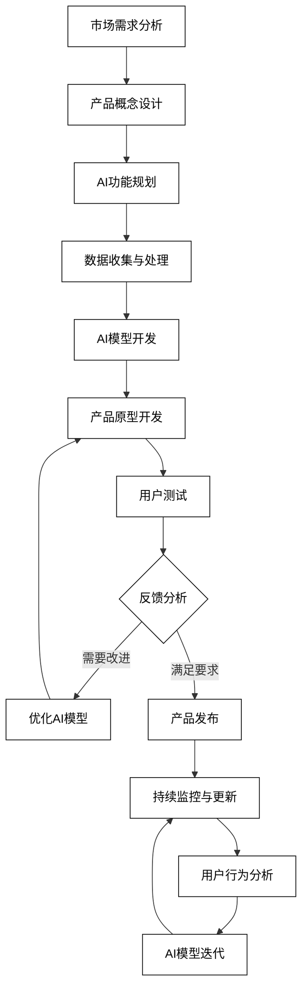
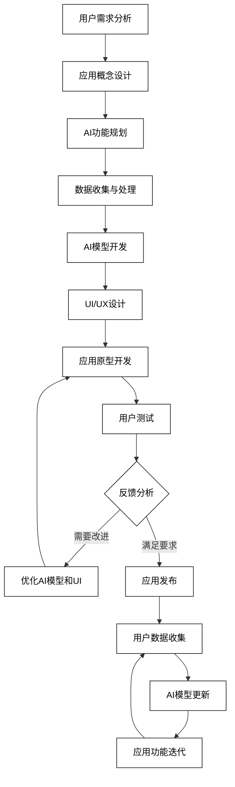
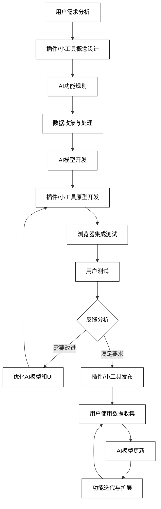
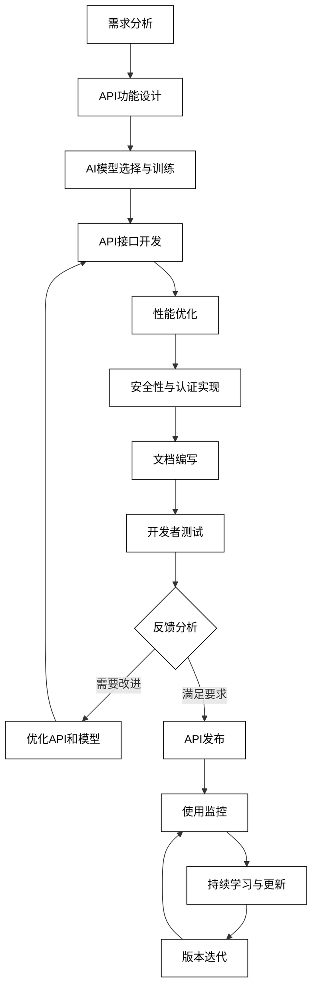

# 6 AI驱动的产品与工具开发

AI技术正在revolutionize产品开发和工具创新的方式，为各行各业带来新的可能性。从SaaS产品到移动应用，从浏览器插件到API服务，AI正在成为驱动创新和提升用户体验的核心力量。本章将深入探讨AI在产品与工具开发中的具体应用，展示如何利用AI技术创造更智能、更个性化、更高效的解决方案。

## 6.1 SaaS产品开发

AI正在为SaaS（软件即服务）产品注入新的活力，提供更智能、更个性化的用户体验。以下是AI在SaaS产品开发中的主要应用：

### 6.1.1 AI写作助手

AI可以开发智能写作助手，帮助用户提高写作效率和质量。

```python
def ai_writing_assistant(user_input, writing_style, target_audience):
    prompt = f"作为AI写作助手，基于以下信息生成内容：\n用户输入：{user_input}\n写作风格：{writing_style}\n目标受众：{target_audience}\n提供改进建议、替代表达和内容扩展。"
    response = openai.Completion.create(
        engine="text-davinci-002",
        prompt=prompt,
        max_tokens=300,
        n=1,
        stop=None,
        temperature=0.7,
    )
    return response.choices[0].text.strip()

user_input = "我想写一篇关于人工智能在医疗领域应用的文章"
writing_style = "通俗易懂，适合大众读者"
target_audience = "对科技感兴趣的普通读者"
writing_assistance = ai_writing_assistant(user_input, writing_style, target_audience)
print(f"AI写作助手建议：\n{writing_assistance}")
```

### 6.1.2 智能数据分析平台

AI可以开发自动化的数据分析平台，帮助用户快速获取洞察。

```python
def intelligent_data_analysis(data_description, analysis_goals, user_expertise):
    prompt = f"作为智能数据分析平台，基于以下信息提供分析建议：\n数据描述：{data_description}\n分析目标：{analysis_goals}\n用户专业水平：{user_expertise}\n推荐适当的分析方法、可视化技术和关键洞察点。"
    response = openai.Completion.create(
        engine="text-davinci-002",
        prompt=prompt,
        max_tokens=400,
        n=1,
        stop=None,
        temperature=0.7,
    )
    return response.choices[0].text.strip()

data_description = "电子商务网站的用户行为数据，包括浏览历史、购买记录和用户属性"
analysis_goals = "提高转化率和客户终身价值"
user_expertise = "市场营销经理，有基本的数据分析知识"
analysis_recommendations = intelligent_data_analysis(data_description, analysis_goals, user_expertise)
print(f"智能数据分析建议：\n{analysis_recommendations}")
```

### 6.1.3 自动化营销工具

AI可以开发智能营销自动化工具，优化营销策略和执行。

```python
def automated_marketing_tool(campaign_objectives, target_audience, available_channels):
    prompt = f"作为自动化营销工具，基于以下信息生成营销策略：\n活动目标：{campaign_objectives}\n目标受众：{target_audience}\n可用渠道：{available_channels}\n提供个性化的内容建议、最佳发送时间和渠道组合推荐。"
    response = openai.Completion.create(
        engine="text-davinci-002",
        prompt=prompt,
        max_tokens=400,
        n=1,
        stop=None,
        temperature=0.7,
    )
    return response.choices[0].text.strip()

campaign_objectives = "提高品牌知名度和增加网站流量"
target_audience = "25-40岁的城市专业人士，对健康生活方式感兴趣"
available_channels = "社交媒体、电子邮件、内容营销、付费广告"
marketing_strategy = automated_marketing_tool(campaign_objectives, target_audience, available_channels)
print(f"自动化营销策略：\n{marketing_strategy}")
```

4. **智能客户服务平台**
   AI可以开发智能客户服务平台，提供全天候的自动化支持。

```python
def intelligent_customer_service(customer_query, product_info, user_history):
    prompt = f"作为智能客户服务平台，回答以下客户查询：\n客户问题：{customer_query}\n产品信息：{product_info}\n用户历史：{user_history}\n提供准确、友好的回答，并推荐相关产品或服务。"
    response = openai.Completion.create(
        engine="text-davinci-002",
        prompt=prompt,
        max_tokens=300,
        n=1,
        stop=None,
        temperature=0.7,
    )
    return response.choices[0].text.strip()

customer_query = "我的订单什么时候能到货？"
product_info = "标准配送时间3-5个工作日，快递公司为XYZ"
user_history = "常客，过去6个月内有5次购买记录"
service_response = intelligent_customer_service(customer_query, product_info, user_history)
print(f"智能客户服务回复：\n{service_response}")
```

5. **AI驱动的项目管理工具**
   AI可以开发智能项目管理工具，自动化任务分配和进度跟踪。

```python
def ai_project_management(project_description, team_members, deadlines):
    prompt = f"作为AI项目管理工具，基于以下信息提供项目规划建议：\n项目描述：{project_description}\n团队成员：{team_members}\n截止日期：{deadlines}\n提供任务分解、资源分配和风险预警。"
    response = openai.Completion.create(
        engine="text-davinci-002",
        prompt=prompt,
        max_tokens=400,
        n=1,
        stop=None,
        temperature=0.7,
    )
    return response.choices[0].text.strip()

project_description = "开发一个新的移动应用，包括UI设计、后端开发和测试"
team_members = "2名UI设计师，3名后端开发者，2名测试工程师"
deadlines = "总工期3个月，UI设计1个月，开发1.5个月，测试0.5个月"
project_plan = ai_project_management(project_description, team_members, deadlines)
print(f"AI项目管理建议：\n{project_plan}")
```

6. **智能财务分析工具**
   AI可以开发智能财务分析工具，提供自动化的财务报告和预测。

```python
def intelligent_financial_analysis(financial_data, analysis_period, business_goals):
    prompt = f"作为智能财务分析工具，基于以下信息提供财务分析和建议：\n财务数据：{financial_data}\n分析期间：{analysis_period}\n业务目标：{business_goals}\n提供关键财务指标分析、趋势预测和改进建议。"
    response = openai.Completion.create(
        engine="text-davinci-002",
        prompt=prompt,
        max_tokens=500,
        n=1,
        stop=None,
        temperature=0.7,
    )
    return response.choices[0].text.strip()

financial_data = "收入增长率10%，毛利率30%，运营成本上升5%"
analysis_period = "过去12个月"
business_goals = "提高盈利能力，控制成本"
financial_analysis = intelligent_financial_analysis(financial_data, analysis_period, business_goals)
print(f"智能财务分析结果：\n{financial_analysis}")
```

7. **AI辅助的产品设计工具**
   AI可以开发辅助产品设计的工具，提供创意建议和优化方案。

```python
def ai_product_design_assistant(product_concept, target_market, design_constraints):
    prompt = f"作为AI产品设计助手，基于以下信息提供设计建议：\n产品概念：{product_concept}\n目标市场：{target_market}\n设计约束：{design_constraints}\n提供创新设计方案、材料选择建议和用户体验优化建议。"
    response = openai.Completion.create(
        engine="text-davinci-002",
        prompt=prompt,
        max_tokens=400,
        n=1,
        stop=None,
        temperature=0.7,
    )
    return response.choices[0].text.strip()

product_concept = "智能家居控制中心，集成语音助手和触摸屏"
target_market = "科技爱好者和智能家居初学者"
design_constraints = "成本控制，易于安装，兼容多种智能设备"
design_suggestions = ai_product_design_assistant(product_concept, target_market, design_constraints)
print(f"AI产品设计建议：\n{design_suggestions}")
```

这些AI驱动的SaaS产品开发应用可以显著提高产品的智能化水平，为用户提供更个性化、更高效的服务体验。然而，产品开发团队仍需要关注用户需求、市场趋势和技术可行性，确保AI功能真正为用户创造价值。

为了更好地理解AI在SaaS产品开发中的应用流程，我们可以使用以下Mermaid流程图：



这个流程图展示了AI驱动的SaaS产品开发的完整循环，从市场需求分析到产品持续优化。它强调了AI在产品开发各个阶段的重要性，以及如何通过持续的数据收集、分析和模型迭代来不断提升产品性能。通过这种方法，SaaS产品可以持续进化，更好地满足用户需求并保持竞争优势。

## 6.2 移动应用开发

AI技术正在revolutionize移动应用开发，为用户提供更智能、更个性化的移动体验。从生产力工具到健康管理应用，AI正在为各种移动应用注入新的活力。以下是AI在移动应用开发中的主要应用：

### 6.2.1 AI驱动的生产力应用

AI可以开发智能的生产力应用，帮助用户更高效地工作和学习。

```python
def ai_productivity_assistant(user_task, user_preferences, time_constraints):
    prompt = f"作为AI生产力助手，基于以下信息提供任务管理建议：\n用户任务：{user_task}\n用户偏好：{user_preferences}\n时间限制：{time_constraints}\n提供任务分解、优先级排序和时间管理建议。"
    response = openai.Completion.create(
        engine="text-davinci-002",
        prompt=prompt,
        max_tokens=300,
        n=1,
        stop=None,
        temperature=0.7,
    )
    return response.choices[0].text.strip()

user_task = "准备一个重要的项目演示"
user_preferences = "喜欢分块工作，需要定期休息"
time_constraints = "48小时内完成"
productivity_advice = ai_productivity_assistant(user_task, user_preferences, time_constraints)
print(f"AI生产力助手建议：\n{productivity_advice}")
```

### 6.2.2 智能健康管理APP

AI可以开发智能健康管理应用，提供个性化的健康建议和监测。

```python
def smart_health_manager(user_health_data, fitness_goals, lifestyle_info):
    prompt = f"作为智能健康管理助手，基于以下信息提供健康建议：\n用户健康数据：{user_health_data}\n健身目标：{fitness_goals}\n生活方式信息：{lifestyle_info}\n提供个性化的饮食建议、运动计划和健康提醒。"
    response = openai.Completion.create(
        engine="text-davinci-002",
        prompt=prompt,
        max_tokens=400,
        n=1,
        stop=None,
        temperature=0.7,
    )
    return response.choices[0].text.strip()

user_health_data = "BMI 24, 轻度高血压, 久坐生活方式"
fitness_goals = "在3个月内减重5公斤，改善心血管健康"
lifestyle_info = "工作繁忙，每周锻炼时间有限，喜欢快餐"
health_advice = smart_health_manager(user_health_data, fitness_goals, lifestyle_info)
print(f"智能健康管理建议：\n{health_advice}")
```

### 6.2.3 个性化学习应用

AI可以开发个性化学习应用，根据用户的学习风格和进度提供定制化内容。

```python
def personalized_learning_app(learning_topic, user_level, learning_style):
    prompt = f"作为个性化学习助手，基于以下信息设计学习计划：\n学习主题：{learning_topic}\n用户水平：{user_level}\n学习风格：{learning_style}\n提供个性化的学习路径、内容推荐和进度跟踪建议。"
    response = openai.Completion.create(
        engine="text-davinci-002",
        prompt=prompt,
        max_tokens=400,
        n=1,
        stop=None,
        temperature=0.7,
    )
    return response.choices[0].text.strip()

learning_topic = "Python编程"
user_level = "初学者"
learning_style = "视觉学习者，喜欢实践项目"
learning_plan = personalized_learning_app(learning_topic, user_level, learning_style)
print(f"个性化学习计划：\n{learning_plan}")
```

4. **AI驱动的旅行助手**
   AI可以开发智能旅行助手应用，提供个性化的旅行规划和推荐。

```python
def ai_travel_assistant(destination, travel_preferences, budget):
    prompt = f"作为AI旅行助手，基于以下信息提供旅行建议：\n目的地：{destination}\n旅行偏好：{travel_preferences}\n预算：{budget}\n提供个性化的行程规划、景点推荐和预订建议。"
    response = openai.Completion.create(
        engine="text-davinci-002",
        prompt=prompt,
        max_tokens=400,
        n=1,
        stop=None,
        temperature=0.7,
    )
    return response.choices[0].text.strip()

destination = "巴黎"
travel_preferences = "文化体验，美食探索，避开人群密集区"
budget = "中等预算，5天4晚"
travel_recommendations = ai_travel_assistant(destination, travel_preferences, budget)
print(f"AI旅行助手建议：\n{travel_recommendations}")
```

5. **智能相机应用**
   AI可以开发智能相机应用，提供实时图像增强和创意编辑功能。

```python
def smart_camera_app(image_type, editing_goals, user_skill_level):
    prompt = f"作为智能相机应用，基于以下信息提供拍摄和编辑建议：\n图像类型：{image_type}\n编辑目标：{editing_goals}\n用户技能水平：{user_skill_level}\n提供拍摄技巧、自动增强建议和创意编辑选项。"
    response = openai.Completion.create(
        engine="text-davinci-002",
        prompt=prompt,
        max_tokens=300,
        n=1,
        stop=None,
        temperature=0.7,
    )
    return response.choices[0].text.strip()

image_type = "夜景人像"
editing_goals = "增强氛围，突出主体"
user_skill_level = "业余摄影爱好者"
camera_suggestions = smart_camera_app(image_type, editing_goals, user_skill_level)
print(f"智能相机应用建议：\n{camera_suggestions}")
```

6. **AI语言学习应用**
   AI可以开发智能语言学习应用，提供个性化的语言练习和实时反馈。

```python
def ai_language_tutor(target_language, proficiency_level, learning_goals):
    prompt = f"作为AI语言教师，基于以下信息设计语言学习计划：\n目标语言：{target_language}\n熟练程度：{proficiency_level}\n学习目标：{learning_goals}\n提供个性化的学习内容、口语练习建议和语法纠正。"
    response = openai.Completion.create(
        engine="text-davinci-002",
        prompt=prompt,
        max_tokens=400,
        n=1,
        stop=None,
        temperature=0.7,
    )
    return response.choices[0].text.strip()

target_language = "西班牙语"
proficiency_level = "中级"
learning_goals = "提高口语流利度，掌握商务词汇"
language_learning_plan = ai_language_tutor(target_language, proficiency_level, learning_goals)
print(f"AI语言学习计划：\n{language_learning_plan}")
```

7. **智能财务管理应用**
   AI可以开发智能财务管理应用，提供个性化的预算建议和投资策略。

```python
def smart_finance_manager(income_data, spending_habits, financial_goals):
    prompt = f"作为智能财务管理助手，基于以下信息提供财务建议：\n收入数据：{income_data}\n消费习惯：{spending_habits}\n财务目标：{financial_goals}\n提供预算规划、节省建议和投资策略。"
    response = openai.Completion.create(
        engine="text-davinci-002",
        prompt=prompt,
        max_tokens=400,
        n=1,
        stop=None,
        temperature=0.7,
    )
    return response.choices[0].text.strip()

income_data = "月收入5000美元，有稳定工作"
spending_habits = "30%用于房租，20%用于饮食，15%用于娱乐"
financial_goals = "建立应急基金，开始为退休储蓄"
financial_advice = smart_finance_manager(income_data, spending_habits, financial_goals)
print(f"智能财务管理建议：\n{financial_advice}")
```

这些AI驱动的移动应用开发示例展示了AI如何为各种类型的应用带来智能化和个性化的体验。通过利用AI技术，移动应用可以更好地理解和满足用户的需求，提供更有价值的服务。

为了更好地理解AI在移动应用开发中的应用流程，我们可以使用以下Mermaid流程图：



这个流程图展示了AI驱动的移动应用开发的完整循环，从用户需求分析到应用的持续迭代。它强调了AI在整个开发过程中的核心作用，以及如何通过持续的数据收集和模型更新来不断改进应用性能和用户体验。通过这种方法，移动应用可以持续进化，更好地适应用户需求的变化和技术的进步。

## 6.3 浏览器插件与小工具

AI技术正在为浏览器插件和小工具带来革命性的变化，提供更智能、更个性化的网络浏览体验。从智能翻译到个人知识管理，AI正在使这些小型但强大的工具变得更加有用。以下是AI在浏览器插件与小工具开发中的主要应用：

### 6.3.1 智能翻译与写作辅助插件

AI可以开发高级的翻译和写作辅助插件，提供实时语言支持。

```python
def smart_translation_writing_assistant(text, source_language, target_language, writing_style):
    prompt = f"作为智能翻译和写作助手，请执行以下任务：\n1. 将文本从{source_language}翻译成{target_language}\n2. 根据{writing_style}的写作风格优化翻译结果\n3. 提供写作改进建议\n原文：{text}"
    response = openai.Completion.create(
        engine="text-davinci-002",
        prompt=prompt,
        max_tokens=500,
        n=1,
        stop=None,
        temperature=0.7,
    )
    return response.choices[0].text.strip()

text = "人工智能正在改变我们的生活方式。"
source_language = "中文"
target_language = "英语"
writing_style = "学术"
translation_writing_assistance = smart_translation_writing_assistant(text, source_language, target_language, writing_style)
print(f"智能翻译与写作辅助结果：\n{translation_writing_assistance}")
```

### 6.3.2 网页内容摘要工具

AI可以开发网页内容摘要工具，快速提取关键信息。

```python
def webpage_content_summarizer(url, summary_length, focus_keywords):
    prompt = f"作为网页内容摘要工具，请执行以下任务：\n1. 分析{url}的网页内容\n2. 生成一个{summary_length}字的摘要\n3. 重点关注以下关键词：{focus_keywords}\n提供简洁、信息丰富的摘要。"
    response = openai.Completion.create(
        engine="text-davinci-002",
        prompt=prompt,
        max_tokens=300,
        n=1,
        stop=None,
        temperature=0.7,
    )
    return response.choices[0].text.strip()

url = "https://example.com/article-about-ai-trends"
summary_length = "100字"
focus_keywords = "机器学习, 深度学习, 自然语言处理"
webpage_summary = webpage_content_summarizer(url, summary_length, focus_keywords)
print(f"网页内容摘要：\n{webpage_summary}")
```

### 6.3.3 个人知识管理插件

AI可以开发智能的个人知识管理插件，帮助用户组织和检索信息。

```python
def personal_knowledge_manager(new_information, existing_knowledge_base, user_interests):
    prompt = f"作为个人知识管理助手，请执行以下任务：\n1. 分析新信息：{new_information}\n2. 将其与现有知识库整合：{existing_knowledge_base}\n3. 考虑用户兴趣：{user_interests}\n4. 提供知识组织和检索建议"
    response = openai.Completion.create(
        engine="text-davinci-002",
        prompt=prompt,
        max_tokens=400,
        n=1,
        stop=None,
        temperature=0.7,
    )
    return response.choices[0].text.strip()

new_information = "最新的机器学习算法在图像识别任务中取得了突破性进展。"
existing_knowledge_base = "包含人工智能基础知识和应用案例的笔记"
user_interests = "深度学习, 计算机视觉"
knowledge_management_advice = personal_knowledge_manager(new_information, existing_knowledge_base, user_interests)
print(f"个人知识管理建议：\n{knowledge_management_advice}")
```

4. **智能书签管理器**
   AI可以开发智能书签管理器，自动分类和推荐相关内容。

```python
def smart_bookmark_manager(new_bookmark, existing_bookmarks, user_browsing_history):
    prompt = f"作为智能书签管理器，请执行以下任务：\n1. 分析新书签：{new_bookmark}\n2. 考虑现有书签：{existing_bookmarks}\n3. 参考用户浏览历史：{user_browsing_history}\n4. 提供书签分类和相关内容推荐"
    response = openai.Completion.create(
        engine="text-davinci-002",
        prompt=prompt,
        max_tokens=300,
        n=1,
        stop=None,
        temperature=0.7,
    )
    return response.choices[0].text.strip()

new_bookmark = "https://example.com/advanced-python-programming"
existing_bookmarks = "编程教程、技术博客、开源项目"
user_browsing_history = "最近浏览了机器学习和数据科学相关内容"
bookmark_suggestions = smart_bookmark_manager(new_bookmark, existing_bookmarks, user_browsing_history)
print(f"智能书签管理建议：\n{bookmark_suggestions}")
```

5. **AI驱动的隐私保护工具**
   AI可以开发智能隐私保护工具，帮助用户管理在线隐私。

```python
def ai_privacy_protector(browsing_data, privacy_preferences, known_threats):
    prompt = f"作为AI隐私保护助手，请执行以下任务：\n1. 分析浏览数据：{browsing_data}\n2. 考虑隐私偏好：{privacy_preferences}\n3. 评估已知威胁：{known_threats}\n4. 提供隐私保护建议和潜在风险警告"
    response = openai.Completion.create(
        engine="text-davinci-002",
        prompt=prompt,
        max_tokens=400,
        n=1,
        stop=None,
        temperature=0.7,
    )
    return response.choices[0].text.strip()

browsing_data = "访问了社交媒体、在线购物网站和新闻门户"
privacy_preferences = "最小化数据共享，阻止第三方跟踪"
known_threats = "最近出现的数据泄露事件，新型钓鱼攻击手法"
privacy_advice = ai_privacy_protector(browsing_data, privacy_preferences, known_threats)
print(f"AI隐私保护建议：\n{privacy_advice}")
```

6. **智能阅读模式优化器**
   AI可以开发智能阅读模式优化器，提供个性化的阅读体验。

```python
def smart_reading_mode_optimizer(webpage_content, user_reading_preferences, device_info):
    prompt = f"作为智能阅读模式优化器，请执行以下任务：\n1. 分析网页内容：{webpage_content}\n2. 考虑用户阅读偏好：{user_reading_preferences}\n3. 适配设备信息：{device_info}\n4. 提供优化的阅读模式设置和内容展示建议"
    response = openai.Completion.create(
        engine="text-davinci-002",
        prompt=prompt,
        max_tokens=300,
        n=1,
        stop=None,
        temperature=0.7,
    )
    return response.choices[0].text.strip()

webpage_content = "长篇技术文章，包含代码示例和图表"
user_reading_preferences = "偏好深色模式，较大字号，代码高亮显示"
device_info = "平板电脑，10英寸屏幕"
reading_mode_suggestions = smart_reading_mode_optimizer(webpage_content, user_reading_preferences, device_info)
print(f"智能阅读模式优化建议：\n{reading_mode_suggestions}")
```

7. **AI辅助的网页访问性增强工具**
   AI可以开发辅助工具，提高网页的可访问性，特别是对于有特殊需求的用户。

```python
def accessibility_enhancer(webpage_structure, user_accessibility_needs, browser_capabilities):
    prompt = f"作为AI辅助的网页访问性增强工具，请执行以下任务：\n1. 分析网页结构：{webpage_structure}\n2. 考虑用户无障碍需求：{user_accessibility_needs}\n3. 利用浏览器功能：{browser_capabilities}\n4. 提供增强网页可访问性的建议和自动调整方案"
    response = openai.Completion.create(
        engine="text-davinci-002",
        prompt=prompt,
        max_tokens=400,
        n=1,
        stop=None,
        temperature=0.7,
    )
    return response.choices[0].text.strip()

webpage_structure = "复杂的多列布局，包含图片和视频内容"
user_accessibility_needs = "视力障碍，需要屏幕阅读器支持"
browser_capabilities = "支持自定义CSS，内置屏幕阅读器API"
accessibility_suggestions = accessibility_enhancer(webpage_structure, user_accessibility_needs, browser_capabilities)
print(f"网页访问性增强建议：\n{accessibility_suggestions}")
```

这些AI驱动的浏览器插件和小工具示例展示了AI如何能够显著提升网络浏览体验，使其更加智能、个性化和无障碍。通过这些工具，用户可以更高效地获取信息、管理知识、保护隐私，并获得更好的阅读体验。

为了更好地理解AI在浏览器插件与小工具开发中的应用流程，我们可以使用以下Mermaid流程图：



这个流程图展示了AI驱动的浏览器插件和小工具开发的完整循环，从用户需求分析到持续的功能迭代。它强调了AI在整个开发过程中的核心作用，以及如何通过持续的数据收集和模型更新来不断改进插件/小工具的性能和用户体验。通过这种方法，开发者可以创建出越来越智能和个性化的浏览器增强工具，为用户提供更优质的网络体验。

## 6.4 API服务开发

AI技术正在revolutionize API服务的开发和应用，为开发者提供强大的工具来构建更智能、更高效的应用程序。从自然语言处理到图像识别，再到知识图谱查询，AI驱动的API服务正在为各种应用场景提供支持。以下是AI在API服务开发中的主要应用：

### 6.4.1 自然语言处理API

AI可以提供强大的自然语言处理API，支持文本分析、情感识别等功能。

```python
def nlp_api_service(text, task_type, language):
    prompt = f"作为自然语言处理API，执行以下任务：\n文本：'{text}'\n任务类型：{task_type}\n语言：{language}\n提供详细的分析结果，包括关键信息提取、情感倾向和相关建议。"
    response = openai.Completion.create(
        engine="text-davinci-002",
        prompt=prompt,
        max_tokens=300,
        n=1,
        stop=None,
        temperature=0.7,
    )
    return response.choices[0].text.strip()

text = "这家餐厅的食物味道不错，但服务态度需要改进。"
task_type = "情感分析和关键信息提取"
language = "中文"
nlp_result = nlp_api_service(text, task_type, language)
print(f"NLP API 分析结果：\n{nlp_result}")
```

### 6.4.2 图像识别与处理服务

AI可以开发先进的图像识别和处理API，支持物体检测、图像分类等功能。

```python
def image_recognition_api(image_url, recognition_tasks, output_format):
    prompt = f"作为图像识别API，执行以下任务：\n图像URL：{image_url}\n识别任务：{recognition_tasks}\n输出格式：{output_format}\n提供详细的识别结果，包括检测到的对象、分类标签和置信度。"
    response = openai.Completion.create(
        engine="text-davinci-002",
        prompt=prompt,
        max_tokens=300,
        n=1,
        stop=None,
        temperature=0.7,
    )
    return response.choices[0].text.strip()

image_url = "https://example.com/image-of-city-street.jpg"
recognition_tasks = "物体检测、场景分类、颜色分析"
output_format = "JSON"
image_analysis = image_recognition_api(image_url, recognition_tasks, output_format)
print(f"图像识别API结果：\n{image_analysis}")
```

### 6.4.3 知识图谱查询接口

AI可以开发知识图谱查询API，支持复杂的语义搜索和关系推理。

```python
def knowledge_graph_api(query, domain, inference_depth):
    prompt = f"作为知识图谱查询API，执行以下任务：\n查询：'{query}'\n领域：{domain}\n推理深度：{inference_depth}\n提供查询结果，包括直接关系、推理路径和相关实体。"
    response = openai.Completion.create(
        engine="text-davinci-002",
        prompt=prompt,
        max_tokens=400,
        n=1,
        stop=None,
        temperature=0.7,
    )
    return response.choices[0].text.strip()

query = "苹果公司的创始人与特斯拉有什么关系？"
domain = "科技企业"
inference_depth = "2级关系"
knowledge_graph_result = knowledge_graph_api(query, domain, inference_depth)
print(f"知识图谱查询结果：\n{knowledge_graph_result}")
```

4. **机器学习模型部署API**
   AI可以提供机器学习模型部署API，使开发者能够轻松集成预训练模型。

```python
def ml_model_deployment_api(model_type, input_data, deployment_environment):
    prompt = f"作为机器学习模型部署API，执行以下任务：\n模型类型：{model_type}\n输入数据：{input_data}\n部署环境：{deployment_environment}\n提供模型部署建议、预测结果和性能指标。"
    response = openai.Completion.create(
        engine="text-davinci-002",
        prompt=prompt,
        max_tokens=300,
        n=1,
        stop=None,
        temperature=0.7,
    )
    return response.choices[0].text.strip()

model_type = "客户流失预测模型"
input_data = "客户使用时长、消费金额、投诉次数"
deployment_environment = "云服务器，需要实时预测"
ml_deployment_result = ml_model_deployment_api(model_type, input_data, deployment_environment)
print(f"机器学习模型部署API结果：\n{ml_deployment_result}")
```

5. **智能对话系统API**
   AI可以开发智能对话系统API，支持自然语言交互和上下文理解。

```python
def conversational_ai_api(user_input, conversation_history, domain):
    prompt = f"作为智能对话系统API，执行以下任务：\n用户输入：'{user_input}'\n对话历史：{conversation_history}\n领域：{domain}\n生成适当的回复，保持对话连贯性和上下文理解。"
    response = openai.Completion.create(
        engine="text-davinci-002",
        prompt=prompt,
        max_tokens=200,
        n=1,
        stop=None,
        temperature=0.7,
    )
    return response.choices[0].text.strip()

user_input = "我想找一家附近的意大利餐厅，有什么推荐吗？"
conversation_history = "用户之前询问了天气情况"
domain = "餐厅推荐"
conversation_response = conversational_ai_api(user_input, conversation_history, domain)
print(f"智能对话系统API响应：\n{conversation_response}")
```

6. **异常检测和预测维护API**
   AI可以开发异常检测和预测维护API，用于工业设备监控和维护。

```python
def anomaly_detection_api(sensor_data, equipment_type, historical_patterns):
    prompt = f"作为异常检测和预测维护API，执行以下任务：\n传感器数据：{sensor_data}\n设备类型：{equipment_type}\n历史模式：{historical_patterns}\n识别潜在异常，预测可能的故障，并提供维护建议。"
    response = openai.Completion.create(
        engine="text-davinci-002",
        prompt=prompt,
        max_tokens=300,
        n=1,
        stop=None,
        temperature=0.7,
    )
    return response.choices[0].text.strip()

sensor_data = "温度、振动、压力读数时间序列"
equipment_type = "工业泵"
historical_patterns = "过去6个月的运行数据和维护记录"
anomaly_detection_result = anomaly_detection_api(sensor_data, equipment_type, historical_patterns)
print(f"异常检测和预测维护API结果：\n{anomaly_detection_result}")
```

7. **个性化推荐API**
   AI可以开发个性化推荐API，为各种应用场景提供智能推荐服务。

```python
def personalized_recommendation_api(user_profile, interaction_history, available_items):
    prompt = f"作为个性化推荐API，执行以下任务：\n用户档案：{user_profile}\n交互历史：{interaction_history}\n可用项目：{available_items}\n生成个性化推荐列表，包括推荐理由和预期兴趣度。"
    response = openai.Completion.create(
        engine="text-davinci-002",
        prompt=prompt,
        max_tokens=300,
        n=1,
        stop=None,
        temperature=0.7,
    )
    return response.choices[0].text.strip()

user_profile = "35岁，男性，喜欢科技和户外运动"
interaction_history = "最近浏览了智能手表和登山装备"
available_items = "新款运动相机、智能登山鞋、户外生存工具"
recommendation_result = personalized_recommendation_api(user_profile, interaction_history, available_items)
print(f"个性化推荐API结果：\n{recommendation_result}")
```

这些AI驱动的API服务示例展示了AI如何能够为开发者提供强大的工具，以构建更智能、更高效的应用程序。通过这些API，开发者可以轻松地将先进的AI功能集成到他们的应用中，而无需深入了解复杂的AI算法和模型训练过程。

为了更好地理解AI在API服务开发中的应用流程，我们可以使用以下Mermaid流程图：



这个流程图展示了AI驱动的API服务开发的完整循环，从需求分析到持续的版本迭代。它强调了AI模型在API开发中的核心作用，以及如何通过持续的监控、学习和更新来不断改进API的性能和功能。通过这种方法，API服务提供商可以确保他们的服务始终保持最新、最相关，并能够满足开发者和最终用户不断变化的需求。
