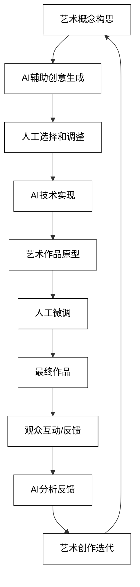
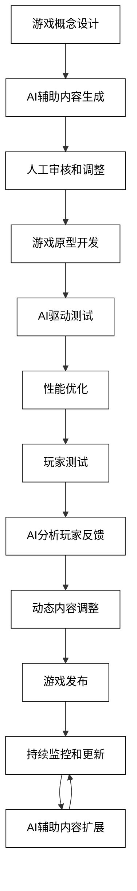
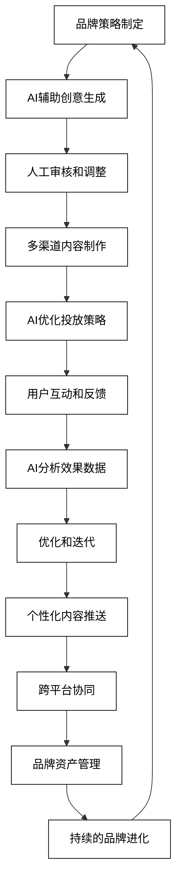
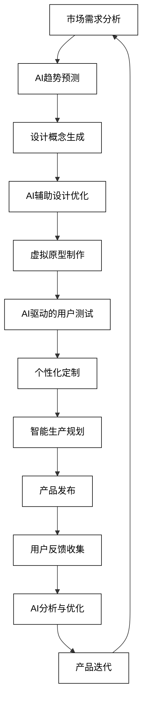

# 7 AI辅助的创意产业

AI技术正在revolutionize创意产业，为艺术家、设计师和创意专业人士提供新的工具和可能性。从数字艺术创作到游戏开发，从广告创意到时尚设计，AI正在推动创意的边界，创造出前所未有的作品和体验。本章将深入探讨AI在创意产业中的具体应用，展示如何利用AI技术增强创意过程，创造出令人惊叹的作品。

## 7.1 数字艺术创作

AI技术正在revolutionize数字艺术创作，为艺术家提供新的表达方式和创作工具。从AI辅助绘画到音乐创作，再到交互式数字艺术装置，AI正在推动艺术创作的边界。以下是AI在数字艺术创作中的主要应用：

### 7.1.1 AI辅助绘画与设计

AI可以辅助艺术家创作独特的视觉艺术作品，提供创意灵感和技术支持。

```python
def ai_assisted_painting(style_description, color_palette, subject_matter):
    prompt = f"作为AI辅助绘画工具，基于以下信息生成绘画创意：\n风格描述：{style_description}\n色彩方案：{color_palette}\n主题：{subject_matter}\n提供详细的绘画建议，包括构图、笔触技巧和视觉效果。"
    response = openai.Completion.create(
        engine="text-davinci-002",
        prompt=prompt,
        max_tokens=300,
        n=1,
        stop=None,
        temperature=0.7,
    )
    return response.choices[0].text.strip()

style_description = "后印象派与未来主义的融合"
color_palette = "鲜艳的蓝色、橙色和紫色"
subject_matter = "城市夜景中的人群"
painting_suggestion = ai_assisted_painting(style_description, color_palette, subject_matter)
print(f"AI辅助绘画建议：\n{painting_suggestion}")
```

### 7.1.2 音乐创作与编曲

AI可以协助音乐创作者生成旋律、和声和编曲。

```python
def ai_music_composer(genre, mood, instruments, duration):
    prompt = f"作为AI音乐创作助手，基于以下信息生成音乐创意：\n流派：{genre}\n情绪：{mood}\n乐器：{instruments}\n时长：{duration}\n提供详细的音乐创作建议，包括旋律轮廓、和声进行和编曲细节。"
    response = openai.Completion.create(
        engine="text-davinci-002",
        prompt=prompt,
        max_tokens=400,
        n=1,
        stop=None,
        temperature=0.7,
    )
    return response.choices[0].text.strip()

genre = "电子流行"
mood = "兴奋与忧郁的交织"
instruments = "合成器、鼓机、电吉他"
duration = "3分钟"
music_composition = ai_music_composer(genre, mood, instruments, duration)
print(f"AI音乐创作建议：\n{music_composition}")
```

### 7.1.3 交互式数字艺术装置

AI可以用于创建响应观众互动的动态数字艺术装置。

```python
def interactive_art_installation(installation_type, interaction_method, visual_elements):
    prompt = f"作为交互式数字艺术装置设计器，基于以下信息生成创意：\n装置类型：{installation_type}\n交互方式：{interaction_method}\n视觉元素：{visual_elements}\n描述装置的工作原理、观众体验和可能的技术实现方式。"
    response = openai.Completion.create(
        engine="text-davinci-002",
        prompt=prompt,
        max_tokens=400,
        n=1,
        stop=None,
        temperature=0.7,
    )
    return response.choices[0].text.strip()

installation_type = "沉浸式投影映射"
interaction_method = "动作捕捉和声音输入"
visual_elements = "抽象几何形状、粒子系统"
art_installation = interactive_art_installation(installation_type, interaction_method, visual_elements)
print(f"交互式数字艺术装置设计：\n{art_installation}")
```

4. **AI生成的诗歌和文学作品**
   AI可以辅助创作诗歌和短篇文学作品，提供独特的表达方式。

```python
def ai_poetry_generator(theme, style, length):
    prompt = f"作为AI诗歌生成器，基于以下信息创作一首诗：\n主题：{theme}\n风格：{style}\n长度：{length}\n创作一首富有想象力和情感的诗歌。"
    response = openai.Completion.create(
        engine="text-davinci-002",
        prompt=prompt,
        max_tokens=200,
        n=1,
        stop=None,
        temperature=0.8,
    )
    return response.choices[0].text.strip()

theme = "时间的流逝"
style = "现代主义，自由诗"
length = "10行"
ai_poem = ai_poetry_generator(theme, style, length)
print(f"AI生成的诗歌：\n{ai_poem}")
```

5. **生成式动画和视觉效果**
   AI可以用于创建复杂的动画序列和视觉效果。

```python
def generative_animation(animation_style, scene_description, duration):
    prompt = f"作为生成式动画创作工具，基于以下信息设计动画序列：\n动画风格：{animation_style}\n场景描述：{scene_description}\n时长：{duration}\n描述动画的视觉风格、运动特征和关键帧。"
    response = openai.Completion.create(
        engine="text-davinci-002",
        prompt=prompt,
        max_tokens=300,
        n=1,
        stop=None,
        temperature=0.7,
    )
    return response.choices[0].text.strip()

animation_style = "抽象几何"
scene_description = "表达城市生活节奏的变化"
duration = "30秒"
animation_design = generative_animation(animation_style, scene_description, duration)
print(f"生成式动画设计：\n{animation_design}")
```

6. **AI辅助的雕塑和3D打印艺术**
   AI可以协助设计复杂的3D形状，用于数字雕塑和3D打印艺术品。

```python
def ai_sculpture_designer(concept, material, size):
    prompt = f"作为AI雕塑设计助手，基于以下信息创作3D雕塑概念：\n概念：{concept}\n材料：{material}\n尺寸：{size}\n描述雕塑的形态、结构和视觉效果，考虑材料特性和3D打印可行性。"
    response = openai.Completion.create(
        engine="text-davinci-002",
        prompt=prompt,
        max_tokens=300,
        n=1,
        stop=None,
        temperature=0.7,
    )
    return response.choices[0].text.strip()

concept = "人类与技术的共生"
material = "金属和透明树脂"
size = "高2米，宽1.5米"
sculpture_design = ai_sculpture_designer(concept, material, size)
print(f"AI辅助雕塑设计：\n{sculpture_design}")
```

7. **AI生成的虚拟现实艺术体验**
   AI可以创造沉浸式的虚拟现实艺术体验，结合视觉、听觉和交互元素。

```python
def vr_art_experience_generator(theme, sensory_elements, interaction_level):
    prompt = f"作为VR艺术体验生成器，基于以下信息设计虚拟现实艺术体验：\n主题：{theme}\n感官元素：{sensory_elements}\n交互级别：{interaction_level}\n描述VR环境的视觉特征、声音设计和用户交互方式。"
    response = openai.Completion.create(
        engine="text-davinci-002",
        prompt=prompt,
        max_tokens=400,
        n=1,
        stop=None,
        temperature=0.7,
    )
    return response.choices[0].text.strip()

theme = "深海探索与意识流动"
sensory_elements = "视觉：深海生物、水流效果；听觉：水下音效、环境音乐"
interaction_level = "高度交互，用户可以影响环境"
vr_experience = vr_art_experience_generator(theme, sensory_elements, interaction_level)
print(f"VR艺术体验设计：\n{vr_experience}")
```

这些AI驱动的数字艺术创作示例展示了AI如何能够为艺术家和创意专业人士提供新的工具和灵感来源。通过结合人类的创造力和AI的计算能力，艺术家们可以探索新的表达形式，创造出前所未有的艺术作品。

为了更好地理解AI在数字艺术创作中的应用流程，我们可以使用以下Mermaid流程图：



这个流程图展示了AI辅助数字艺术创作的完整循环，从概念构思到作品迭代。它强调了AI在创意生成、技术实现和反馈分析中的作用，同时保留了人类艺术家在创作过程中的核心地位。通过这种人机协作的方式，艺术家可以突破传统限制，创造出更加创新和令人惊叹的数字艺术作品。

## 7.2 游戏开发

AI技术正在revolutionize游戏开发行业，为游戏设计师和开发者提供强大的工具，以创造更加immersive、动态和个性化的游戏体验。从剧情生成到程序化关卡设计，再到NPC行为智能化，AI正在游戏开发的各个方面发挥重要作用。以下是AI在游戏开发中的主要应用：

### 7.2.1 剧情与对话生成

AI可以协助创作复杂的游戏剧情和动态对话系统。

```python
def game_story_generator(game_genre, setting, main_characters):
    prompt = f"作为游戏剧情生成器，基于以下信息创作游戏故事大纲：\n游戏类型：{game_genre}\n背景设定：{setting}\n主要角色：{main_characters}\n提供故事梗概、主要情节点和角色发展arc。"
    response = openai.Completion.create(
        engine="text-davinci-002",
        prompt=prompt,
        max_tokens=500,
        n=1,
        stop=None,
        temperature=0.7,
    )
    return response.choices[0].text.strip()

game_genre = "科幻RPG"
setting = "后启示录的地球，人类与AI共存"
main_characters = "人类探险家、叛逆AI助手、神秘的古代AI"
game_story = game_story_generator(game_genre, setting, main_characters)
print(f"游戏剧情大纲：\n{game_story}")
```

### 7.2.2 程序化地图与关卡设计

AI可以生成多样化和平衡的游戏地图和关卡。

```python
def procedural_level_generator(game_style, difficulty, environmental_themes):
    prompt = f"作为程序化关卡生成器，设计一个游戏关卡：\n游戏风格：{game_style}\n难度：{difficulty}\n环境主题：{environmental_themes}\n描述关卡布局、障碍物分布、资源放置和特殊挑战。"
    response = openai.Completion.create(
        engine="text-davinci-002",
        prompt=prompt,
        max_tokens=400,
        n=1,
        stop=None,
        temperature=0.7,
    )
    return response.choices[0].text.strip()

game_style = "2D平台动作"
difficulty = "中等"
environmental_themes = "废弃工厂、有毒沼泽"
level_design = procedural_level_generator(game_style, difficulty, environmental_themes)
print(f"程序化关卡设计：\n{level_design}")
```

### 7.2.3 NPC行为智能化

AI可以创造更真实、更动态的NPC行为模式。

```python
def intelligent_npc_behavior(npc_role, personality_traits, game_context):
    prompt = f"设计一个智能NPC的行为模式：\nNPC角色：{npc_role}\n性格特征：{personality_traits}\n游戏环境：{game_context}\n描述NPC的决策逻辑、互动方式和动态反应。"
    response = openai.Completion.create(
        engine="text-davinci-002",
        prompt=prompt,
        max_tokens=400,
        n=1,
        stop=None,
        temperature=0.7,
    )
    return response.choices[0].text.strip()

npc_role = "城镇商人"
personality_traits = "精明、健谈、略带神秘感"
game_context = "中世纪奇幻世界，玩家可以与NPC进行交易和对话"
npc_behavior = intelligent_npc_behavior(npc_role, personality_traits, game_context)
print(f"智能NPC行为设计：\n{npc_behavior}")
```

4. **动态难度调整系统**
   AI可以实时分析玩家表现，动态调整游戏难度。

```python
def dynamic_difficulty_adjustment(player_data, game_progress, performance_metrics):
    prompt = f"设计一个动态难度调整系统：\n玩家数据：{player_data}\n游戏进度：{game_progress}\n表现指标：{performance_metrics}\n提供难度调整策略，包括敌人强度、资源分配和挑战复杂度的变化。"
    response = openai.Completion.create(
        engine="text-davinci-002",
        prompt=prompt,
        max_tokens=300,
        n=1,
        stop=None,
        temperature=0.7,
    )
    return response.choices[0].text.strip()

player_data = "新手玩家，反应速度中等"
game_progress = "完成新手教程，进入第一个主要区域"
performance_metrics = "完成率80%，死亡次数较多"
difficulty_adjustment = dynamic_difficulty_adjustment(player_data, game_progress, performance_metrics)
print(f"动态难度调整策略：\n{difficulty_adjustment}")
```

5. **AI驱动的游戏测试**
   AI可以自动化游戏测试过程，发现bug和平衡性问题。

```python
def ai_game_tester(game_features, test_scenarios, performance_criteria):
    prompt = f"作为AI游戏测试员，执行以下测试任务：\n游戏特性：{game_features}\n测试场景：{test_scenarios}\n性能标准：{performance_criteria}\n提供测试结果报告，包括发现的问题、性能瓶颈和改进建议。"
    response = openai.Completion.create(
        engine="text-davinci-002",
        prompt=prompt,
        max_tokens=400,
        n=1,
        stop=None,
        temperature=0.7,
    )
    return response.choices[0].text.strip()

game_features = "开放世界、多人对战、物理引擎"
test_scenarios = "极限压力测试、长时间游戏会话、多平台兼容性"
performance_criteria = "帧率稳定、网络延迟<50ms、内存占用<4GB"
test_report = ai_game_tester(game_features, test_scenarios, performance_criteria)
print(f"AI游戏测试报告：\n{test_report}")
```

6. **个性化游戏内容推荐**
   AI可以分析玩家行为，提供个性化的游戏内容和任务推荐。

```python
def personalized_content_recommender(player_profile, gameplay_history, available_content):
    prompt = f"为玩家推荐个性化游戏内容：\n玩家档案：{player_profile}\n游戏历史：{gameplay_history}\n可用内容：{available_content}\n提供定制的内容推荐，包括任务、物品和游戏模式。"
    response = openai.Completion.create(
        engine="text-davinci-002",
        prompt=prompt,
        max_tokens=300,
        n=1,
        stop=None,
        temperature=0.7,
    )
    return response.choices[0].text.strip()

player_profile = "喜欢探索和解谜，偏好单人游戏"
gameplay_history = "完成主线50%，收集成就80%，偏好隐藏任务"
available_content = "新DLC区域、挑战模式、限时活动"
content_recommendations = personalized_content_recommender(player_profile, gameplay_history, available_content)
print(f"个性化内容推荐：\n{content_recommendations}")
```

7. **AI辅助的游戏音效和配乐生成**
   AI可以根据游戏场景和情感需求生成动态音效和背景音乐。

```python
def ai_game_audio_generator(scene_description, emotional_tone, audio_style):
    prompt = f"生成游戏音频设计方案：\n场景描述：{scene_description}\n情感基调：{emotional_tone}\n音频风格：{audio_style}\n描述背景音乐的构成、音效设计和动态音频变化。"
    response = openai.Completion.create(
        engine="text-davinci-002",
        prompt=prompt,
        max_tokens=400,
        n=1,
        stop=None,
        temperature=0.7,
    )
    return response.choices[0].text.strip()

scene_description = "宏大的太空战斗场景，玩家驾驶飞船穿梭于小行星带"
emotional_tone = "紧张刺激，带有史诗感"
audio_style = "电子音乐与管弦乐结合，科幻音效"
audio_design = ai_game_audio_generator(scene_description, emotional_tone, audio_style)
print(f"AI游戏音频设计：\n{audio_design}")
```

这些AI驱动的游戏开发应用展示了AI如何能够为游戏设计师和开发者提供强大的工具，以创造更加immersive、动态和个性化的游戏体验。通过结合人类创意和AI的计算能力，游戏开发团队可以推动游戏设计的边界，创造出更加创新和引人入胜的游戏作品。

为了更好地理解AI在游戏开发中的应用流程，我们可以使用以下Mermaid流程图：



这个流程图展示了AI在整个游戏开发生命周期中的应用，从初始概念设计到持续的内容更新。它强调了AI在内容生成、测试、玩家分析和动态调整等关键环节中的作用，同时保留了人类开发者在创意决策和质量控制方面的重要性。通过这种人机协作的方式，游戏开发团队可以更高效地创造出高质量、富有创新性的游戏体验，并能够快速响应玩家需求和市场变化。

## 7.3 广告与品牌创意

AI技术正在revolutionize广告和品牌创意领域，为营销人员和创意专业人士提供新的工具和方法，以创造更加个性化、有影响力和创新的广告和品牌体验。从品牌故事生成到创意广告文案，再到个性化品牌体验设计，AI正在推动广告和品牌创意的边界。以下是AI在广告与品牌创意中的主要应用：

### 7.3.1 品牌故事生成

AI可以协助创作引人入胜的品牌故事，结合品牌价值观和目标受众的兴趣。

```python
def brand_story_generator(brand_values, target_audience, brand_history):
    prompt = f"作为品牌故事生成器，创作一个引人入胜的品牌故事：\n品牌价值观：{brand_values}\n目标受众：{target_audience}\n品牌历史：{brand_history}\n创作一个能够体现品牌精神、吸引目标受众的故事。"
    response = openai.Completion.create(
        engine="text-davinci-002",
        prompt=prompt,
        max_tokens=500,
        n=1,
        stop=None,
        temperature=0.7,
    )
    return response.choices[0].text.strip()

brand_values = "创新、可持续性、社区参与"
target_audience = "25-40岁的环保意识强的都市专业人士"
brand_history = "成立于2010年，从小型创业公司发展成为行业领导者"
brand_story = brand_story_generator(brand_values, target_audience, brand_history)
print(f"生成的品牌故事：\n{brand_story}")
```

### 7.3.2 创意广告文案

AI可以生成创意广告文案，针对不同的媒体平台和目标受众。

```python
def creative_ad_copy_generator(product_features, campaign_objective, ad_platform):
    prompt = f"作为创意广告文案生成器，创作一则广告文案：\n产品特性：{product_features}\n广告目标：{campaign_objective}\n投放平台：{ad_platform}\n创作一个吸引人、有创意的广告文案，突出产品优势并符合平台特性。"
    response = openai.Completion.create(
        engine="text-davinci-002",
        prompt=prompt,
        max_tokens=200,
        n=1,
        stop=None,
        temperature=0.8,
    )
    return response.choices[0].text.strip()

product_features = "智能家居设备，节能环保，易于安装"
campaign_objective = "提高品牌知名度并增加销量"
ad_platform = "Instagram"
ad_copy = creative_ad_copy_generator(product_features, campaign_objective, ad_platform)
print(f"创意广告文案：\n{ad_copy}")
```

### 7.3.3 个性化品牌体验设计

AI可以帮助设计个性化的品牌体验，根据用户偏好和行为调整内容。

```python
def personalized_brand_experience(user_profile, brand_assets, interaction_context):
    prompt = f"设计一个个性化的品牌体验：\n用户档案：{user_profile}\n品牌资产：{brand_assets}\n交互场景：{interaction_context}\n描述如何根据用户特征定制品牌体验，包括视觉元素、信息呈现和互动方式。"
    response = openai.Completion.create(
        engine="text-davinci-002",
        prompt=prompt,
        max_tokens=400,
        n=1,
        stop=None,
        temperature=0.7,
    )
    return response.choices[0].text.strip()

user_profile = "35岁女性，喜欢瑜伽和有机食品，经常使用移动应用"
brand_assets = "有机食品品牌，绿色和棕色为主色调，强调自然和健康"
interaction_context = "用户首次访问品牌网站"
personalized_experience = personalized_brand_experience(user_profile, brand_assets, interaction_context)
print(f"个性化品牌体验设计：\n{personalized_experience}")
```

4. **AI驱动的视觉识别广告**
   AI可以创建能够识别特定场景或物体的智能广告。

```python
def visual_recognition_ad(ad_concept, target_objects, user_interaction):
    prompt = f"设计一个基于视觉识别的广告概念：\n广告理念：{ad_concept}\n目标识别对象：{target_objects}\n用户交互方式：{user_interaction}\n描述广告如何利用视觉识别技术与用户互动，以及可能的创意表现。"
    response = openai.Completion.create(
        engine="text-davinci-002",
        prompt=prompt,
        max_tokens=400,
        n=1,
        stop=None,
        temperature=0.7,
    )
    return response.choices[0].text.strip()

ad_concept = "提高人们对回收利用的意识"
target_objects = "塑料瓶、纸张、电子废弃物"
user_interaction = "用手机扫描物品，获取回收建议"
visual_ad_concept = visual_recognition_ad(ad_concept, target_objects, user_interaction)
print(f"视觉识别广告概念：\n{visual_ad_concept}")
```

5. **情感分析优化广告投放**
   AI可以分析用户情感状态，优化广告投放时机和内容。

```python
def emotion_based_ad_optimization(user_emotional_data, ad_inventory, platform_context):
    prompt = f"基于情感分析优化广告投放策略：\n用户情感数据：{user_emotional_data}\n广告库存：{ad_inventory}\n平台环境：{platform_context}\n提供广告选择和投放建议，以最大化情感共鸣和用户参与度。"
    response = openai.Completion.create(
        engine="text-davinci-002",
        prompt=prompt,
        max_tokens=300,
        n=1,
        stop=None,
        temperature=0.7,
    )
    return response.choices[0].text.strip()

user_emotional_data = "用户最近表现出压力和疲劳的情绪"
ad_inventory = "放松类产品广告、激励性内容、生活方式改善建议"
platform_context = "社交媒体平台，晚间浏览"
emotion_optimized_strategy = emotion_based_ad_optimization(user_emotional_data, ad_inventory, platform_context)
print(f"基于情感的广告优化策略：\n{emotion_optimized_strategy}")
```

6. **AI生成的品牌logo和视觉识别系统**
   AI可以协助设计品牌logo和整体视觉识别系统。

```python
def ai_brand_identity_generator(brand_attributes, industry, target_market):
    prompt = f"设计一个品牌视觉识别系统：\n品牌属性：{brand_attributes}\n行业：{industry}\n目标市场：{target_market}\n描述logo设计理念、色彩方案、字体选择和关键视觉元素。"
    response = openai.Completion.create(
        engine="text-davinci-002",
        prompt=prompt,
        max_tokens=400,
        n=1,
        stop=None,
        temperature=0.7,
    )
    return response.choices[0].text.strip()

brand_attributes = "现代、环保、科技感"
industry = "可再生能源"
target_market = "环保意识强的企业和个人消费者"
brand_identity = ai_brand_identity_generator(brand_attributes, industry, target_market)
print(f"AI生成的品牌视觉识别系统：\n{brand_identity}")
```

7. **跨文化广告本地化**
   AI可以帮助广告内容在不同文化背景下进行本地化调整。

```python
def cross_cultural_ad_localization(ad_concept, target_culture, local_preferences):
    prompt = f"将广告概念本地化适应目标文化：\n原始广告概念：{ad_concept}\n目标文化：{target_culture}\n当地偏好：{local_preferences}\n提供本地化建议，包括文案调整、视觉元素修改和文化敏感性考虑。"
    response = openai.Completion.create(
        engine="text-davinci-002",
        prompt=prompt,
        max_tokens=400,
        n=1,
        stop=None,
        temperature=0.7,
    )
    return response.choices[0].text.strip()

ad_concept = "展示产品如何让生活更轻松愉快"
target_culture = "日本"
local_preferences = "含蓄表达、群体和谐、高科技形象"
localized_ad = cross_cultural_ad_localization(ad_concept, target_culture, local_preferences)
print(f"跨文化广告本地化建议：\n{localized_ad}")
```

这些AI驱动的广告与品牌创意应用展示了AI如何能够为营销人员和创意专业人士提供强大的工具，以创造更加个性化、有影响力和创新的广告和品牌体验。通过结合人类的创造力和AI的数据分析能力，品牌可以更精准地触达目标受众，创造出更有共鸣的品牌故事和广告内容。

为了更好地理解AI在广告与品牌创意中的应用流程，我们可以使用以下Mermaid流程图：



这个流程图展示了AI在广告与品牌创意整个生命周期中的应用，从初始策略制定到持续的品牌进化。它强调了AI在创意生成、投放优化、数据分析和个性化推送等关键环节中的作用，同时保留了人类创意专业人士在战略决策和创意审核方面的重要性。通过这种人机协作的方式，品牌可以更高效地创造出富有吸引力和影响力的广告内容，并能够快速适应市场变化和消费者需求。

## 7.4 时尚与产品设计

AI技术正在revolutionize时尚和产品设计领域，为设计师提供新的创意工具和方法，以创造更加创新、个性化和可持续的设计。从AI辅助服装设计到个性化产品推荐系统，再到虚拟试衣和家居布置，AI正在推动时尚和产品设计的边界。以下是AI在时尚与产品设计中的主要应用：

### 7.4.1 AI辅助服装设计

AI可以协助设计师生成新的服装设计理念，结合当前趋势和个人风格。

```python
def ai_fashion_designer(style_preferences, seasonal_trends, sustainability_requirements):
    prompt = f"作为AI时装设计师，创作一个新的服装设计概念：\n风格偏好：{style_preferences}\n季节趋势：{seasonal_trends}\n可持续性要求：{sustainability_requirements}\n描述服装的设计元素、材料选择和创新特点。"
    response = openai.Completion.create(
        engine="text-davinci-002",
        prompt=prompt,
        max_tokens=400,
        n=1,
        stop=None,
        temperature=0.7,
    )
    return response.choices[0].text.strip()

style_preferences = "现代简约与复古元素融合"
seasonal_trends = "2024春夏，强调轻盈质地和明亮色彩"
sustainability_requirements = "使用有机棉和回收材料，注重生产过程的低碳排放"
fashion_design = ai_fashion_designer(style_preferences, seasonal_trends, sustainability_requirements)
print(f"AI辅助服装设计概念：\n{fashion_design}")
```

### 7.4.2 个性化产品推荐系统

AI可以分析用户偏好和行为，提供高度个性化的产品推荐。

```python
def personalized_product_recommender(user_profile, purchase_history, current_trends):
    prompt = f"基于用户信息生成个性化产品推荐：\n用户档案：{user_profile}\n购买历史：{purchase_history}\n当前趋势：{current_trends}\n提供5个个性化产品推荐，包括推荐理由和预期吸引力。"
    response = openai.Completion.create(
        engine="text-davinci-002",
        prompt=prompt,
        max_tokens=400,
        n=1,
        stop=None,
        temperature=0.7,
    )
    return response.choices[0].text.strip()

user_profile = "28岁女性，职业是市场营销，喜欢瑜伽和户外活动"
purchase_history = "最近购买了运动服、瑜伽垫和一款智能手表"
current_trends = "运动休闲风、可持续时尚、智能可穿戴设备"
product_recommendations = personalized_product_recommender(user_profile, purchase_history, current_trends)
print(f"个性化产品推荐：\n{product_recommendations}")
```

### 7.4.3 虚拟试衣与家居布置

AI可以创建虚拟试衣和家居布置体验，帮助用户可视化产品效果。

```python
def virtual_try_on_system(user_body_data, clothing_item, environment_context):
    prompt = f"设计一个虚拟试衣体验：\n用户身体数据：{user_body_data}\n服装项目：{clothing_item}\n环境背景：{environment_context}\n描述虚拟试衣的视觉效果、互动特性和个性化建议。"
    response = openai.Completion.create(
        engine="text-davinci-002",
        prompt=prompt,
        max_tokens=300,
        n=1,
        stop=None,
        temperature=0.7,
    )
    return response.choices[0].text.strip()

user_body_data = "身高170cm，体重60kg，体型偏瘦"
clothing_item = "一件红色连衣裙，中等长度，V领设计"
environment_context = "夏日沙滩派对"
virtual_try_on = virtual_try_on_system(user_body_data, clothing_item, environment_context)
print(f"虚拟试衣体验设计：\n{virtual_try_on}")
```

4. **AI驱动的可持续材料创新**
   AI可以协助开发和优化可持续的新型材料。

```python
def sustainable_material_innovator(desired_properties, environmental_constraints, production_capabilities):
    prompt = f"作为可持续材料创新者，设计一种新型材料：\n期望属性：{desired_properties}\n环境约束：{environmental_constraints}\n生产能力：{production_capabilities}\n描述材料的组成、特性和潜在应用。"
    response = openai.Completion.create(
        engine="text-davinci-002",
        prompt=prompt,
        max_tokens=400,
        n=1,
        stop=None,
        temperature=0.7,
    )
    return response.choices[0].text.strip()

desired_properties = "轻质、高强度、防水"
environmental_constraints = "100%可回收，生物降解"
production_capabilities = "3D打印技术，低能耗制造过程"
new_material = sustainable_material_innovator(desired_properties, environmental_constraints, production_capabilities)
print(f"AI驱动的可持续材料创新：\n{new_material}")
```

5. **智能尺寸和版型优化**
   AI可以分析大量用户数据，优化服装尺寸和版型。

```python
def smart_sizing_optimizer(customer_data, fit_feedback, production_constraints):
    prompt = f"优化服装尺寸和版型：\n客户数据：{customer_data}\n试穿反馈：{fit_feedback}\n生产限制：{production_constraints}\n提供尺寸调整建议和新版型设计，以提高整体适配度。"
    response = openai.Completion.create(
        engine="text-davinci-002",
        prompt=prompt,
        max_tokens=300,
        n=1,
        stop=None,
        temperature=0.7,
    )
    return response.choices[0].text.strip()

customer_data = "1000名客户的体型数据，包括身高、体重和主要测量数据"
fit_feedback = "70%的客户反馈腰部偏紧，30%反馈袖长偏短"
production_constraints = "最多可提供5种尺码，需考虑生产效率"
sizing_optimization = smart_sizing_optimizer(customer_data, fit_feedback, production_constraints)
print(f"智能尺寸和版型优化建议：\n{sizing_optimization}")
```

6. **趋势预测和设计灵感生成**
   AI可以分析时尚趋势数据，为设计师提供未来趋势预测和创意灵感。

```python
def trend_prediction_inspiration(historical_trends, social_media_data, cultural_events):
    prompt = f"预测未来时尚趋势并生成设计灵感：\n历史趋势数据：{historical_trends}\n社交媒体数据：{social_media_data}\n文化事件：{cultural_events}\n提供未来6-12个月的趋势预测和相应的设计理念。"
    response = openai.Completion.create(
        engine="text-davinci-002",
        prompt=prompt,
        max_tokens=500,
        n=1,
        stop=None,
        temperature=0.7,
    )
    return response.choices[0].text.strip()

historical_trends = "过去5年的季节性色彩和剪裁趋势数据"
social_media_data = "Instagram和TikTok上最受欢迎的时尚话题和标签"
cultural_events = "即将举行的大型体育赛事和环保主题国际会议"
trend_inspiration = trend_prediction_inspiration(historical_trends, social_media_data, cultural_events)
print(f"趋势预测和设计灵感：\n{trend_inspiration}")
```

7. **智能产品生命周期管理**
   AI可以优化产品的整个生命周期，从设计到回收。

```python
def product_lifecycle_manager(product_design, usage_data, end_of_life_options):
    prompt = f"优化产品生命周期管理：\n产品设计：{product_design}\n使用数据：{usage_data}\n报废选项：{end_of_life_options}\n提供优化建议，包括材料选择、耐用性改进和回收策略。"
    response = openai.Completion.create(
        engine="text-davinci-002",
        prompt=prompt,
        max_tokens=400,
        n=1,
        stop=None,
        temperature=0.7,
    )
    return response.choices[0].text.strip()

product_design = "模块化智能手表，主要材料包括铝、塑料和电子元件"
usage_data = "平均使用寿命2年，20%用户反馈电池性能下降"
end_of_life_options = "目前10%被回收，其余进入普通垃圾处理"
lifecycle_optimization = product_lifecycle_manager(product_design, usage_data, end_of_life_options)
print(f"智能产品生命周期管理建议：\n{lifecycle_optimization}")
```

这些AI驱动的时尚与产品设计应用展示了AI如何能够为设计师和品牌提供强大的工具，以创造更加创新、个性化和可持续的产品。通过结合人类的创造力和AI的数据分析能力，设计师可以更精准地把握市场需求，优化产品性能，并提供更好的用户体验。

为了更好地理解AI在时尚与产品设计中的应用流程，我们可以使用以下Mermaid流程图：



这个流程图展示了AI在时尚与产品设计整个生命周期中的应用，从市场需求分析到产品迭代。它强调了AI在趋势预测、设计优化、用户测试和反馈分析等关键环节中的作用，同时保留了人类设计师在创意概念和最终决策方面的核心地位。通过这种人机协作的方式，品牌和设计师可以更高效地创造出符合市场需求、富有创新性和可持续性的产品，并能够快速响应用户反馈和市场变化。
