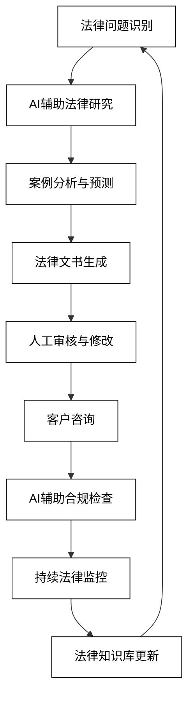
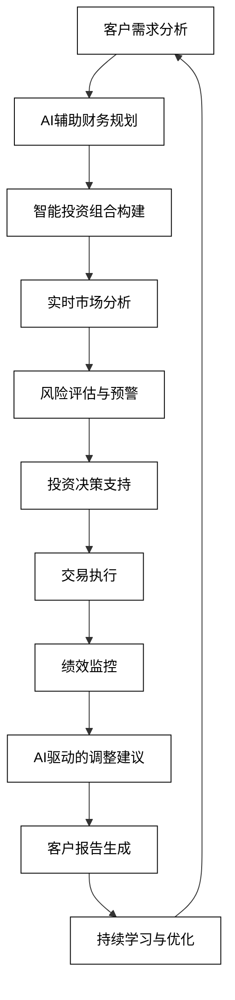
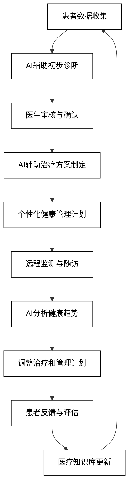
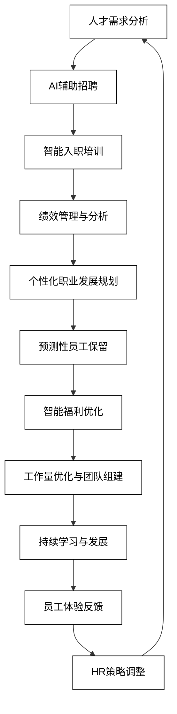

# 8 AI增强的专业服务

AI技术正在revolutionize各种专业服务领域，为法律、金融、医疗健康和人力资源等行业带来前所未有的变革。通过结合AI的分析能力和专业人士的经验，这些服务正变得更加高效、准确和个性化。本章将深入探讨AI在专业服务中的具体应用，展示如何利用AI技术提升服务质量，优化决策过程，并创造新的价值。

## 8.1 法律服务

AI技术正在改变法律服务的提供方式，为律师和法律专业人士提供强大的工具，以提高工作效率、准确性和服务质量。从智能合同审查到案例研究与预测，再到法律文书自动生成，AI正在法律领域发挥越来越重要的作用。以下是AI在法律服务中的主要应用：

### 8.1.1 智能合同审查

AI可以快速分析和审查合同，识别潜在风险和不一致之处。

```python
def smart_contract_review(contract_text, legal_requirements, company_policies):
    prompt = f"作为智能合同审查系统，分析以下合同：\n合同内容：{contract_text}\n法律要求：{legal_requirements}\n公司政策：{company_policies}\n识别潜在风险、不一致之处和改进建议。"
    response = openai.Completion.create(
        engine="text-davinci-002",
        prompt=prompt,
        max_tokens=500,
        n=1,
        stop=None,
        temperature=0.7,
    )
    return response.choices[0].text.strip()

contract_text = "This agreement, dated [DATE], is between [PARTY A] and [PARTY B]..."
legal_requirements = "符合最新的数据保护法规和知识产权法"
company_policies = "限制责任条款，保密协议标准"
review_result = smart_contract_review(contract_text, legal_requirements, company_policies)
print(f"智能合同审查结果：\n{review_result}")
```

### 8.1.2 案例研究与预测

AI可以分析大量历史案例，预测诉讼结果和策略效果。

```python
def legal_case_predictor(case_details, relevant_precedents, jurisdiction_info):
    prompt = f"基于以下信息预测法律案例结果：\n案件详情：{case_details}\n相关先例：{relevant_precedents}\n管辖权信息：{jurisdiction_info}\n提供可能的结果预测、成功率估计和建议策略。"
    response = openai.Completion.create(
        engine="text-davinci-002",
        prompt=prompt,
        max_tokens=500,
        n=1,
        stop=None,
        temperature=0.7,
    )
    return response.choices[0].text.strip()

case_details = "知识产权侵权案件，涉及软件专利争议"
relevant_precedents = "Smith v. Tech Corp (2019), Johnson Electronics v. InnovaSoft (2021)"
jurisdiction_info = "加利福尼亚北区联邦法院，倾向于支持创新和竞争"
prediction = legal_case_predictor(case_details, relevant_precedents, jurisdiction_info)
print(f"法律案例预测结果：\n{prediction}")
```

### 8.1.3 法律文书自动生成

AI可以协助生成各种法律文书，提高效率和一致性。

```python
def legal_document_generator(document_type, case_information, client_details):
    prompt = f"生成以下类型的法律文书：\n文书类型：{document_type}\n案件信息：{case_information}\n客户详情：{client_details}\n创建一份专业、准确和符合法律要求的文书。"
    response = openai.Completion.create(
        engine="text-davinci-002",
        prompt=prompt,
        max_tokens=600,
        n=1,
        stop=None,
        temperature=0.7,
    )
    return response.choices[0].text.strip()

document_type = "起诉状"
case_information = "商标侵权案件，被告在未经授权的情况下使用原告的注册商标"
client_details = "原告为一家知名科技公司，成立于2005年"
legal_document = legal_document_generator(document_type, case_information, client_details)
print(f"自动生成的法律文书：\n{legal_document}")
```

4. **法律研究助手**
   AI可以快速检索和总结相关法律信息，协助律师进行法律研究。

```python
def legal_research_assistant(research_topic, relevant_laws, time_period):
    prompt = f"作为法律研究助手，请就以下主题进行研究：\n研究主题：{research_topic}\n相关法律：{relevant_laws}\n时间范围：{time_period}\n提供关键法规摘要、相关案例分析和最新法律动态。"
    response = openai.Completion.create(
        engine="text-davinci-002",
        prompt=prompt,
        max_tokens=500,
        n=1,
        stop=None,
        temperature=0.7,
    )
    return response.choices[0].text.strip()

research_topic = "人工智能在医疗诊断中的法律责任"
relevant_laws = "医疗法、人工智能伦理指南、数据保护法规"
time_period = "过去5年"
research_results = legal_research_assistant(research_topic, relevant_laws, time_period)
print(f"法律研究结果：\n{research_results}")
```

5. **法律咨询聊天机器人**
   AI可以提供初步的法律咨询，回答常见法律问题。

```python
def legal_chatbot(user_query, legal_knowledge_base, jurisdiction):
    prompt = f"作为法律咨询聊天机器人，回答以下问题：\n用户询问：{user_query}\n法律知识库：{legal_knowledge_base}\n管辖区域：{jurisdiction}\n提供准确、简洁的法律建议，并说明可能需要进一步咨询专业律师的情况。"
    response = openai.Completion.create(
        engine="text-davinci-002",
        prompt=prompt,
        max_tokens=300,
        n=1,
        stop=None,
        temperature=0.7,
    )
    return response.choices[0].text.strip()

user_query = "我的邻居的树枝伸到了我的院子里，我有权砍掉吗？"
legal_knowledge_base = "财产法、邻里纠纷相关法规"
jurisdiction = "加利福尼亚州"
chatbot_response = legal_chatbot(user_query, legal_knowledge_base, jurisdiction)
print(f"法律咨询聊天机器人回复：\n{chatbot_response}")
```

6. **法律文件智能分类与管理**
   AI可以自动分类和组织大量法律文件，提高检索效率。

```python
def legal_document_classifier(document_content, document_types, metadata):
    prompt = f"对以下法律文件进行分类和组织：\n文件内容摘要：{document_content}\n可能的文件类型：{document_types}\n元数据：{metadata}\n确定文件类型，提取关键信息，并建议适当的存储和检索标签。"
    response = openai.Completion.create(
        engine="text-davinci-002",
        prompt=prompt,
        max_tokens=300,
        n=1,
        stop=None,
        temperature=0.7,
    )
    return response.choices[0].text.strip()

document_content = "本协议规定了双方在软件开发项目中的权利和义务..."
document_types = "合同、备忘录、诉讼文件、法律意见书"
metadata = "创建日期：2023-05-15，作者：John Doe律师"
classification_result = legal_document_classifier(document_content, document_types, metadata)
print(f"法律文件分类结果：\n{classification_result}")
```

7. **法律合规性检查**
   AI可以自动检查企业运营是否符合最新的法律法规。

```python
def legal_compliance_checker(company_practices, industry_regulations, recent_law_changes):
    prompt = f"进行法律合规性检查：\n公司实践：{company_practices}\n行业法规：{industry_regulations}\n最新法律变化：{recent_law_changes}\n识别潜在的合规问题，提供改进建议和风险评估。"
    response = openai.Completion.create(
        engine="text-davinci-002",
        prompt=prompt,
        max_tokens=500,
        n=1,
        stop=None,
        temperature=0.7,
    )
    return response.choices[0].text.strip()

company_practices = "数据收集和存储、员工隐私政策、产品安全测试"
industry_regulations = "GDPR、产品责任法、劳动法"
recent_law_changes = "新的数据保护条例将于下个季度生效"
compliance_report = legal_compliance_checker(company_practices, industry_regulations, recent_law_changes)
print(f"法律合规性检查报告：\n{compliance_report}")
```

这些AI驱动的法律服务应用展示了AI如何能够为法律专业人士提供强大的支持，提高工作效率和准确性。通过结合AI的分析能力和法律专业人士的专业判断，法律服务可以变得更加高效、精准和个性化。

为了更好地理解AI在法律服务中的应用流程，我们可以使用以下Mermaid流程图：



这个流程图展示了AI在法律服务整个过程中的应用，从问题识别到持续的法律监控。它强调了AI在研究、分析、文书生成和合规检查等关键环节中的作用，同时保留了人类法律专业人士在审核、咨询和决策方面的核心地位。通过这种人机协作的方式，法律服务可以变得更加高效、准确和全面，同时确保了法律建议的质量和可靠性。

## 8.2 金融与投资顾问

AI技术正在revolutionize金融和投资顾问行业，为金融专业人士和投资者提供强大的工具，以做出更明智的财务决策。从个性化理财规划到智能投资组合管理，再到风险评估与预警系统，AI正在金融领域发挥越来越重要的作用。以下是AI在金融与投资顾问服务中的主要应用：

### 8.2.1 个性化理财规划

AI可以根据个人财务状况和目标提供定制化的理财建议。

```python
def personalized_financial_planner(financial_data, goals, risk_tolerance):
    prompt = f"作为AI财务规划师，基于以下信息提供个性化理财建议：\n财务数据：{financial_data}\n财务目标：{goals}\n风险承受能力：{risk_tolerance}\n提供详细的理财计划，包括储蓄、投资和债务管理策略。"
    response = openai.Completion.create(
        engine="text-davinci-002",
        prompt=prompt,
        max_tokens=500,
        n=1,
        stop=None,
        temperature=0.7,
    )
    return response.choices[0].text.strip()

financial_data = "年收入：$80,000，现有储蓄：$50,000，月支出：$3,000，房贷：$200,000"
goals = "5年内购买更大的房子，为退休储蓄，子女教育基金"
risk_tolerance = "中等"
financial_plan = personalized_financial_planner(financial_data, goals, risk_tolerance)
print(f"个性化理财计划：\n{financial_plan}")
```

### 8.2.2 智能投资组合管理

AI可以优化投资组合，根据市场变化和个人偏好进行动态调整。

```python
def intelligent_portfolio_manager(current_portfolio, market_conditions, investment_preferences):
    prompt = f"作为智能投资组合管理器，基于以下信息优化投资组合：\n当前组合：{current_portfolio}\n市场状况：{market_conditions}\n投资偏好：{investment_preferences}\n提供投资组合调整建议，包括资产配置、再平衡策略和预期回报分析。"
    response = openai.Completion.create(
        engine="text-davinci-002",
        prompt=prompt,
        max_tokens=500,
        n=1,
        stop=None,
        temperature=0.7,
    )
    return response.choices[0].text.strip()

current_portfolio = "60% 股票（科技40%，医疗20%），30% 债券，10% 现金"
market_conditions = "科技股波动，新兴市场增长强劲，利率预期上升"
investment_preferences = "中长期增长，ESG投资，每季度再平衡"
portfolio_advice = intelligent_portfolio_manager(current_portfolio, market_conditions, investment_preferences)
print(f"智能投资组合管理建议：\n{portfolio_advice}")
```

### 8.2.3 风险评估与预警系统

AI可以实时监控市场风险，提供及时的风险评估和预警。

```python
def risk_assessment_alert_system(market_data, portfolio_composition, risk_thresholds):
    prompt = f"作为风险评估与预警系统，分析以下信息：\n市场数据：{market_data}\n投资组合构成：{portfolio_composition}\n风险阈值：{risk_thresholds}\n评估当前风险水平，识别潜在威胁，并提供风险缓解建议。"
    response = openai.Completion.create(
        engine="text-davinci-002",
        prompt=prompt,
        max_tokens=400,
        n=1,
        stop=None,
        temperature=0.7,
    )
    return response.choices[0].text.strip()

market_data = "股市波动加剧，某科技巨头财报不及预期，地缘政治紧张局势升级"
portfolio_composition = "40% 科技股，30% 蓝筹股，20% 债券，10% 商品"
risk_thresholds = "最大可接受损失：15%，波动率上限：25%"
risk_assessment = risk_assessment_alert_system(market_data, portfolio_composition, risk_thresholds)
print(f"风险评估与预警：\n{risk_assessment}")
```

4. **智能交易算法**
   AI可以开发和优化交易算法，实现自动化交易和套利。

```python
def intelligent_trading_algorithm(market_trends, trading_rules, performance_metrics):
    prompt = f"设计一个智能交易算法：\n市场趋势：{market_trends}\n交易规则：{trading_rules}\n性能指标：{performance_metrics}\n描述算法的交易策略、风险管理方法和预期表现。"
    response = openai.Completion.create(
        engine="text-davinci-002",
        prompt=prompt,
        max_tokens=500,
        n=1,
        stop=None,
        temperature=0.7,
    )
    return response.choices[0].text.strip()

market_trends = "高频数据显示大盘震荡，板块轮动加速，算法交易占比上升"
trading_rules = "日内交易，止损设置为1%，单笔交易量不超过日均交易量的0.1%"
performance_metrics = "目标年化收益率15%，最大回撤控制在10%以内，夏普比率>1.5"
trading_algorithm = intelligent_trading_algorithm(market_trends, trading_rules, performance_metrics)
print(f"智能交易算法设计：\n{trading_algorithm}")
```

5. **金融欺诈检测**
   AI可以分析交易模式和行为，识别潜在的金融欺诈活动。

```python
def fraud_detection_system(transaction_data, user_behavior, historical_patterns):
    prompt = f"作为金融欺诈检测系统，分析以下信息：\n交易数据：{transaction_data}\n用户行为：{user_behavior}\n历史模式：{historical_patterns}\n识别可疑活动，评估欺诈风险，并提供调查建议。"
    response = openai.Completion.create(
        engine="text-davinci-002",
        prompt=prompt,
        max_tokens=400,
        n=1,
        stop=None,
        temperature=0.7,
    )
    return response.choices[0].text.strip()

transaction_data = "多笔大额跨境转账，频繁的小额取现"
user_behavior = "登录位置频繁变化，使用多个设备访问账户"
historical_patterns = "该用户过去6个月交易模式稳定，主要是工资收入和日常消费"
fraud_analysis = fraud_detection_system(transaction_data, user_behavior, historical_patterns)
print(f"金融欺诈检测结果：\n{fraud_analysis}")
```

6. **智能信用评分**
   AI可以综合分析多维度数据，提供更准确的信用评分。

```python
def intelligent_credit_scoring(financial_history, social_data, behavioral_metrics):
    prompt = f"作为智能信用评分系统，基于以下信息评估信用分数：\n财务历史：{financial_history}\n社交数据：{social_data}\n行为指标：{behavioral_metrics}\n提供详细的信用评分报告，包括主要影响因素和改善建议。"
    response = openai.Completion.create(
        engine="text-davinci-002",
        prompt=prompt,
        max_tokens=400,
        n=1,
        stop=None,
        temperature=0.7,
    )
    return response.choices[0].text.strip()

financial_history = "信用卡使用率70%，无逾期还款，房贷按时偿还"
social_data = "LinkedIn显示稳定就业，社交媒体活跃度中等"
behavioral_metrics = "经常使用预算应用，定期查看信用报告"
credit_score_report = intelligent_credit_scoring(financial_history, social_data, behavioral_metrics)
print(f"智能信用评分报告：\n{credit_score_report}")
```

7. **市场情绪分析**
   AI可以分析新闻、社交媒体和其他数据源，评估市场情绪。

```python
def market_sentiment_analyzer(news_data, social_media_trends, economic_indicators):
    prompt = f"作为市场情绪分析器，评估以下信息：\n新闻数据：{news_data}\n社交媒体趋势：{social_media_trends}\n经济指标：{economic_indicators}\n提供市场情绪分析报告，包括主要影响因素和短期市场预测。"
    response = openai.Completion.create(
        engine="text-davinci-002",
        prompt=prompt,
        max_tokens=500,
        n=1,
        stop=None,
        temperature=0.7,
    )
    return response.choices[0].text.strip()

news_data = "央行暗示可能加息，科技巨头发布积极财报"
social_media_trends = "投资相关话题热度上升，#牛市来了 标签走红"
economic_indicators = "GDP增长3.5%，失业率下降到4.5%，通胀率2.1%"
sentiment_analysis = market_sentiment_analyzer(news_data, social_media_trends, economic_indicators)
print(f"市场情绪分析报告：\n{sentiment_analysis}")
```

这些AI驱动的金融与投资顾问服务应用展示了AI如何能够为金融专业人士和投资者提供强大的支持，提高决策的准确性和效率。通过结合AI的数据分析能力和金融专家的专业判断，金融服务可以变得更加个性化、精准和及时。

为了更好地理解AI在金融与投资顾问服务中的应用流程，我们可以使用以下Mermaid流程图：



这个流程图展示了AI在金融与投资顾问服务整个过程中的应用，从客户需求分析到持续的学习与优化。它强调了AI在财务规划、投资组合管理、风险评估和市场分析等关键环节中的作用，同时保留了人类金融顾问在客户关系管理和最终决策方面的重要性。通过这种人机协作的方式，金融服务可以提供更加精准、及时和个性化的建议，同时有效管理风险，为客户创造更大的价值。

## 8.3 医疗健康咨询

AI技术正在revolutionize医疗健康咨询领域，为医疗专业人士和患者提供强大的工具，以提高诊断准确性、个性化治疗方案和健康管理效果。从初步诊断与分诊系统到个性化健康管理计划，再到医学文献研究助手，AI正在医疗健康领域发挥越来越重要的作用。以下是AI在医疗健康咨询中的主要应用：

### 8.3.1 初步诊断与分诊系统

AI可以分析患者症状和医疗历史，提供初步诊断建议和分诊指导。

```python
def ai_triage_system(patient_symptoms, medical_history, vital_signs):
    prompt = f"作为AI辅助初步诊断系统，分析以下信息：\n患者症状：{patient_symptoms}\n医疗历史：{medical_history}\n生命体征：{vital_signs}\n提供初步诊断建议、紧急程度评估和后续检查建议。"
    response = openai.Completion.create(
        engine="text-davinci-002",
        prompt=prompt,
        max_tokens=500,
        n=1,
        stop=None,
        temperature=0.7,
    )
    return response.choices[0].text.strip()

patient_symptoms = "持续性头痛，视力模糊，颈部僵硬"
medical_history = "高血压病史，家族有脑卒中病史"
vital_signs = "血压160/95 mmHg，心率88次/分，体温37.2°C"
triage_result = ai_triage_system(patient_symptoms, medical_history, vital_signs)
print(f"AI辅助初步诊断结果：\n{triage_result}")
```

### 8.3.2 个性化健康管理计划

AI可以根据个人健康数据和生活方式制定定制化的健康管理计划。

```python
def personalized_health_plan(health_data, lifestyle_info, genetic_factors):
    prompt = f"作为个性化健康管理系统，基于以下信息制定健康计划：\n健康数据：{health_data}\n生活方式信息：{lifestyle_info}\n遗传因素：{genetic_factors}\n提供详细的健康管理建议，包括饮食、运动、睡眠和压力管理策略。"
    response = openai.Completion.create(
        engine="text-davinci-002",
        prompt=prompt,
        max_tokens=500,
        n=1,
        stop=None,
        temperature=0.7,
    )
    return response.choices[0].text.strip()

health_data = "BMI 27，总胆固醇220mg/dL，空腹血糖105mg/dL"
lifestyle_info = "久坐办公室工作，每周运动1-2次，压力大，睡眠质量差"
genetic_factors = "家族有2型糖尿病和心脏病史"
health_plan = personalized_health_plan(health_data, lifestyle_info, genetic_factors)
print(f"个性化健康管理计划：\n{health_plan}")
```

### 8.3.3 医学文献研究助手

AI可以快速分析大量医学文献，为医疗专业人士提供最新研究摘要和见解。

```python
def medical_literature_assistant(research_topic, recent_publications, clinical_focus):
    prompt = f"作为医学文献研究助手，分析以下信息：\n研究主题：{research_topic}\n最新发表文献：{recent_publications}\n临床关注点：{clinical_focus}\n提供研究摘要、关键发现和潜在的临床应用建议。"
    response = openai.Completion.create(
        engine="text-davinci-002",
        prompt=prompt,
        max_tokens=500,
        n=1,
        stop=None,
        temperature=0.7,
    )
    return response.choices[0].text.strip()

research_topic = "新型冠状病毒长期影响"
recent_publications = "过去6个月发表的20篇高影响因子期刊文章"
clinical_focus = "神经系统和心血管系统的长期并发症"
literature_review = medical_literature_assistant(research_topic, recent_publications, clinical_focus)
print(f"医学文献研究摘要：\n{literature_review}")
```

4. **AI辅助医学影像分析**
   AI可以协助分析医学影像，提高诊断准确性和效率。

```python
def ai_medical_imaging_analysis(image_type, patient_info, clinical_question):
    prompt = f"作为AI医学影像分析系统，分析以下信息：\n影像类型：{image_type}\n患者信息：{patient_info}\n临床问题：{clinical_question}\n提供详细的影像分析报告，包括异常发现、诊断建议和进一步检查建议。"
    response = openai.Completion.create(
        engine="text-davinci-002",
        prompt=prompt,
        max_tokens=500,
        n=1,
        stop=None,
        temperature=0.7,
    )
    return response.choices[0].text.strip()

image_type = "胸部CT扫描"
patient_info = "65岁男性，吸烟史40年，近期出现持续性咳嗽"
clinical_question = "评估是否存在肺部肿瘤或其他异常"
imaging_analysis = ai_medical_imaging_analysis(image_type, patient_info, clinical_question)
print(f"AI辅助医学影像分析报告：\n{imaging_analysis}")
```

5. **药物相互作用检查**
   AI可以快速分析复杂的药物组合，识别潜在的相互作用和副作用。

```python
def drug_interaction_checker(current_medications, proposed_drug, patient_allergies):
    prompt = f"作为药物相互作用检查系统，分析以下信息：\n当前用药：{current_medications}\n拟添加药物：{proposed_drug}\n患者过敏史：{patient_allergies}\n评估潜在的药物相互作用、副作用风险和用药建议。"
    response = openai.Completion.create(
        engine="text-davinci-002",
        prompt=prompt,
        max_tokens=400,
        n=1,
        stop=None,
        temperature=0.7,
    )
    return response.choices[0].text.strip()

current_medications = "阿司匹林、雷米普利、甲状腺素"
proposed_drug = "氟伐他汀"
patient_allergies = "青霉素过敏"
interaction_check = drug_interaction_checker(current_medications, proposed_drug, patient_allergies)
print(f"药物相互作用检查结果：\n{interaction_check}")
```

6. **远程患者监测系统**
   AI可以分析来自可穿戴设备和家用医疗设备的数据，提供持续的健康监测。

```python
def remote_patient_monitoring(vital_signs, activity_data, medication_adherence):
    prompt = f"作为远程患者监测系统，分析以下数据：\n生命体征：{vital_signs}\n活动数据：{activity_data}\n用药依从性：{medication_adherence}\n评估患者健康状况，识别潜在风险，并提供干预建议。"
    response = openai.Completion.create(
        engine="text-davinci-002",
        prompt=prompt,
        max_tokens=500,
        n=1,
        stop=None,
        temperature=0.7,
    )
    return response.choices[0].text.strip()

vital_signs = "过去24小时内血压波动较大，心率偶有异常"
activity_data = "日均步数下降20%，睡眠质量降低"
medication_adherence = "降压药漏服2次"
monitoring_report = remote_patient_monitoring(vital_signs, activity_data, medication_adherence)
print(f"远程患者监测报告：\n{monitoring_report}")
```

7. **心理健康评估与支持**
   AI可以提供初步的心理健康评估和支持，帮助识别潜在的心理健康问题。

```python
def mental_health_assessment(mood_data, behavioral_patterns, life_events):
    prompt = f"作为心理健康评估系统，分析以下信息：\n情绪数据：{mood_data}\n行为模式：{behavioral_patterns}\n生活事件：{life_events}\n提供心理健康状况评估，识别潜在问题，并给出支持和干预建议。"
    response = openai.Completion.create(
        engine="text-davinci-002",
        prompt=prompt,
        max_tokens=500,
        n=1,
        stop=None,
        temperature=0.7,
    )
    return response.choices[0].text.strip()

mood_data = "过去两周情绪低落，兴趣减退"
behavioral_patterns = "睡眠障碍，食欲下降，社交活动减少"
life_events = "最近失去工作，与长期伴侣分手"
mental_health_report = mental_health_assessment(mood_data, behavioral_patterns, life_events)
print(f"心理健康评估报告：\n{mental_health_report}")
```

这些AI驱动的医疗健康咨询应用展示了AI如何能够为医疗专业人士和患者提供强大的支持，提高诊断准确性、治疗效果和健康管理效率。通过结合AI的数据分析能力和医疗专家的临床经验，医疗健康服务可以变得更加个性化、精准和及时。

为了更好地理解AI在医疗健康咨询中的应用流程，我们可以使用以下Mermaid流程图：



这个流程图展示了AI在医疗健康咨询整个过程中的应用，从患者数据收集到持续的健康管理和知识更新。它强调了AI在初步诊断、治疗方案制定、健康监测和数据分析等关键环节中的作用，同时保留了医疗专业人士在诊断确认、治疗决策和患者沟通方面的核心地位。通过这种人机协作的方式，医疗健康服务可以提供更加精准、及时和个性化的诊疗方案，同时提高整体医疗效率和患者满意度。

## 8.4 人力资源管理

AI技术正在revolutionize人力资源管理领域，为HR专业人士提供强大的工具，以优化招聘流程、提高员工绩效管理效率，并制定更有针对性的职业发展计划。从智能简历筛选与匹配到员工绩效分析与预测，再到个性化职业发展规划，AI正在人力资源管理的各个方面发挥重要作用。以下是AI在人力资源管理中的主要应用：

### 8.4.1 智能简历筛选与匹配

AI可以快速分析大量简历，识别最适合职位的候选人。

```python
def intelligent_resume_screening(job_description, candidate_resumes, company_culture):
    prompt = f"作为智能简历筛选系统，分析以下信息：\n职位描述：{job_description}\n候选人简历：{candidate_resumes}\n公司文化：{company_culture}\n识别最适合的候选人，提供匹配度评分和推荐理由。"
    response = openai.Completion.create(
        engine="text-davinci-002",
        prompt=prompt,
        max_tokens=500,
        n=1,
        stop=None,
        temperature=0.7,
    )
    return response.choices[0].text.strip()

job_description = "高级软件工程师，要求5年以上Python开发经验，熟悉机器学习"
candidate_resumes = "10份候选人简历，包括教育背景、工作经验和技能清单"
company_culture = "注重创新，强调团队协作，鼓励持续学习"
screening_results = intelligent_resume_screening(job_description, candidate_resumes, company_culture)
print(f"智能简历筛选结果：\n{screening_results}")
```

### 8.4.2 员工绩效分析与预测

AI可以分析多维度的员工数据，提供客观的绩效评估和未来表现预测。

```python
def employee_performance_analyzer(performance_data, project_outcomes, peer_feedback):
    prompt = f"作为员工绩效分析系统，评估以下信息：\n绩效数据：{performance_data}\n项目成果：{project_outcomes}\n同事反馈：{peer_feedback}\n提供全面的绩效分析报告，包括优势、改进领域和未来潜力预测。"
    response = openai.Completion.create(
        engine="text-davinci-002",
        prompt=prompt,
        max_tokens=500,
        n=1,
        stop=None,
        temperature=0.7,
    )
    return response.choices[0].text.strip()

performance_data = "过去12个月的KPI达成率、工作时间记录、客户满意度评分"
project_outcomes = "成功完成3个大型项目，1个项目略有延期"
peer_feedback = "团队协作能力强，技术专业性高，沟通有待提升"
performance_analysis = employee_performance_analyzer(performance_data, project_outcomes, peer_feedback)
print(f"员工绩效分析报告：\n{performance_analysis}")
```

### 8.4.3 个性化职业发展规划

AI可以根据员工的技能、兴趣和公司需求制定个性化的职业发展计划。

```python
def career_development_planner(employee_profile, company_needs, industry_trends):
    prompt = f"作为职业发展规划系统，基于以下信息制定计划：\n员工档案：{employee_profile}\n公司需求：{company_needs}\n行业趋势：{industry_trends}\n提供个性化的职业发展建议，包括技能提升路径、潜在晋升机会和长期职业目标。"
    response = openai.Completion.create(
        engine="text-davinci-002",
        prompt=prompt,
        max_tokens=500,
        n=1,
        stop=None,
        temperature=0.7,
    )
    return response.choices[0].text.strip()

employee_profile = "3年经验的前端开发工程师，擅长React，对UI/UX设计感兴趣"
company_needs = "扩展移动应用开发团队，需要跨功能型人才"
industry_trends = "AR/VR技术在用户界面中的应用日益增加"
career_plan = career_development_planner(employee_profile, company_needs, industry_trends)
print(f"个性化职业发展计划：\n{career_plan}")
```

4. **智能员工培训系统**
   AI可以设计个性化的培训计划，并评估培训效果。

```python
def intelligent_training_system(employee_skills, learning_style, business_objectives):
    prompt = f"作为智能员工培训系统，设计培训计划：\n员工技能：{employee_skills}\n学习风格：{learning_style}\n业务目标：{business_objectives}\n提供个性化的培训方案，包括课程内容、学习路径和效果评估方法。"
    response = openai.Completion.create(
        engine="text-davinci-002",
        prompt=prompt,
        max_tokens=500,
        n=1,
        stop=None,
        temperature=0.7,
    )
    return response.choices[0].text.strip()

employee_skills = "中级Java开发，基础数据库知识，缺乏云计算经验"
learning_style = "偏好实践学习，适应性强，喜欢团队协作"
business_objectives = "在未来6个月内将50%的应用迁移到云平台"
training_plan = intelligent_training_system(employee_skills, learning_style, business_objectives)
print(f"智能培训计划：\n{training_plan}")
```

5. **预测性员工流失分析**
   AI可以分析各种因素，预测可能离职的员工，并提供留存策略。

```python
def employee_attrition_predictor(employee_data, engagement_metrics, work_environment):
    prompt = f"作为员工流失预测系统，分析以下数据：\n员工数据：{employee_data}\n敬业度指标：{engagement_metrics}\n工作环境：{work_environment}\n识别高流失风险的员工，分析主要原因，并提供留存建议。"
    response = openai.Completion.create(
        engine="text-davinci-002",
        prompt=prompt,
        max_tokens=500,
        n=1,
        stop=None,
        temperature=0.7,
    )
    return response.choices[0].text.strip()

employee_data = "工作年限、薪酬水平、绩效评分、晋升历史"
engagement_metrics = "员工满意度调查结果、加班频率、请假情况"
work_environment = "远程工作政策、团队氛围、最近的组织变革"
attrition_analysis = employee_attrition_predictor(employee_data, engagement_metrics, work_environment)
print(f"员工流失风险分析：\n{attrition_analysis}")
```

6. **AI驱动的员工福利优化**
   AI可以分析员工需求和公司资源，提供个性化的福利方案。

```python
def benefits_optimization_system(employee_demographics, usage_data, budget_constraints):
    prompt = f"作为员工福利优化系统，分析以下信息：\n员工人口统计：{employee_demographics}\n福利使用数据：{usage_data}\n预算限制：{budget_constraints}\n设计个性化的福利方案，最大化员工满意度和资源利用效率。"
    response = openai.Completion.create(
        engine="text-davinci-002",
        prompt=prompt,
        max_tokens=500,
        n=1,
        stop=None,
        temperature=0.7,
    )
    return response.choices[0].text.strip()

employee_demographics = "年龄分布25-55岁，60%已婚，40%有子女"
usage_data = "健康保险使用率高，健身补贴利用率低，弹性工作时间受欢迎"
budget_constraints = "福利预算较去年增加5%，需要优化资源分配"
benefits_plan = benefits_optimization_system(employee_demographics, usage_data, budget_constraints)
print(f"优化后的员工福利方案：\n{benefits_plan}")
```

7. **智能工作量分配与团队组建**
   AI可以优化工作分配和团队组建，以提高整体效率和员工满意度。

```python
def workload_team_optimizer(project_requirements, employee_skills, workload_data):
    prompt = f"作为工作量分配与团队组建系统，基于以下信息进行优化：\n项目需求：{project_requirements}\n员工技能：{employee_skills}\n当前工作量数据：{workload_data}\n提供最优的工作分配方案和团队组建建议，平衡效率和员工发展。"
    response = openai.Completion.create(
        engine="text-davinci-002",
        prompt=prompt,
        max_tokens=500,
        n=1,
        stop=None,
        temperature=0.7,
    )
    return response.choices[0].text.strip()

project_requirements = "开发一个新的移动应用，需要前端、后端、UI/UX和测试人员"
employee_skills = "团队成员的技能矩阵，包括专长领域和经验水平"
workload_data = "各团队成员当前项目参与情况和可用时间"
optimization_result = workload_team_optimizer(project_requirements, employee_skills, workload_data)
print(f"工作量分配与团队组建方案：\n{optimization_result}")
```

这些AI驱动的人力资源管理应用展示了AI如何能够为HR专业人士提供强大的支持，优化招聘、绩效管理、职业发展和员工体验等关键领域。通过结合AI的数据分析能力和HR专家的人际洞察，人力资源管理可以变得更加精准、高效和个性化。

为了更好地理解AI在人力资源管理中的应用流程，我们可以使用以下Mermaid流程图：



这个流程图展示了AI在人力资源管理整个生命周期中的应用，从人才需求分析到HR策略调整。它强调了AI在招聘、培训、绩效管理、职业发展和员工保留等关键环节中的作用，同时保留了HR专业人士在战略决策、员工关系管理和组织文化塑造方面的核心地位。通过这种人机协作的方式，人力资源管理可以更好地平衡组织需求和员工发展，创造一个更加高效、公平和满意的工作环境。
