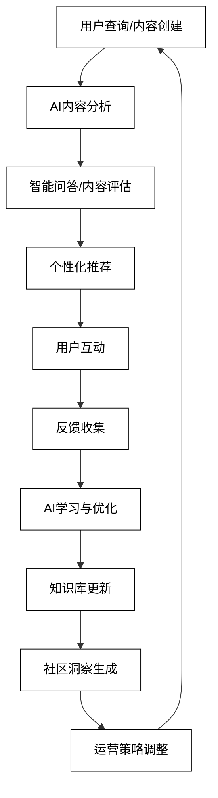
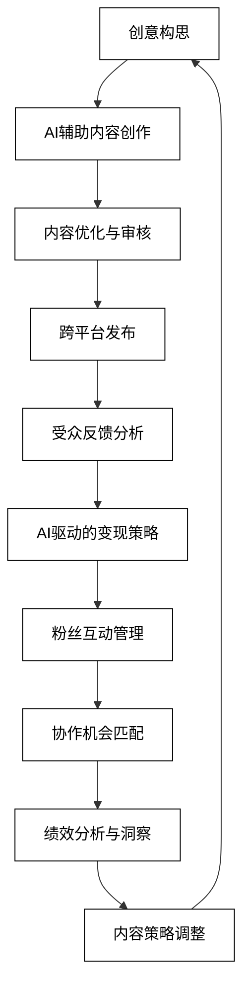
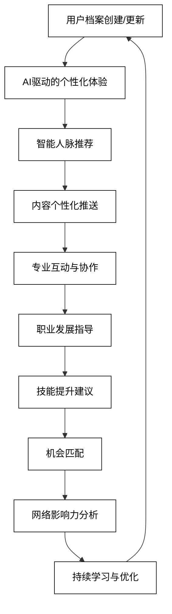
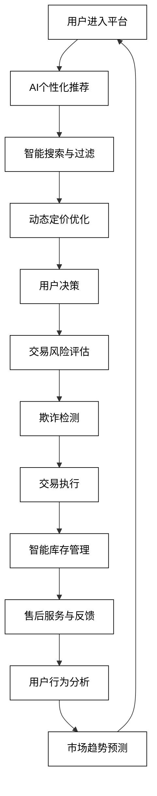

# 9 AI驱动的社区与平台运营

AI技术正在revolutionize社区和平台的运营方式，为运营者和用户提供更智能、更个性化的体验。从知识共享平台到创作者经济平台，从专业社交网络到在线市场与交易平台，AI正在各种类型的社区和平台中发挥越来越重要的作用。本章将深入探讨AI在社区与平台运营中的具体应用，展示如何利用AI技术提升用户体验、优化内容管理、促进社区互动和提高运营效率。

## 9.1 知识共享平台

AI技术正在revolutionize知识共享平台的运营，为用户提供更智能、更高效的知识获取和分享体验。从智能问答系统到内容质量自动评估，再到个性化学习路径推荐，AI正在知识共享平台的各个方面发挥重要作用。以下是AI在知识共享平台中的主要应用：

### 9.1.1 智能问答系统

AI可以理解用户问题，快速检索相关信息，并提供准确的回答。

```python
def intelligent_qa_system(user_query, knowledge_base, user_context):
    prompt = f"作为智能问答系统，回答以下问题：\n用户问题：{user_query}\n知识库：{knowledge_base}\n用户上下文：{user_context}\n提供准确、简洁的回答，并考虑用户的背景知识。"
    response = openai.Completion.create(
        engine="text-davinci-002",
        prompt=prompt,
        max_tokens=300,
        n=1,
        stop=None,
        temperature=0.7,
    )
    return response.choices[0].text.strip()

user_query = "机器学习中的过拟合是什么，如何避免？"
knowledge_base = "机器学习理论、常见问题和解决方案的综合数据库"
user_context = "初级数据科学学习者，有基础的统计学知识"
answer = intelligent_qa_system(user_query, knowledge_base, user_context)
print(f"智能问答系统回答：\n{answer}")
```

### 9.1.2 内容质量自动评估

AI可以评估用户生成内容的质量，帮助维护平台的内容标准。

```python
def content_quality_assessor(content, platform_guidelines, user_reputation):
    prompt = f"作为内容质量评估系统，分析以下内容：\n用户内容：{content}\n平台指南：{platform_guidelines}\n用户声誉：{user_reputation}\n评估内容质量，识别潜在问题，并提供改进建议。"
    response = openai.Completion.create(
        engine="text-davinci-002",
        prompt=prompt,
        max_tokens=400,
        n=1,
        stop=None,
        temperature=0.7,
    )
    return response.choices[0].text.strip()

content = "Python是一种解释型、高级、通用型编程语言。它的设计哲学强调代码的可读性和简洁的语法，这使得程序员能够用更少的代码表达概念。"
platform_guidelines = "内容应准确、原创、有深度，并对读者有价值"
user_reputation = "资深贡献者，过去内容平均评分4.8/5"
assessment = content_quality_assessor(content, platform_guidelines, user_reputation)
print(f"内容质量评估结果：\n{assessment}")
```

### 9.1.3 个性化学习路径推荐

AI可以分析用户的学习历史和目标，推荐个性化的学习路径。

```python
def personalized_learning_path(user_profile, learning_history, learning_goals):
    prompt = f"作为个性化学习路径推荐系统，基于以下信息设计学习路径：\n用户档案：{user_profile}\n学习历史：{learning_history}\n学习目标：{learning_goals}\n提供定制的学习路径，包括推荐的内容、学习顺序和预期成果。"
    response = openai.Completion.create(
        engine="text-davinci-002",
        prompt=prompt,
        max_tokens=500,
        n=1,
        stop=None,
        temperature=0.7,
    )
    return response.choices[0].text.strip()

user_profile = "25岁，软件工程背景，对人工智能感兴趣"
learning_history = "完成了Python基础和机器学习入门课程"
learning_goals = "在6个月内掌握深度学习，能够独立开发AI应用"
learning_path = personalized_learning_path(user_profile, learning_history, learning_goals)
print(f"个性化学习路径推荐：\n{learning_path}")
```

4. **智能内容推荐**
   AI可以根据用户兴趣和浏览历史推荐相关内容，提高用户参与度。

```python
def intelligent_content_recommender(user_interests, browsing_history, platform_content):
    prompt = f"作为智能内容推荐系统，基于以下信息推荐内容：\n用户兴趣：{user_interests}\n浏览历史：{browsing_history}\n平台内容：{platform_content}\n提供个性化的内容推荐列表，包括推荐理由和预期相关性。"
    response = openai.Completion.create(
        engine="text-davinci-002",
        prompt=prompt,
        max_tokens=400,
        n=1,
        stop=None,
        temperature=0.7,
    )
    return response.choices[0].text.strip()

user_interests = "人工智能、可持续发展、太空探索"
browsing_history = "最近浏览了关于机器学习在气候变化研究中的应用文章"
platform_content = "各领域的学术文章、教程和讨论帖"
recommendations = intelligent_content_recommender(user_interests, browsing_history, platform_content)
print(f"智能内容推荐：\n{recommendations}")
```

5. **自动标签生成与内容分类**
   AI可以自动为内容生成标签并进行分类，提高内容的可发现性。

```python
def auto_tagger_and_classifier(content, existing_categories, tagging_guidelines):
    prompt = f"作为自动标签生成和内容分类系统，分析以下内容：\n内容：{content}\n现有类别：{existing_categories}\n标签指南：{tagging_guidelines}\n生成相关标签并将内容分类到适当的类别。"
    response = openai.Completion.create(
        engine="text-davinci-002",
        prompt=prompt,
        max_tokens=300,
        n=1,
        stop=None,
        temperature=0.7,
    )
    return response.choices[0].text.strip()

content = "本文探讨了区块链技术在供应链管理中的应用，包括提高透明度、减少欺诈和优化物流流程。"
existing_categories = "技术、商业、创新、管理"
tagging_guidelines = "使用3-5个相关标签，选择最具体的类别"
tags_and_category = auto_tagger_and_classifier(content, existing_categories, tagging_guidelines)
print(f"自动生成的标签和类别：\n{tags_and_category}")
```

6. **社区互动促进**
   AI可以识别潜在的有价值讨论，并鼓励用户参与。

```python
def community_engagement_booster(discussion_topics, user_expertise, platform_goals):
    prompt = f"作为社区互动促进系统，分析以下信息：\n讨论主题：{discussion_topics}\n用户专长：{user_expertise}\n平台目标：{platform_goals}\n识别潜在的高价值讨论，并提供促进用户参与的策略。"
    response = openai.Completion.create(
        engine="text-davinci-002",
        prompt=prompt,
        max_tokens=400,
        n=1,
        stop=None,
        temperature=0.7,
    )
    return response.choices[0].text.strip()

discussion_topics = "人工智能伦理、量子计算应用、可持续能源创新"
user_expertise = "平台上活跃的AI研究者、物理学家和环境科学家"
platform_goals = "促进跨学科交流，推动前沿科技讨论"
engagement_strategy = community_engagement_booster(discussion_topics, user_expertise, platform_goals)
print(f"社区互动促进策略：\n{engagement_strategy}")
```

7. **知识图谱构建与可视化**
   AI可以从平台内容中提取关键概念和关系，构建知识图谱。

```python
def knowledge_graph_builder(content_corpus, domain_ontology, visualization_preferences):
    prompt = f"作为知识图谱构建系统，基于以下信息构建知识图谱：\n内容语料库：{content_corpus}\n领域本体：{domain_ontology}\n可视化偏好：{visualization_preferences}\n提取关键概念和关系，构建知识图谱，并提供可视化建议。"
    response = openai.Completion.create(
        engine="text-davinci-002",
        prompt=prompt,
        max_tokens=500,
        n=1,
        stop=None,
        temperature=0.7,
    )
    return response.choices[0].text.strip()

content_corpus = "平台上关于人工智能的文章和讨论"
domain_ontology = "AI领域的标准术语和概念层次结构"
visualization_preferences = "交互式网络图，支持缩放和过滤"
knowledge_graph = knowledge_graph_builder(content_corpus, domain_ontology, visualization_preferences)
print(f"知识图谱构建结果：\n{knowledge_graph}")
```

这些AI驱动的知识共享平台应用展示了AI如何能够提升用户体验、优化内容管理和促进社区互动。通过结合AI的智能分析能力和平台运营者的策略洞察，知识共享平台可以为用户提供更加个性化、高效和有价值的学习体验。

为了更好地理解AI在知识共享平台中的应用流程，我们可以使用以下Mermaid流程图：



这个流程图展示了AI在知识共享平台整个运营周期中的应用，从用户查询和内容创建到运营策略调整。它强调了AI在内容分析、智能问答、个性化推荐和社区洞察等关键环节中的作用，同时也展示了如何通过持续的学习和优化来不断提升平台的性能和用户体验。通过这种方式，知识共享平台可以创造一个更加智能、动态和有价值的学习生态系统。

## 9.2 创作者经济平台

AI技术正在revolutionize创作者经济平台，为内容创作者提供强大的工具和支持，同时优化平台运营和用户体验。从内容创作辅助工具到智能定价与收益优化，再到粉丝互动管理系统，AI正在创作者经济平台的各个方面发挥重要作用。以下是AI在创作者经济平台中的主要应用：

### 9.2.1 内容创作辅助工具

AI可以为创作者提供灵感、辅助写作和编辑，提高内容质量和创作效率。

```python
def content_creation_assistant(content_type, creator_style, target_audience):
    prompt = f"作为内容创作辅助工具，基于以下信息提供创作建议：\n内容类型：{content_type}\n创作者风格：{creator_style}\n目标受众：{target_audience}\n提供创意灵感、结构建议和表达技巧。"
    response = openai.Completion.create(
        engine="text-davinci-002",
        prompt=prompt,
        max_tokens=400,
        n=1,
        stop=None,
        temperature=0.7,
    )
    return response.choices[0].text.strip()

content_type = "科技评论视频脚本"
creator_style = "幽默风趣，喜欢使用类比和比喻"
target_audience = "18-35岁的科技爱好者"
creation_advice = content_creation_assistant(content_type, creator_style, target_audience)
print(f"内容创作建议：\n{creation_advice}")
```

### 9.2.2 智能定价与收益优化

AI可以分析市场趋势和用户行为，为创作者提供最优定价策略和收益优化建议。

```python
def pricing_revenue_optimizer(content_metrics, market_trends, creator_goals):
    prompt = f"作为智能定价与收益优化系统，分析以下信息：\n内容指标：{content_metrics}\n市场趋势：{market_trends}\n创作者目标：{creator_goals}\n提供定价策略和收益优化建议，包括价格点、订阅模式和促销策略。"
    response = openai.Completion.create(
        engine="text-davinci-002",
        prompt=prompt,
        max_tokens=400,
        n=1,
        stop=None,
        temperature=0.7,
    )
    return response.choices[0].text.strip()

content_metrics = "月均观看时长10万小时，订阅转化率5%，平均观看时长15分钟"
market_trends = "类似内容的平均订阅费为$5/月，行业增长率20%"
creator_goals = "在6个月内将月收入提高50%，同时保持内容质量"
optimization_advice = pricing_revenue_optimizer(content_metrics, market_trends, creator_goals)
print(f"定价和收益优化建议：\n{optimization_advice}")
```

### 9.2.3 粉丝互动管理系统

AI可以帮助创作者更好地管理和促进与粉丝的互动，提高粉丝忠诚度。

```python
def fan_engagement_manager(fan_data, interaction_history, engagement_goals):
    prompt = f"作为粉丝互动管理系统，基于以下信息优化粉丝互动策略：\n粉丝数据：{fan_data}\n互动历史：{interaction_history}\n互动目标：{engagement_goals}\n提供个性化的粉丝互动策略，包括内容定制、互动活动和忠诚度计划建议。"
    response = openai.Completion.create(
        engine="text-davinci-002",
        prompt=prompt,
        max_tokens=400,
        n=1,
        stop=None,
        temperature=0.7,
    )
    return response.choices[0].text.strip()

fan_data = "核心粉丝群体为25-34岁的专业人士，主要通过移动设备访问内容"
interaction_history = "评论参与率高，直播互动热烈，但社区讨论参与度较低"
engagement_goals = "提高粉丝留存率，增加社区活跃度，培养超级粉丝"
engagement_strategy = fan_engagement_manager(fan_data, interaction_history, engagement_goals)
print(f"粉丝互动策略：\n{engagement_strategy}")
```

4. **内容趋势预测与规划**
   AI可以分析平台数据和市场趋势，帮助创作者规划未来内容。

```python
def content_trend_predictor(platform_data, industry_trends, creator_niche):
    prompt = f"作为内容趋势预测系统，分析以下信息：\n平台数据：{platform_data}\n行业趋势：{industry_trends}\n创作者领域：{creator_niche}\n预测未来3-6个月的内容趋势，并提供内容规划建议。"
    response = openai.Completion.create(
        engine="text-davinci-002",
        prompt=prompt,
        max_tokens=400,
        n=1,
        stop=None,
        temperature=0.7,
    )
    return response.choices[0].text.strip()

platform_data = "短视频内容增长率30%，教育类内容观看时长增加50%"
industry_trends = "AR/VR内容需求上升，个人财务管理主题受关注"
creator_niche = "科技教育和个人发展"
trend_prediction = content_trend_predictor(platform_data, industry_trends, creator_niche)
print(f"内容趋势预测和规划建议：\n{trend_prediction}")
```

5. **AI驱动的内容审核**
   AI可以自动审核创作者内容，确保符合平台规则和法律要求。

```python
def ai_content_moderator(content_sample, platform_guidelines, legal_requirements):
    prompt = f"作为AI内容审核系统，审核以下内容：\n内容样本：{content_sample}\n平台指南：{platform_guidelines}\n法律要求：{legal_requirements}\n评估内容是否符合规定，识别潜在问题，并提供修改建议。"
    response = openai.Completion.create(
        engine="text-davinci-002",
        prompt=prompt,
        max_tokens=400,
        n=1,
        stop=None,
        temperature=0.7,
    )
    return response.choices[0].text.strip()

content_sample = "这是一段关于新型饮食疗法的视频脚本，包含一些未经证实的健康声明..."
platform_guidelines = "禁止误导性健康信息，要求有可靠来源支持的声明"
legal_requirements = "遵守食品和药品广告法规，不得做出治疗疾病的承诺"
moderation_result = ai_content_moderator(content_sample, platform_guidelines, legal_requirements)
print(f"AI内容审核结果：\n{moderation_result}")
```

6. **跨平台内容优化**
   AI可以帮助创作者优化内容，以适应不同平台的特性和受众。

```python
def cross_platform_content_optimizer(original_content, target_platforms, audience_data):
    prompt = f"作为跨平台内容优化工具，基于以下信息优化内容：\n原始内容：{original_content}\n目标平台：{target_platforms}\n受众数据：{audience_data}\n提供针对每个平台的内容调整建议，包括格式、长度和风格的优化。"
    response = openai.Completion.create(
        engine="text-davinci-002",
        prompt=prompt,
        max_tokens=500,
        n=1,
        stop=None,
        temperature=0.7,
    )
    return response.choices[0].text.strip()

original_content = "一篇关于人工智能在日常生活中应用的长文章"
target_platforms = "YouTube, Instagram, Twitter, 播客"
audience_data = "各平台用户年龄、兴趣和内容消费习惯的统计数据"
optimization_suggestions = cross_platform_content_optimizer(original_content, target_platforms, audience_data)
print(f"跨平台内容优化建议：\n{optimization_suggestions}")
```

7. **创作者协作匹配**
   AI可以分析创作者的风格、专长和受众，推荐潜在的合作伙伴。

```python
def creator_collaboration_matcher(creator_profile, collaboration_goals, platform_data):
    prompt = f"作为创作者协作匹配系统，基于以下信息推荐合作伙伴：\n创作者档案：{creator_profile}\n合作目标：{collaboration_goals}\n平台数据：{platform_data}\n提供潜在合作伙伴建议，包括匹配理由和预期协同效应。"
    response = openai.Completion.create(
        engine="text-davinci-002",
        prompt=prompt,
        max_tokens=400,
        n=1,
        stop=None,
        temperature=0.7,
    )
    return response.choices[0].text.strip()

creator_profile = "科技评论创作者，擅长深度硬件评测，10万订阅者"
collaboration_goals = "扩大受众群体，探索软件评测领域"
platform_data = "平台上活跃的软件评测创作者列表及其表现数据"
collaboration_suggestions = creator_collaboration_matcher(creator_profile, collaboration_goals, platform_data)
print(f"创作者协作匹配建议：\n{collaboration_suggestions}")
```

这些AI驱动的创作者经济平台应用展示了AI如何能够为内容创作者提供全方位的支持，从内容创作到变现优化，再到粉丝管理。通过结合AI的智能分析能力和创作者的创意才能，创作者经济平台可以培育一个更加繁荣、高效和可持续的创作生态系统。

为了更好地理解AI在创作者经济平台中的应用流程，我们可以使用以下Mermaid流程图：



这个流程图展示了AI在创作者经济平台整个创作和运营周期中的应用，从创意构思到内容策略调整。它强调了AI在内容创作、优化、发布、变现和粉丝管理等关键环节中的作用，同时也展示了如何通过持续的分析和优化来支持创作者的成长和成功。通过这种方式，创作者经济平台可以为创作者提供一个更加智能、高效和有利可图的创作环境，同时为用户提供更加丰富和优质的内容体验。

## 9.3 专业社交网络

AI技术正在revolutionize专业社交网络，为用户提供更智能、更有价值的社交和职业发展体验。从智能人脉推荐到行业趋势分析与分享，再到协作项目匹配系统，AI正在专业社交网络的各个方面发挥重要作用。以下是AI在专业社交网络中的主要应用：

### 9.3.1 智能人脉推荐

AI可以分析用户的职业背景、技能和兴趣，推荐最相关的人脉连接。

```python
def intelligent_networking_recommender(user_profile, network_data, career_goals):
    prompt = f"作为智能人脉推荐系统，基于以下信息推荐潜在联系人：\n用户档案：{user_profile}\n网络数据：{network_data}\n职业目标：{career_goals}\n提供个性化的人脉推荐，包括推荐理由和潜在价值。"
    response = openai.Completion.create(
        engine="text-davinci-002",
        prompt=prompt,
        max_tokens=400,
        n=1,
        stop=None,
        temperature=0.7,
    )
    return response.choices[0].text.strip()

user_profile = "软件工程师，5年经验，专注于人工智能和机器学习"
network_data = "用户的二级连接网络，包括其他AI专业人士和技术领导者"
career_goals = "在未来2年内晋升为AI团队负责人，拓展在医疗AI领域的经验"
networking_recommendations = intelligent_networking_recommender(user_profile, network_data, career_goals)
print(f"智能人脉推荐：\n{networking_recommendations}")
```

### 9.3.2 行业趋势分析与分享

AI可以分析大量行业数据，生成洞察报告并推荐给相关用户。

```python
def industry_trend_analyzer(industry_data, user_interests, sharing_preferences):
    prompt = f"作为行业趋势分析系统，基于以下信息生成分析报告：\n行业数据：{industry_data}\n用户兴趣：{user_interests}\n分享偏好：{sharing_preferences}\n提供简洁的行业趋势分析，包括关键洞察和潜在机会。"
    response = openai.Completion.create(
        engine="text-davinci-002",
        prompt=prompt,
        max_tokens=500,
        n=1,
        stop=None,
        temperature=0.7,
    )
    return response.choices[0].text.strip()

industry_data = "过去6个月的科技行业新闻、研究报告和市场数据"
user_interests = "人工智能、可持续技术、远程工作工具"
sharing_preferences = "喜欢简短的图文结合的内容，经常在LinkedIn上分享"
trend_analysis = industry_trend_analyzer(industry_data, user_interests, sharing_preferences)
print(f"行业趋势分析报告：\n{trend_analysis}")
```

### 9.3.3 协作项目匹配系统

AI可以根据用户的技能、经验和兴趣，推荐合适的协作项目和团队。

```python
def collaboration_project_matcher(user_skills, project_database, collaboration_history):
    prompt = f"作为协作项目匹配系统，基于以下信息推荐项目：\n用户技能：{user_skills}\n项目数据库：{project_database}\n协作历史：{collaboration_history}\n提供个性化的项目推荐，包括项目描述、所需技能和预期收益。"
    response = openai.Completion.create(
        engine="text-davinci-002",
        prompt=prompt,
        max_tokens=400,
        n=1,
        stop=None,
        temperature=0.7,
    )
    return response.choices[0].text.strip()

user_skills = "Python编程、数据分析、机器学习、项目管理"
project_database = "平台上正在招募成员的开源和商业项目列表"
collaboration_history = "过去参与过3个数据科学项目，获得积极评价"
project_recommendations = collaboration_project_matcher(user_skills, project_database, collaboration_history)
print(f"协作项目推荐：\n{project_recommendations}")
```

4. **智能职业发展顾问**
   AI可以分析用户的职业轨迹和市场需求，提供个性化的职业发展建议。

```python
def career_development_advisor(career_history, skill_set, job_market_data):
    prompt = f"作为智能职业发展顾问，基于以下信息提供建议：\n职业历史：{career_history}\n技能集：{skill_set}\n就业市场数据：{job_market_data}\n提供个性化的职业发展建议，包括技能提升方向、潜在职位机会和长期职业规划。"
    response = openai.Completion.create(
        engine="text-davinci-002",
        prompt=prompt,
        max_tokens=500,
        n=1,
        stop=None,
        temperature=0.7,
    )
    return response.choices[0].text.strip()

career_history = "5年软件开发经验，2年项目管理经验，目前是一家中型科技公司的团队负责人"
skill_set = "Java, Python, Agile方法论, 云计算, 基础机器学习"
job_market_data = "AI产品经理需求增长50%, 全栈开发者薪资上涨20%, 远程工作机会增加"
career_advice = career_development_advisor(career_history, skill_set, job_market_data)
print(f"智能职业发展建议：\n{career_advice}")
```

5. **内容个性化推荐引擎**
   AI可以根据用户的专业背景和兴趣，推荐最相关的文章、课程和活动。

```python
def personalized_content_recommender(user_profile, content_library, engagement_history):
    prompt = f"作为个性化内容推荐引擎，基于以下信息推荐内容：\n用户档案：{user_profile}\n内容库：{content_library}\n互动历史：{engagement_history}\n提供个性化的内容推荐，包括文章、课程和活动，并说明推荐理由。"
    response = openai.Completion.create(
        engine="text-davinci-002",
        prompt=prompt,
        max_tokens=400,
        n=1,
        stop=None,
        temperature=0.7,
    )
    return response.choices[0].text.strip()

user_profile = "市场营销经理，对数字营销和客户体验优化感兴趣"
content_library = "专业文章、在线课程、网络研讨会和行业会议信息"
engagement_history = "最近阅读了关于AI在个性化营销中的应用文章，参加了客户数据分析工作坊"
content_recommendations = personalized_content_recommender(user_profile, content_library, engagement_history)
print(f"个性化内容推荐：\n{content_recommendations}")
```

6. **智能问答和专业知识共享**
   AI可以协助用户快速找到专业问题的答案，或将他们与相关专家连接。

```python
def intelligent_qa_system(user_query, knowledge_base, expert_network):
    prompt = f"作为智能问答系统，回答以下专业问题或推荐专家：\n用户问题：{user_query}\n知识库：{knowledge_base}\n专家网络：{expert_network}\n提供准确的答案或相关专家推荐，包括回答的可信度和专家的专长说明。"
    response = openai.Completion.create(
        engine="text-davinci-002",
        prompt=prompt,
        max_tokens=400,
        n=1,
        stop=None,
        temperature=0.7,
    )
    return response.choices[0].text.strip()

user_query = "如何在B2B营销中有效利用LinkedIn广告？"
knowledge_base = "营销策略、社交媒体广告最佳实践、B2B营销案例研究"
expert_network = "平台上的数字营销专家、LinkedIn广告专家和B2B营销顾问"
qa_response = intelligent_qa_system(user_query, knowledge_base, expert_network)
print(f"智能问答系统回复：\n{qa_response}")
```

7. **AI驱动的专业社交网络分析**
   AI可以分析用户的社交网络结构，提供网络优化建议和影响力分析。

```python
def social_network_analyzer(user_connections, interaction_data, industry_influence):
    prompt = f"作为专业社交网络分析工具，分析以下数据：\n用户连接：{user_connections}\n互动数据：{interaction_data}\n行业影响力：{industry_influence}\n提供网络结构分析、影响力评估和网络优化建议。"
    response = openai.Completion.create(
        engine="text-davinci-002",
        prompt=prompt,
        max_tokens=500,
        n=1,
        stop=None,
        temperature=0.7,
    )
    return response.choices[0].text.strip()

user_connections = "500+一级连接，主要分布在科技和金融行业"
interaction_data = "平均每周发布2篇文章，获得50+点赞和10+评论"
industry_influence = "在AI和金融科技领域被视为新兴意见领袖"
network_analysis = social_network_analyzer(user_connections, interaction_data, industry_influence)
print(f"专业社交网络分析报告：\n{network_analysis}")
```

这些AI驱动的专业社交网络应用展示了AI如何能够为用户提供更智能、更有价值的社交和职业发展体验。通过结合AI的数据分析能力和用户的专业知识，专业社交网络可以创造一个更加高效、有针对性和互惠互利的职业生态系统。

为了更好地理解AI在专业社交网络中的应用流程，我们可以使用以下Mermaid流程图：



这个流程图展示了AI在专业社交网络整个用户体验周期中的应用，从用户档案创建到持续的学习与优化。它强调了AI在个性化推荐、职业发展指导、协作匹配和网络分析等关键环节中的作用，同时也展示了如何通过持续的数据收集和分析来不断优化用户体验。通过这种方式，专业社交网络可以为用户提供一个更加智能、高效和有价值的平台，促进职业发展和专业交流。

## 9.4 在线市场与交易平台

AI技术正在revolutionize在线市场与交易平台，为买家、卖家和平台运营者提供更智能、更高效的交易体验。从智能定价策略到个性化商品推荐，再到信用评估与风险控制，AI正在在线市场与交易平台的各个方面发挥重要作用。以下是AI在在线市场与交易平台中的主要应用：

### 9.4.1 智能定价策略

AI可以分析市场数据、竞争对手价格和需求变化，为卖家提供最优定价建议。

```python
def intelligent_pricing_system(product_data, market_trends, competitor_prices):
    prompt = f"作为智能定价系统，基于以下信息提供定价建议：\n产品数据：{product_data}\n市场趋势：{market_trends}\n竞争对手价格：{competitor_prices}\n提供最优定价策略，包括基础价格、折扣策略和价格调整建议。"
    response = openai.Completion.create(
        engine="text-davinci-002",
        prompt=prompt,
        max_tokens=400,
        n=1,
        stop=None,
        temperature=0.7,
    )
    return response.choices[0].text.strip()

product_data = "智能手表，成本$150，平均利润率30%，库存200件"
market_trends = "可穿戴设备需求上升15%，节日季即将来临"
competitor_prices = "主要竞争对手价格范围$249-$299"
pricing_strategy = intelligent_pricing_system(product_data, market_trends, competitor_prices)
print(f"智能定价策略：\n{pricing_strategy}")
```

### 9.4.2 个性化商品推荐

AI可以分析用户行为和偏好，提供高度个性化的商品推荐。

```python
def personalized_product_recommender(user_profile, browsing_history, purchase_data):
    prompt = f"作为个性化商品推荐系统，基于以下信息推荐产品：\n用户档案：{user_profile}\n浏览历史：{browsing_history}\n购买数据：{purchase_data}\n提供个性化的商品推荐列表，包括推荐理由和预期匹配度。"
    response = openai.Completion.create(
        engine="text-davinci-002",
        prompt=prompt,
        max_tokens=400,
        n=1,
        stop=None,
        temperature=0.7,
    )
    return response.choices[0].text.strip()

user_profile = "30岁男性，科技爱好者，经常购买电子产品和户外装备"
browsing_history = "最近浏览了高端相机、登山背包和智能家居设备"
purchase_data = "过去6个月购买了一台笔记本电脑和一套智能照明系统"
product_recommendations = personalized_product_recommender(user_profile, browsing_history, purchase_data)
print(f"个性化商品推荐：\n{product_recommendations}")
```

### 9.4.3 信用评估与风险控制

AI可以分析用户行为和交易历史，进行实时信用评估和风险控制。

```python
def credit_risk_assessment(user_transaction_history, platform_behavior, external_credit_data):
    prompt = f"作为信用评估与风险控制系统，分析以下数据：\n交易历史：{user_transaction_history}\n平台行为：{platform_behavior}\n外部信用数据：{external_credit_data}\n提供信用评分、风险等级和相应的交易限制建议。"
    response = openai.Completion.create(
        engine="text-davinci-002",
        prompt=prompt,
        max_tokens=400,
        n=1,
        stop=None,
        temperature=0.7,
    )
    return response.choices[0].text.strip()

user_transaction_history = "过去12个月完成50笔交易，总额$5000，无争议"
platform_behavior = "账户活跃度高，响应速度快，好评率95%"
external_credit_data = "银行信用评分720，无逾期还款记录"
risk_assessment = credit_risk_assessment(user_transaction_history, platform_behavior, external_credit_data)
print(f"信用评估与风险控制报告：\n{risk_assessment}")
```

4. **智能库存管理**
   AI可以预测需求变化，优化库存水平，减少过度库存和缺货情况。

```python
def intelligent_inventory_manager(sales_data, seasonal_trends, supply_chain_info):
    prompt = f"作为智能库存管理系统，基于以下信息优化库存：\n销售数据：{sales_data}\n季节性趋势：{seasonal_trends}\n供应链信息：{supply_chain_info}\n提供库存优化建议，包括采购计划、库存水平调整和促销策略。"
    response = openai.Completion.create(
        engine="text-davinci-002",
        prompt=prompt,
        max_tokens=400,
        n=1,
        stop=None,
        temperature=0.7,
    )
    return response.choices[0].text.strip()

sales_data = "过去3个月各产品类别的日销售量和趋势"
seasonal_trends = "即将进入夏季，户外用品需求预计增加30%"
supply_chain_info = "主要供应商交货时间2-4周，部分原材料价格上涨"
inventory_advice = intelligent_inventory_manager(sales_data, seasonal_trends, supply_chain_info)
print(f"智能库存管理建议：\n{inventory_advice}")
```

5. **欺诈检测与预防**
   AI可以实时监控交易行为，识别潜在的欺诈活动。

```python
def fraud_detection_system(transaction_data, user_behavior, historical_patterns):
    prompt = f"作为欺诈检测系统，分析以下信息：\n交易数据：{transaction_data}\n用户行为：{user_behavior}\n历史模式：{historical_patterns}\n识别潜在的欺诈活动，提供风险评估和预防建议。"
    response = openai.Completion.create(
        engine="text-davinci-002",
        prompt=prompt,
        max_tokens=400,
        n=1,
        stop=None,
        temperature=0.7,
    )
    return response.choices[0].text.strip()

transaction_data = "突然出现大额购买，支付方式异常，收货地址与常用地址不符"
user_behavior = "账户近期频繁修改个人信息，登录位置多变"
historical_patterns = "平台上类似欺诈案例的特征和模式"
fraud_analysis = fraud_detection_system(transaction_data, user_behavior, historical_patterns)
print(f"欺诈检测分析结果：\n{fraud_analysis}")
```

6. **智能客户服务**
   AI可以处理常见查询，提供个性化支持，并在必要时将复杂问题升级给人工客服。

```python
def intelligent_customer_service(customer_query, user_history, product_knowledge):
    prompt = f"作为智能客户服务系统，回答以下查询：\n客户问题：{customer_query}\n用户历史：{user_history}\n产品知识库：{product_knowledge}\n提供准确、个性化的回答，必要时建议升级到人工客服。"
    response = openai.Completion.create(
        engine="text-davinci-002",
        prompt=prompt,
        max_tokens=400,
        n=1,
        stop=None,
        temperature=0.7,
    )
    return response.choices[0].text.strip()

customer_query = "我购买的智能手表无法连接到手机app，如何解决？"
user_history = "首次购买智能设备，账户创建1周"
product_knowledge = "常见连接问题及解决方案，产品说明书链接"
service_response = intelligent_customer_service(customer_query, user_history, product_knowledge)
print(f"智能客户服务回复：\n{service_response}")
```

7. **市场趋势预测**
   AI可以分析大量市场数据，预测未来趋势，帮助平台和卖家做出战略决策。

```python
def market_trend_predictor(historical_sales_data, economic_indicators, consumer_sentiment):
    prompt = f"作为市场趋势预测系统，基于以下信息预测未来趋势：\n历史销售数据：{historical_sales_data}\n经济指标：{economic_indicators}\n消费者情绪：{consumer_sentiment}\n提供未来3-6个月的市场趋势预测，包括热门品类、价格走势和消费者行为变化。"
    response = openai.Completion.create(
        engine="text-davinci-002",
        prompt=prompt,
        max_tokens=500,
        n=1,
        stop=None,
        temperature=0.7,
    )
    return response.choices[0].text.strip()

historical_sales_data = "过去12个月各品类的销售数据和季节性模式"
economic_indicators = "GDP增长率3%, 通胀率2%, 失业率4.5%"
consumer_sentiment = "消费者信心指数上升，对科技和健康产品的兴趣增加"
trend_forecast = market_trend_predictor(historical_sales_data, economic_indicators, consumer_sentiment)
print(f"市场趋势预测：\n{trend_forecast}")
```

这些AI驱动的在线市场与交易平台应用展示了AI如何能够优化交易流程、提高用户体验、加强风险控制，并为平台参与者提供有价值的洞察。通过结合AI的数据分析能力和平台的业务逻辑，在线市场与交易平台可以创造一个更加高效、安全和个性化的交易环境。

为了更好地理解AI在在线市场与交易平台中的应用流程，我们可以使用以下Mermaid流程图：



这个流程图展示了AI在在线市场与交易平台整个用户交易周期中的应用，从用户进入平台到市场趋势预测。它强调了AI在个性化推荐、定价优化、风险控制、库存管理和市场分析等关键环节中的作用，同时也展示了如何通过持续的数据收集和分析来不断优化平台性能和用户体验。通过这种方式，在线市场与交易平台可以为买家和卖家提供一个更加智能、高效和安全的交易环境，促进电子商务的健康发展。
